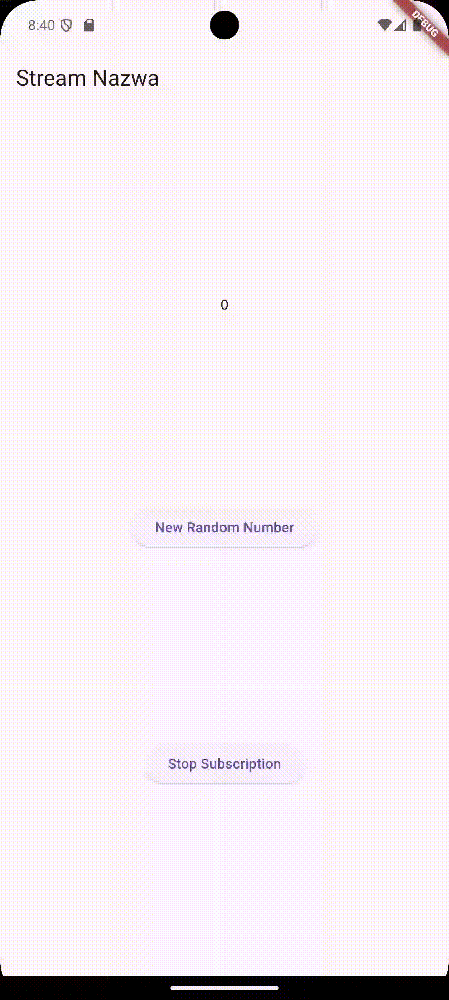

**Laporan Praktikum**
# **Pertemuan 12**
### **Lanjutan State Management dengan Streams**
------

### **Data Mahasiswa**

<table>
<tr>
    <th>Nama</th>
    <td>Nazwa Ayunda Mirrohillah</td>
  </tr>
  <tr>
    <th>NIM</th>
    <td>2241720013</td>
  </tr>
  <tr>
    <th>Kelas/Absn</th>
    <td>3C/20</td>
  </tr>
</table>

<br>

# Praktikum 1: Dart Streams

Selesaikan langkah-langkah praktikum berikut ini menggunakan editor Visual Studio Code (VS Code) atau Android Studio atau code editor lain kesukaan Anda. Jawablah di laporan praktikum Anda (ketik di `README.md`) pada setiap soal yang ada di beberapa langkah praktikum ini.

> **Perhatian**: Diasumsikan Anda telah berhasil melakukan setup environment Flutter SDK, VS Code, Flutter Plugin, dan Android SDK pada pertemuan pertama.

### Langkah 1: Buat Project Baru
Buatlah sebuah project flutter baru dengan nama `stream_nama` (beri nama panggilan Anda) di folder `week-13/src/` repository GitHub Anda.

### Langkah 2: Buka file `main.dart`
Ketiklah kode seperti berikut ini.<br>
```dart
import 'package:flutter/material.dart';

void main() {
  runApp(const MyApp());
}

class MyApp extends StatelessWidget {
  const MyApp({super.key});

  @override
  Widget build(BuildContext context) {
    return MaterialApp(
      title: 'Stream Nazwa',
      theme: ThemeData(
        primarySwatch: Colors.deepPurple,
      ),
      home: const StreamHomePage(),
    );
  }
}

class StreamHomePage extends StatefulWidget {
  const StreamHomePage({super.key});

  @override
  State<StreamHomePage> createState() => _StreamHomePageState();
}

class _StreamHomePageState extends State<StreamHomePage> {
  @override
  Widget build(BuildContext context) {
    return Container();
  }
}
```

> **Soal 1**
> - Tambahkan nama panggilan Anda pada `title` app sebagai identitas hasil pekerjaan Anda.
> - Gantilah warna tema aplikasi sesuai kesukaan Anda.
> - Lakukan commit hasil jawaban Soal 1 dengan pesan "W12: Jawaban Soal 1"

> **JAWAB** :

```dart
  Widget build(BuildContext context) {
    return MaterialApp(
      title: 'Stream Nazwa',
      theme: ThemeData(
        primarySwatch: Colors.deepPurple,
      ),
      home: StreamHomePage(),
    );
  }
```

### Langkah 3: Buat file baru `stream.dart`
Buat file baru di folder `lib` project Anda. Lalu isi dengan kode berikut.

``` dart
import 'package:flutter/material.dart';

class ColorStream{
}

```

### Langkah 4: Tambah variabel `colors`
Tambahkan variabel di dalam class `ColorStream` seperti berikut.<br>

``` dart
final List<Color> colors = [
    Colors.blueGrey,
    Colors.amber,
    Colors.deepPurple,
    Colors.lightBlue,
    Colors.teal,
```

> **Soal 2**
> - Tambahkan 5 warna lainnya sesuai keinginan Anda pada variabel `colors` tersebut.
> - Lakukan commit hasil jawaban Soal 2 dengan pesan "W12: Jawaban Soal 2"

> **JAWABb** :
```dart
class ColorStream{
  final List<Color> colors = [
    Colors.blueGrey,
    Colors.amber,
    Colors.deepPurple,
    Colors.lightBlue,
    Colors.teal,
    Colors.brown,
    Colors.pink,
    Colors.indigo,
    Colors.lime,
    Colors.yellow,
  ];
}
```

### Langkah 5: Tambah method `getColors()`
Di dalam class `ColorStream`, ketik method seperti kode berikut. Perhatikan tanda bintang di akhir keyword `async*` (ini digunakan untuk melakukan `Stream` data).<br>

``` dart
Stream<Color> getColors() async* {
```

### Langkah 6: Tambah perintah `yield*`
Tambahkan kode berikut ini:
```dart
yield* Stream.periodic(
  const Duration(seconds: 1), (int t) {
    int index = t % colors.length;
    return colors[index];
});
```

> **Soal 3**
> - Jelaskan fungsi keyword `yield*` pada kode tersebut!<P>
> **Jawab**<p>
>Pada Dart, penggunaan yield* digunakan dalam konteks pengembalian nilai dari suatu fungsi yang juga merupakan generator. Generator adalah fungsi yang menghasilkan serangkaian nilai secara berurutan dan dapat dihentikan atau dilanjutkan.<p>
> - Apa maksud isi perintah kode tersebut?<p>
> **Jawab**<p>
> Secara keseluruhan, kode tersebut membuat sebuah stream yang menghasilkan warna dari sebuah array colors secara berulang setiap detik. Kode tersebut hanya mendefinisikan stream dan tidak mencetak atau menggunakan stream tersebut. Untuk menggunakan stream tersebut, Anda dapat menggabungkannya dengan operator .listen atau menggunakannya dalam blok await for jika berada dalam konteks async.
> - Lakukan commit hasil jawaban Soal 3 dengan pesan "W12: Jawaban Soal 3"

### Langkah 7: Buka `main.dart`
Ketik kode impor file ini pada file `main.dart`:
```dart
import 'stream.dart';
```

### Langkah 8: Tambah variabel
Ketik dua properti ini di dalam class `_StreamHomePageState`<br>
``` dart
Color bgColor = Colors.blueGrey;
late ColorStream colorStream;

```

### Langkah 9: Tambah method `changeColor()`
Tetap di file `main`, ketik kode seperti berikut:<br>
``` dart
  void changeColor() async{
    // SOAL 4
    await for (var eventColor in colorStream.getColors()){
      setState(() {
        bgColor = eventColor;
      });
    }
  }
```

### Langkah 10: Lakukan override `initState()`
Ketik kode berikut:<br>
``` dart
 @override
    void initState() {
    super.initState();
    colorStream = ColorStream();
    changeColor();
   }
```

### Langkah 11: Ubah isi `Scaffold()`
Sesuaikan kode seperti berikut.<br>
```dart
 @override
  Widget build(BuildContext context) {
    return Scaffold(
      appBar: AppBar(
        title: const Text('Stream Nazwa'),
      ),
      body: 
      Container(
        decoration: BoxDecoration(color: bgColor),
      ));
  }
```

### Langkah 12: Run
Lakukan running pada aplikasi Flutter Anda, maka akan terlihat berubah warna background setiap detik.<br>


> **Soal 4**
> - Capture hasil praktikum Anda berupa GIF dan lampirkan di `README`.<p>
> **Jawab**<p>


> - Lakukan commit hasil jawaban Soal 4 dengan pesan "W12: Jawaban Soal 4"

### Langkah 13: Ganti isi method `changeColor()`
Anda boleh comment atau hapus kode sebelumnya, lalu ketik kode seperti berikut.<br>
``` dart
colorStream.getColors().listen((eventColor){
      setState(() {
        bgColor = eventColor;
      });
    });
```

> **Soal 5**
> - Jelaskan perbedaan menggunakan `listen` dan `await for` (langkah 9)!<p>

> **Jawab**<p>
> Kedua pendekatan tersebut, yakni menggunakan await for dan listen, berfungsi untuk mendengarkan perubahan pada stream, tetapi terdapat perbedaan utama dalam cara mereka berinteraksi dengan stream.
- await for mengharapkan fungsi yang dilabeli async, sementara listen dapat digunakan di dalam atau di luar fungsi yang diberi label async.
- await for digunakan untuk membuat loop yang akan terus menunggu dan mendengarkan stream, sementara listen digunakan untuk menetapkan fungsi callback yang akan dipanggil setiap kali ada perubahan pada stream.

>Dalam kedua kasus, tujuannya tetap sama, yaitu merespons perubahan pada stream dan memperbarui UI melalui setState ketika ada perubahan warna. Pilihan antara keduanya tergantung pada kebutuhan dan struktur kode aplikasi


# Praktikum 2: Stream Controllers dan Sinks

`StreamControllers` akan membuat jembatan antara `Stream` dan `Sink`. `Stream` berisi data secara sekuensial yang dapat diterima oleh subscriber manapun, sedangkan `Sink` digunakan untuk mengisi (injeksi) data.

Secara sederhana, StreamControllers merupakan stream management. Ia akan otomatis membuat stream dan sink serta beberapa method untuk melakukan kontrol terhadap event dan fitur-fitur yang ada di dalamnya.

Anda dapat membayangkan stream sebagai pipa air yang mengalir searah, dari salah satu ujung Anda dapat mengisi data dan dari ujung lain data itu keluar. Anda dapat melihat konsep stream pada gambar diagram berikut ini.


Di Flutter, Anda dapat menggunakan `StreamController` untuk mengontrol aliran data `stream`. Sebuah `StreamController` memiliki sebuah properti bernama `sink` yang berguna untuk insert data, sedangkan properti `stream` berguna untuk menerima atau keluarnya data dari `StreamController` tersebut.

Setelah Anda menyelesaikan praktikum 1, Anda dapat melanjutkan praktikum 2 ini. Selesaikan langkah-langkah praktikum berikut ini menggunakan editor Visual Studio Code (VS Code), Android Studio, atau code editor lain kesukaan Anda. Jawablah di laporan praktikum Anda pada setiap soal yang ada di beberapa langkah praktikum ini.

> **Perhatian:** Diasumsikan Anda telah berhasil menyelesaikan Praktikum 1.

Pada codelab ini, kita akan menambah kode dari aplikasi **stream** di praktikum sebelumnya.

### Langkah 1: Buka file `stream.dart`
Lakukan impor dengan mengetik kode ini.

```dart
import 'dart:async';
```

### Langkah 2: Tambah `class NumberStream`
Tetap di file `stream.dart`, tambah class baru seperti berikut.
``` dart
class NumberStream{
}
```

### Langkah 3: Tambah `StreamController`
Di dalam `class NumberStream` buatlah variabel seperti berikut.
```dart
final StreamController<int> controller = StreamController<int>();
```

### Langkah 4: Tambah method `addNumberToSink`
Tetap di `class NumberStream`, buatlah method ini.
```dart
 void addNumberToSink(int newNumber){
    controller.sink.add(newNumber);
  }
```

### Langkah 5: Tambah method `close()`
Tambahkan kode berikut.
```dart
  close(){
    controller.close();
  }
```

### Langkah 6: Buka `main.dart`
Ketik kode import seperti berikut
```dart
import 'dart:async';
import 'dart:math';
```

### Langkah 7: Tambah variabel
Di dalam `class _StreamHomePageState`, ketik variabel berikut
```dart
  int lastNumber = 0;
  late StreamController numberStreamController;
  late NumberStream numberStream;
```

### Langkah 8: Edit `initState()`
```dart
@override
  void initState() {

    numberStream = NumberStream();
    numberStreamController = numberStream.controller;
    Stream stream = numberStreamController.stream.asBroadcastStream();
    stream.listen((event){
      setState(() {
        lastNumber = event;
      });
    });
    super.initState();
  }
```
- Pada langkah kedelapan dibuat terlebih dahulu objek NumberStream yang berasal dari stream.dart, kemudian mengakses variabel controller dari numberStream dengan menyimpannya ke variabel numberStreamController, data stream dari numberStreamController ini akan disimpan dalam variabel stream bertipe data Stream, yang akhirnya value stream yang diperoleh ini akan digunakan untuk memperbarui value dari lastNumber.

### Langkah 9: Edit `dispose()`
```dart
@override
  void dispose() {
    numberStreamController.close();
    super.dispose();
  }
```

### Langkah 10: Tambah method `addRandomNumber()`
Tambahkan kode berikut.

```dart
void addRandomNumber() {
  Random random = Random();
  int myNum = random.nextInt(10);
  numberStream.addNumberToSink(myNum);
}
```
- Method addRandomNumber() pertama-tama membuat objek Random() dengan nama random, yang kemudian objek ini akan digunakan untuk memperoleh value integer acak dengan rentang 0 sampai dengan 9 dan disimpan dalam variabel myNum. Selanjutnya memanggil method addNumbertoSink() dari objek numberStram yang dibuat dilangkah kedelapan sebelumnya. Dengann mengakses addNumbertoSink() dengan argument value dari myNum, maka value ini akan ditambahkan kedalam aliran data yang dibuat.

### Langkah 11: Edit method `build()`
```dart
SizedBox(
        width: double.infinity,
        child: Column(
          mainAxisAlignment: MainAxisAlignment.spaceEvenly,
          crossAxisAlignment: CrossAxisAlignment.center,
          children: [
            Text(lastNumber.toString()),
            ElevatedButton(
              onPressed: ()=>addRandomNumber(),
              child: const Text('New Random Number'),
            ),
          ],
        ),
      ),
    );
  }
```

### Langkah 12: Run
Lakukan running pada aplikasi Flutter Anda, maka akan terlihat seperti gambar berikut.


> **Soal 6**
> - **Jelaskan maksud kode langkah 8 dan 10 tersebut!**<p>

> **Jawab**<p>
1. Langkah 8:
- Menginisialisasi objek NumberStream dan StreamController.
- Membuat objek Stream dari StreamController.
- Menambahkan listener ke stream tersebut. Setiap kali ada data yang masuk ke dalam stream, fungsi yang diberikan kepada listen akan dipanggil. Dalam kasus ini, fungsi tersebut akan memperbarui lastNumber menggunakan setState. Ini umumnya dilakukan untuk memastikan bahwa perubahan nilai di dalam widget diperbarui dan direfleksikan pada antarmuka pengguna (UI).
2. Langkah 10:
- Membuat fungsi addRandomNumber yang bertujuan untuk menambahkan angka acak ke dalam stream menggunakan objek NumberStream.
- Fungsi ini menggunakan objek Random untuk menghasilkan angka acak antara 0 dan 9, dan kemudian memanggil metode addNumberToSink pada objek NumberStream untuk menambahkan angka tersebut ke dalam stream.

> - **Capture hasil praktikum Anda berupa GIF dan lampirkan di README.**<p>

> **Jawab**<p>


> - **Lalu lakukan commit dengan pesan "W12: Jawaban Soal 6"**.

### Langkah 13: Buka `stream.dart`
Tambahkan method berikut ini.
``` dart
addError(){
    controller.sink.addError('error');
  }
```

### Langkah 14: Buka `main.dart`
Tambahkan method `onError` di dalam `class StreamHomePageState` pada method `listen` di fungsi `initState()` seperti berikut ini.

``` dart
stream.listen((event){
      setState(() {
        lastNumber = event;
      });
    }).onError((error){
      setState(() {
        lastNumber = -1;
      });
    });
```

### Langkah 15: Edit method `addRandomNumber()`
Lakukan *comment* pada dua baris kode berikut, lalu ketik kode seperti berikut ini.

```dart
void addRandomNumber() {
  Random random = Random();
  // int myNum = random.nextInt(10);
  // numberStream.addNumberToSink(myNum);
  numberStream.addError();
}
```

> **Soal 7**
> - Jelaskan maksud kode langkah 13 sampai 15 tersebut!<p>
> **Jawab**<p>
> 1. Pada langkah 13, kita menambahkan sebuah metode bernama addError() ke dalam objek NumberStream yang mungkin merupakan suatu kelas yang mengelola stream angka. Metode ini bertujuan untuk menambahkan pesan error ke dalam sink (tempat penyimpanan) stream dengan menggunakan controller.sink.addError('error').<p>
> 2. Pada langkah 14, kita menambahkan metode onError ke dalam fungsi listen yang mendengarkan perubahan pada stream dalam fungsi initState(). Ketika terjadi error pada stream, fungsi onError akan dipanggil, dan Anda mengupdate nilai lastNumber menjadi -1. Ini memberikan cara untuk menangani kesalahan yang mungkin terjadi pada stream.
<p>
> 3. Pada langkah 15,  kita melakukan komentar pada dua baris kode yang awalnya digunakan untuk menambahkan angka acak ke dalam stream. Ini berarti bahwa metode addRandomNumber() sekarang tidak melakukan apa pun, dan angka tidak lagi ditambahkan ke dalam stream.<p>


> - Kembalikan kode seperti semula pada Langkah 15, comment `addError()` agar Anda dapat melanjutkan ke praktikum 3 berikutnya.<p>
> **Jawab**
```dart
void addRandomNumber() {
    Random random = Random();
    int myNum = random.nextInt(10);
    numberStream.addNumberToSink(myNum);
    // numberStream.addError();
  }
```
> - Lalu lakukan commit dengan pesan "**W12: Jawaban Soal 7**".


<br><br>

# Praktikum 3: Injeksi Data ke Streams

Skenario yang umum dilakukan adalah melakukan manipulasi atau transformasi data stream sebelum sampai pada UI end user. Hal ini sangat berguna ketika Anda perlu melakukan filter data berdasarkan kondisi tertentu, memvalidasi data, memodifikasinya, atau menjalankan proses lain yang memicu beberapa output baru. Contohnya melakukan konversi angka ke string, melakukan perhitungan, atau menghilangkan data yang berulang.

Pada praktikum ini, Anda akan menggunakan `StreamTransformers` dalam `stream` untuk melakukan operasi `map` dan filter data.

Setelah Anda menyelesaikan praktikum 2, Anda dapat melanjutkan praktikum 3 ini. Selesaikan langkah-langkah praktikum berikut ini menggunakan editor Visual Studio Code (VS Code), Android Studio, atau editor lain kesukaan Anda. Jawablah di laporan praktikum Anda pada setiap soal yang ada di beberapa langkah praktikum ini.

> **Perhatian:** Diasumsikan Anda telah berhasil menyelesaikan Praktikum 2.

### Langkah 1: Buka `main.dart`
Tambahkan variabel baru di dalam `class _StreamHomePageState` seperti berikut.

```dart
 late StreamTransformer transformer;
```

### Langkah 2: Tambahkan kode ini di `initState`
Edit bagian `initState` dengan menambahkan kode berikut.

```dart
 transformer = StreamTransformer<int, int>.fromHandlers(
      handleData: (value, sink){
        sink.add(value*10);
      },
      handleError: (error, trace, sink){
        sink.add(-1);
      },
      handleDone: (sink) => sink.close(),
    );
```

### Langkah 3: Tetap di `initState`
Lakukan edit tambahan pada `initState` seperti kode berikut.

```dart
stream.transform(transformer).listen((event){
      setState(() {
        lastNumber = event;
      });
    }).onError((error){
      setState(() {
        lastNumber = -1;
      });
    });
    super.initState();
```

### Langkah 4: Run
Terakhir, jalankan aplikasi dengan menekan **F5** atau **run**. Jika aplikasi sudah berjalan, lakukan **hot restart**. Maka hasilnya akan terlihat seperti gambar berikut ini dengan tampilan angka dari 0 hingga 90.


> **Soal 8**
> - Jelaskan maksud kode langkah 1-3 tersebut!<p>
> **Jawab**<p>
>Langkah 1<p>
>Pada langkah ini, kita menambahkan variabel transformer ke dalam kelas _StreamHomePageState. Variabel ini memiliki tipe StreamTransformer, yang merupakan objek yang dapat mengubah (transform) nilai di dalam stream.<p>
>Langkah 2<p>
>Pada langkah ini, kita membuat objek StreamTransformer dengan menggunakan metode fromHandlers. Objek ini digunakan untuk mengubah nilai di dalam stream. Dalam kasus ini, nilai diubah dengan mengalikan setiap nilai dengan 10. Selain itu, terdapat penanganan error yang menghasilkan nilai -1, dan penanganan ketika stream selesai.<p>
>Langkah 3<p>
>Pada langkah ini, Anda menggunakan transform pada stream untuk menerapkan transformasi yang telah ditentukan oleh transformer. Setiap nilai yang masuk ke dalam stream akan dikalikan dengan 10 sesuai dengan logika yang didefinisikan dalam transformer. Selanjutnya, Anda mendengarkan perubahan pada stream seperti biasa dan memperbarui UI melalui setState.<p>

> - Capture hasil praktikum Anda berupa GIF dan lampirkan di README.<p>
> **Jawab**<p>

> - Lalu lakukan commit dengan pesan "**W12: Jawaban Soal 8**".
<br><br>

# Praktikum 4: Subscribe ke Stream Events

Dari praktikum sebelumnya, Anda telah menggunakan method listen mendapatkan nilai dari stream. Ini akan menghasilkan sebuah Subscription. Subscription berisi method yang dapat digunakan untuk melakukan listen pada suatu event dari stream secara terstruktur.<p>

Pada praktikum 4 ini, kita akan gunakan Subscription untuk menangani event dan error dengan teknik praktik baik (best practice), dan menutup Subscription tersebut.<p>

Setelah Anda menyelesaikan praktikum 3, Anda dapat melanjutkan praktikum 4 ini. Selesaikan langkah-langkah praktikum berikut ini menggunakan editor Visual Studio Code (VS Code) atau Android Studio atau code editor lain kesukaan Anda. Jawablah di laporan praktikum Anda pada setiap soal yang ada di beberapa langkah praktikum ini.<p>

> **Perhatian:** Diasumsikan Anda telah menyelesaikan Praktikum 3.

### Langkah 1: Tambah Variabel
Tambahkan variabel berikut di dalam `class _StreamHomePageState`.

```dart
late StreamSubscription subscription;
```

### Langkah 2: Edit `initState()`
Edit bagian `initState` dengan menambahkan kode berikut.

```dart
  @override
  void initState() {
    numberStream = NumberStream();
    numberStreamController = numberStream.controller;
    Stream stream = numberStreamController.stream;
    subscription = stream.listen((event){
      setState(() {
        lastNumber = event;
      });
    });
```

### Langkah 3: Tetap di `initState()`
Tambahkan kode berikut di `initState`.

```dart
      setState(() {
        lastNumber = -1;
      });
    });
```

### Langkah 4: Tambah Properti `onDone()`
Tambahkan kode berikut di bawah `onError`.

```dart
subscription.onDone((){
      print('OnDone was called');
    });
```

### Langkah 5: Tambah Method Baru
Tambahkan method baru berikut di dalam `class _StreamHomePageState`.

```dart
void stopStream(){
    numberStreamController.close();
  }
```

### Langkah 6: Pindah ke Method `dispose()`
Jika `dispose()` belum ada, buat method ini dan tambahkan kode berikut di dalamnya.

```dart
subscription.cancel();
```

### Langkah 7: Pindah ke Method `build()`
Tambahkan button kedua di method `build()` dengan kode berikut.

```dart
ElevatedButton(
              onPressed: ()=> stopStream(),
              child: const Text('Stop Subscription'),
            ),

```

### Langkah 8: Edit Method `addRandomNumber()`
Edit method `addRandomNumber()` seperti kode berikut.

```dart
 void addRandomNumber() {
    Random random = Random();
    int myNum = random.nextInt(10);
    // numberStream.addNumberToSink(myNum);
    // numberStream.addError();

    if(!numberStreamController.isClosed){
      numberStream.addNumberToSink(myNum);
    }else{
      setState(() {
        lastNumber = -1;
      });
    }
  }
  ```

### Langkah 9: Run
Jalankan aplikasi, Anda akan melihat dua button seperti gambar berikut.


### Langkah 10: Tekan Button ‘Stop Subscription'
Saat Anda menekan button ini, akan muncul pesan di Debug Console seperti berikut.


> **Soal 9**
> - Jelaskan maksud kode langkah 2, 6, dan 8 tersebut!<p>
> **Jawab**<p>
>Langkah 2<p>
> Pada langkah ini, Anda sedang mengedit metode initState() dalam framework Flutter. initState() adalah metode yang dipanggil setelah widget telah diinisialisasi, dan ini sering digunakan untuk melakukan konfigurasi awal dan memulai sumber daya yang diperlukan.<p>
>Langkah 6<p>
> Langkah ini menunjukkan bagaimana menangani pembuangan (disposing) sumber daya yang digunakan oleh widget. Metode dispose() dipanggil ketika widget dihapus dari pohon widget.<p>
>Langkah 8<p>
>Dengan langkah ini, memberikan fungsionalitas untuk menambahkan angka acak ke aliran sesuai dengan kondisi-kondisi tertentu, dan Anda menangani dengan bijak situasi di mana kontroler aliran sudah ditutup.<p>

> - Capture hasil praktikum Anda berupa GIF dan lampirkan di README.<p>
> **Jawab**<p>



> - Lalu lakukan commit dengan pesan "**W12: Jawaban Soal 9**".

<br><br>

# Praktikum 5: Multiple Stream Subscriptions

Secara default, stream hanya bisa digunakan untuk satu subscription. Jika Anda mencoba untuk melakukan subscription yang sama lebih dari satu, maka akan terjadi error. Untuk menangani hal itu, tersedia broadcast stream yang dapat digunakan untuk multiple subscriptions. Pada praktikum ini, Anda akan mencoba untuk melakukan multiple stream subscriptions.<p>

Setelah Anda menyelesaikan praktikum 4, Anda dapat melanjutkan praktikum 5 ini. Selesaikan langkah-langkah praktikum berikut ini menggunakan editor Visual Studio Code (VS Code) atau Android Studio atau code editor lain kesukaan Anda. Jawablah di laporan praktikum Anda pada setiap soal yang ada di beberapa langkah praktikum ini.<p>

> **Perhatian:** Diasumsikan Anda telah menyelesaikan Praktikum 4.

### Langkah 1: Buka file `main.dart`
Tambahkan variabel berikut di dalam `class _StreamHomePageState`.

```dart
late StreamSubscription subscription2;
    String values = '';
```

### Langkah 2: Edit `initState()`
Tambahkan kode berikut di `initState`.
```dart
subscription2 = stream.listen((event){
       setState(() {
         values += '$event -';
       });
   });
```

### Langkah 3: Run
Jalankan aplikasi, dan akan muncul error seperti berikut.


> **Soal 10**: Jelaskan mengapa error tersebut bisa terjadi?<p>
> **Jawab**<p> 

>Kesalahan tersebut terjadi ketika mencoba untuk menambahkan atau membuat dua langganan pada stream yang sama, tanpa membatalkan langganan sebelumnya. Hal tersebut terjadi ketika inisialisasi langganan2 pada metode initState() karena sudah ada inisialisasi langganan untuk menangani stream yang sama pada satu waktu.


### Langkah 4: Set Broadcast Stream
Untuk memungkinkan multiple subscriptions, edit `initState` agar stream menjadi broadcast seperti pada kode berikut.
```dart
void initState() {
    numberStream = NumberStream();
    numberStreamController = numberStream.controller;
     Stream stream = numberStreamController.stream.asBroadcastStream();
```

### Langkah 5: Edit Method `build()`
Tambahkan kode berikut pada method `build()` untuk menampilkan data dari kedua subscriptions.
```dart
child: Column(
          mainAxisAlignment: MainAxisAlignment.spaceEvenly,
          crossAxisAlignment: CrossAxisAlignment.center,
          children: [
            // Text(lastNumber.toString()),
            Text(values),
```

### Langkah 6: Run
Tekan tombol **New Random Number** beberapa kali. Angka yang ditampilkan akan bertambah dua kali untuk setiap subscription, seperti pada gambar berikut.


> **Soal 11**
> - Jelaskan mengapa angka terus bertambah dua kali untuk setiap subscription.<p>
> **Jawab**<p>
>Saat tombol "New Random Number" ditekan, maka akan menghasilkan dua angka random yang sama. Angka-angka tersebut merupakan output dari stream yang dipanggil oleh objek subscription dan subscription2. Stream tersebut akan mengembalikan nilai berupa event (angka random) yang dipisahkan dengan tanda "-".<p>
>Saat tombol "Stop Stream" ditekan, maka akan menghentikan langganan terhadap stream. Hal ini menyebabkan stream tidak lagi bisa mengeluarkan output, meskipun tombol "New Random Number" ditekan.<p>
> - Capture hasil praktikum Anda dalam bentuk GIF dan lampirkan di README.<p>
> **Jawab**<p>

<p>


> - Lalu lakukan commit dengan pesan "**W12: Jawaban Soal 10,11**".
<br><br>

# Praktikum 6: StreamBuilder

StreamBuilder adalah sebuah widget untuk melakukan listen terhadap event dari stream. Ketika sebuah event terkirim, maka akan dibangun ulang semua turunannya. Seperti halnya widget FutureBuilder pada pertemuan pekan lalu, StreamBuilder berguna untuk membangun UI secara reaktif yang diperbarui setiap data baru tersedia.<p>

Setelah Anda menyelesaikan praktikum 5, Anda dapat melanjutkan praktikum 6 ini. Selesaikan langkah-langkah praktikum berikut ini menggunakan editor Visual Studio Code (VS Code) atau Android Studio atau code editor lain kesukaan Anda. Jawablah di laporan praktikum Anda pada setiap soal yang ada di beberapa langkah praktikum ini.<p>

> **Perhatian:** Diasumsikan Anda telah menyelesaikan Praktikum 5.

### Langkah 1: Buat Project Baru
Buat project Flutter baru dengan nama `streambuilder_nama` (gunakan nama panggilan Anda) di folder `week-13/src/` pada repository GitHub Anda.

### Langkah 2: Buat file `stream.dart`
Tambahkan kode berikut di dalam file `stream.dart`.

```dart
class NumberStream{}
```

### Langkah 3: Tambah Stream Controller
Tambahkan kode berikut di `stream.dart` untuk membuat stream dan mengirim data secara periodik.

```dart
import 'dart:math';

class NumberStream{
  Stream<int> getNumbers() async*{
    yield* Stream.periodic(const Duration(seconds: 1), (int t){
      Random random = Random();
      int myNum = random.nextInt(10);
      return myNum;
    });
  }
}
```

### Langkah 4: Edit `main.dart`
Tambahkan kode berikut di `main.dart` untuk menggunakan `StreamBuilder` dalam UI aplikasi.

```dart
import 'package:flutter/material.dart';
import 'stream.dart';
import 'dart:async';

void main() {
  runApp(const MyApp());
}

class MyApp extends StatelessWidget {
  const MyApp({super.key});

  @override
  Widget build(BuildContext context) {
    return MaterialApp(
      title: 'Stream Nadila',
      theme: ThemeData(
        primarySwatch: Colors.deepPurple,
      ),
      home: const StreamHomepage(),
    );
  }
}

class StreamHomepage extends StatefulWidget {
  const StreamHomepage({super.key});

  @override
  State<StreamHomepage> createState() => _StreamHomepageState();
}

class _StreamHomepageState extends State<StreamHomepage> {

  @override
  Widget build(BuildContext context) {
    return Scaffold(
      appBar: AppBar(title: const Text('Stream Nazwa')),
      body: Container(
      ),
    );
  }
```

### Langkah 5: Tambah Variabel
Tambahkan variabel berikut di dalam `class _StreamHomePageState`.

```dart
late Stream<int> numberStream;
```

### Langkah 6: Edit `initState()`
Tambahkan kode berikut di dalam `initState()` untuk menginisialisasi stream controller.

```dart
@override
  void initState() {
    numberStream = NumberStream().getNumbers();
    super.initState();
  }
```

### Langkah 7: Edit Method `build()`
Tambahkan kode berikut pada method `build()` untuk menampilkan data dari stream menggunakan `StreamBuilder`.

```dart
body: StreamBuilder(
        stream: numberStream,
        initialData: 0,
        builder: (context, snapshot){
          if(snapshot.hasError){
            print('Error!');
          }
          if(snapshot.hasData){
            return Center(
              child: Text(
                snapshot.data.toString(),
                style: const TextStyle(fontSize: 96),
              ),
            );
          } else{
            return const SizedBox.shrink();
          }
        },
      ),
    );
  }
}
```

### Langkah 8: Run
Jalankan aplikasi, dan setiap detik akan muncul angka baru pada tampilan seperti berikut.


> **Soal 12**
> - Jelaskan maksud kode pada langkah 3 dan 7.<p>
> **Jawab**<p>
>Langkah 3 melibatkan pembuatan class NumberStream(), yang mencakup metode getNumbers() untuk menghasilkan stream yang berisi angka-angka acak. Stream ini diperbarui setiap 1 detik.**Kesimpulannya digunakan untuk membuat stream yang mengenerate random number.**<p>
>Langkah 7 menunjukkan penggunaan kode untuk membuat antarmuka pengguna (UI) yang dapat menampilkan nilai dari stream secara real-time. Untuk mencapai ini, digunakan StreamBuilder, yang secara otomatis memperbarui antarmuka setiap kali ada perubahan dalam stream. Perubahan ini dapat berupa perubahan nilai atau munculnya error. Dalam kasus terjadinya error, pesan 'Error!' akan ditampilkan. Jika tidak ada error dan data diterima dari stream, angka acak akan ditampilkan dengan ukuran font setara dengan 96. Namun, jika tidak ada data yang diterima, antarmuka akan menampilkan widget kosong.**Lebih jelasnya digunakan untuk mengimplimentasikan stream menggunakan StreamBuilder. Jika stream mendapatkan data maka akan menampilkan Text dengan nilai snapshot.data dan jika terjadi error maka akan melakukan log.**<p>

> - Capture hasil praktikum Anda dalam bentuk GIF dan lampirkan di README.<p>
> **Jawab**<p>
> 
> - Lakukan commit dengan pesan "**W12: Jawaban Soal 12**".

<br><br>

# Praktikum 7: BLoC Pattern

Ketika menggunakan pola BLoC, maka segalanya merupakan stream event. BLoC atau Business Logic Component adalah lapisan antara semua sumber data dan UI yang mengonsumsi data itu. Contohnya seperti sumber data dari HTTP layanan web servis atau JSON dari sebuah basis data.<p>

Sebuah BLoC menerima stream data dari sumbernya, proses itu membutuhkan logika bisnis Anda, dan return stream data ke subscriber-nya. Perhatikan diagram pola kerja BLoC berikut ini.<p>


Alasan utama menggunakan BLoC adalah memisahkan logika bisnis aplikasi dengan presentasi UI pada widget, terutama akan sangat berguna ketika aplikasi Anda mulai semakin kompleks dan membutuhkan akses state di berbagai tempat. Hal ini akan membuat semakin mudah dalam menggunakan kode Anda, pada beberapa bagian di aplikasi atau bahkan berbeda aplikasi. Selain itu, BLoC secara independen berdiri sendiri dengan UI, sehingga sangat mudah dilakukan isolasi dalam proses testing.<p>

Pada praktikum codelab ini, Anda akan membuat aplikasi sederhana menggunakan BLoC, namun Anda dapat dengan mudah mengembangkannya untuk aplikasi yang lebih besar ruang lingkupnya.<p>

Setelah Anda menyelesaikan praktikum 6, Anda dapat melanjutkan praktikum 7 ini. Selesaikan langkah-langkah praktikum berikut ini menggunakan editor Visual Studio Code (VS Code) atau Android Studio atau code editor lain kesukaan Anda. Jawablah di laporan praktikum Anda pada setiap soal yang ada di beberapa langkah praktikum ini.<p>

> **Perhatian:** Diasumsikan Anda telah menyelesaikan Praktikum 6.

### Langkah 1: Buat Project Baru
Buat project Flutter baru dengan nama `bloc_random_nama` (gunakan nama panggilan Anda) di folder `week-13/src/` pada repository GitHub Anda. Lalu buat file baru di folder `lib` dengan nama `random_bloc.dart`.

### Langkah 2: Tambah Kode Import
Tambahkan kode berikut di dalam file `random_bloc.dart`.

```dart
import 'dart:async';
import 'dart:math';
```

### Langkah 3: Buat Class `RandomNumberBloc`
Buat class `RandomNumberBloc()` di dalam file `random_bloc.dart`.

```dart
class RandomNumberBloc {}
```

### Langkah 4: Buat Variabel StreamController
Di dalam `class RandomNumberBloc()`, tambahkan variabel `StreamController` berikut.

```dart
  // for input events
  final _generateRandomController = StreamController<void>();
  // for output events
  final _randomNumberController = StreamController<int>();
  // input Sink
  Sink<void> get generateRandom => _generateRandomController.sink;
  // ouput Stream
  Stream<int> get randomNumber => _randomNumberController.stream;
  // _secondStreamController.sink
```

### Langkah 5: Buat Constructor
Tambahkan constructor untuk menginisialisasi `StreamController`.

```dart
//constructor
  RandomNumberBloc() {
    _generateRandomController.stream.listen((_) {
      final random = Random().nextInt(10);
      _randomNumberController.sink.add(random);
    });
  }
```

### Langkah 6: Buat Method `dispose()`
Tambahkan method `dispose()` untuk membersihkan `StreamController`.

```dart
void dispose(){
    _generateRandomController.close();
    _randomNumberController.close();
  }
```

### Langkah 7: Edit `main.dart`
Tambahkan kode berikut di `main.dart` untuk memanggil `RandomNumberBloc` di aplikasi.

```dart
class MyApp extends StatelessWidget {
  const MyApp({super.key});

  @override
  Widget build(BuildContext context) {
    return MaterialApp(
      title: 'Flutter Demo Nazwa',
      theme: ThemeData(
        colorScheme: ColorScheme.fromSeed(seedColor: Colors.deepPurple),
        useMaterial3: true,
      ),
      home: const RandomScreen(),
    );
  }
}
```

### Langkah 8: Buat File `random_screen.dart`
Di dalam folder `lib`, buatlah file baru bernama `random_screen.dart`.

### Langkah 9: Tambah Kode Import di `random_screen.dart`
Tambahkan import material dan `random_bloc.dart`.

```dart
import 'package:flutter/material.dart';
import 'random_bloc.dart';
```

### Langkah 10: Buat `StatefulWidget` RandomScreen
Buat class `RandomScreen` di `random_screen.dart`.

### Langkah 11: Tambah Variabel
Tambahkan variabel berikut di dalam `class _RandomScreenState`.

```dart
final _bloc = RandomNumberBloc();
```

### Langkah 12: Buat Method `dispose()`
Tambahkan method `dispose()` untuk membersihkan controller.

```dart
 @override
  void dispose() {
    _bloc.dispose();
    super.dispose();
  }
```

### Langkah 13: Edit Method `build()`
Tambahkan kode ini di dalam `class _RandomScreenState`.

```dart
@override
  Widget build(BuildContext context) {
    return Scaffold(
      appBar: AppBar(title: const Text('Random Number Nazwa')),
      body: Center(
        child: StreamBuilder<int>(
          stream: _bloc.randomNumber,
          initialData: 0,
          builder: (context, snapshot) {
            return Text(
              'Random Number: ${snapshot.data}',
              style: const TextStyle(fontSize: 24),
            );
          },
        ),
      ),
      floatingActionButton: FloatingActionButton(
        onPressed: () => _bloc.generateRandom.add(null),
        child: const Icon(Icons.refresh),
      ),
    );
  }
```

### Langkah 14: Run
Jalankan aplikasi. Setiap kali menekan tombol **FloatingActionButton**, angka acak antara 0 sampai 9 akan tampil.

> **Soal 13**
> - Jelaskan maksud praktikum ini dan letak konsep pola BLoC-nya.<p>
> **Jawab**<p>
>1. Class RandomNumberBloc:<p>
>RandomNumberBloc adalah implementasi BLoC yang menggunakan dua StreamController: satu untuk mengontrol input events (_generateRandomController), dan satu untuk mengontrol output (_randomNumberController). _generateRandomController digunakan untuk mengirim events yang akan memicu pembangkitan nomor acak, sedangkan _randomNumberController mengontrol stream output yang berisi nomor acak yang dihasilkan.<p>
>2. Kelas MyHomePage:<p>
>MyHomePage merupakan antarmuka pengguna sederhana yang tidak secara langsung terlibat dalam logika bisnis. Ini tidak menyertakan logika khusus terkait BLoC. Namun, dalam pengembangan aplikasi yang lebih kompleks, logika bisnis dapat dipindahkan ke dalam BLoC untuk menjaga kesatuan dan pemisahan tanggung jawab.<p>
>3. Class RandomScreen:<p>
>RandomScreen adalah antarmuka pengguna yang menggunakan RandomNumberBloc. State dari widget ini dikendalikan oleh stream yang dihasilkan oleh _bloc.randomNumber. Setiap kali event dikirim melalui _bloc.generateRandom, nomor acak baru dihasilkan dan diperbarui di UI. Dengan memisahkan logika bisnis ke dalam RandomNumberBloc, antarmuka pengguna dapat fokus pada tampilan dan merespons perubahan state.<p>
>4. Pemanggilan BLoC di main.dart:<p>
>BLoC (RandomNumberBloc) diinisialisasi dan dimiliki oleh _RandomScreenState. Pemanggilan _bloc.generateRandom.add(null) pada tombol tindakan antarmuka pengguna memicu pembangkitan nomor acak melalui BLoC.<p>

> **Kesimpulannya :** Praktikum ini menjelaskan cara menggunakan pola BLoC pada Flutter untuk membuat aplikasi yang lebih terorganisir dan mudah dirawat. Pola BLoC memisahkan logika bisnis dari tampilan, sehingga memudahkan pengembangan dan pemeliharaan aplikasi. Dalam praktikum ini, pola BLoC digunakan untuk menghasilkan nomor acak. Kelas RandomBloc bertanggung jawab untuk menghasilkan aliran data untuk nomor acak. Kelas RandomScreen bertanggung jawab untuk menampilkan nomor acak tersebut. Tombol refresh pada kelas RandomScreen digunakan untuk menghasilkan nomor acak baru. Tombol ini mentrigger fungsi generateRandom() pada kelas RandomBloc. Secara keseluruhan, praktikum ini menunjukkan cara menggunakan pola BLoC untuk membuat aplikasi Flutter yang lebih terorganisir.<p>

> - Capture hasil praktikum Anda dalam bentuk GIF dan lampirkan di README.<p>
> **Jawab**<p>
<p>
> - Lakukan commit dengan pesan "**W12: Jawaban Soal 13**".


