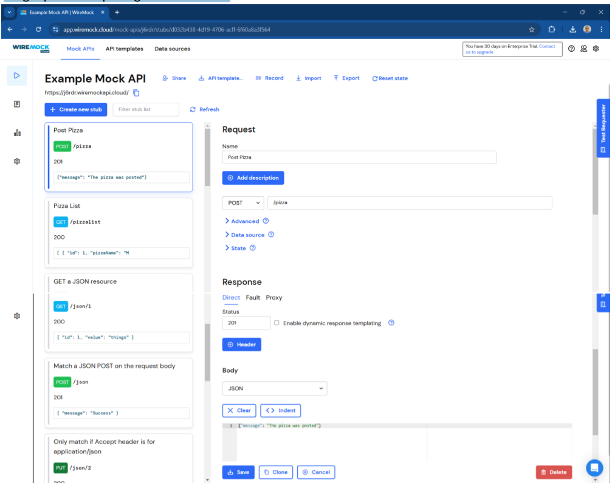
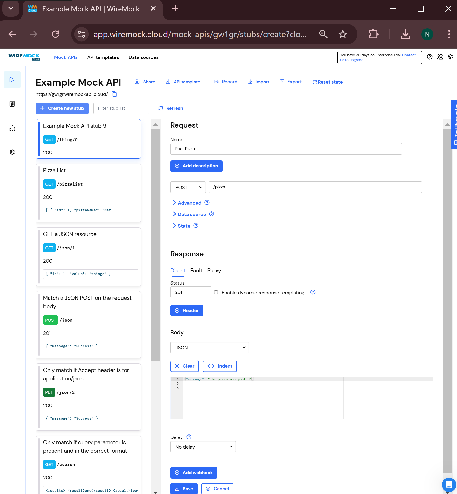
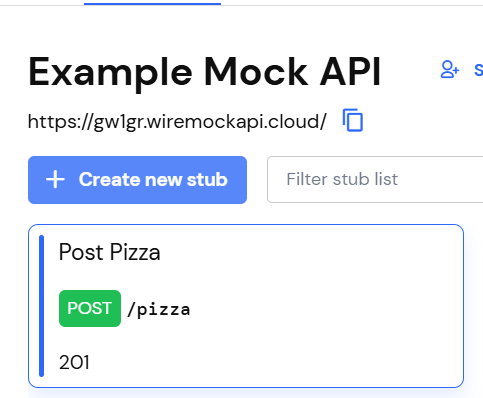
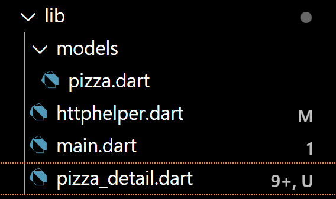
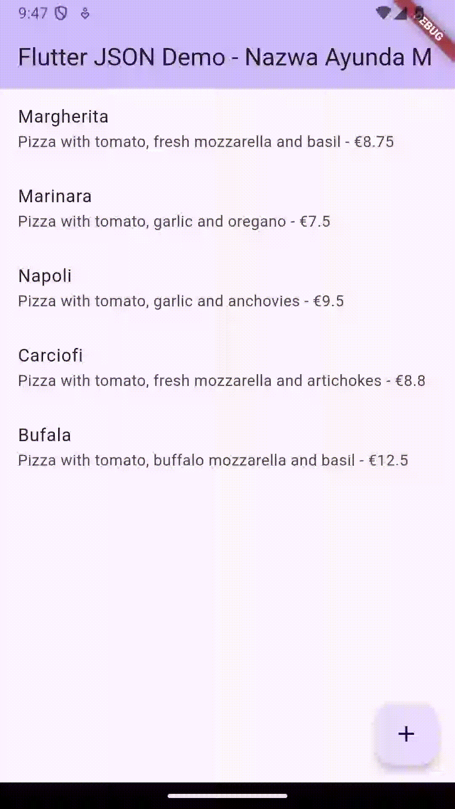
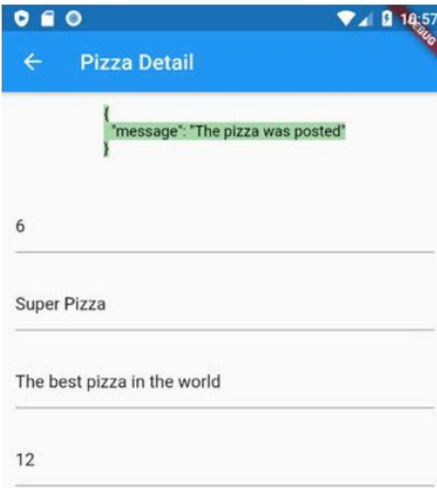
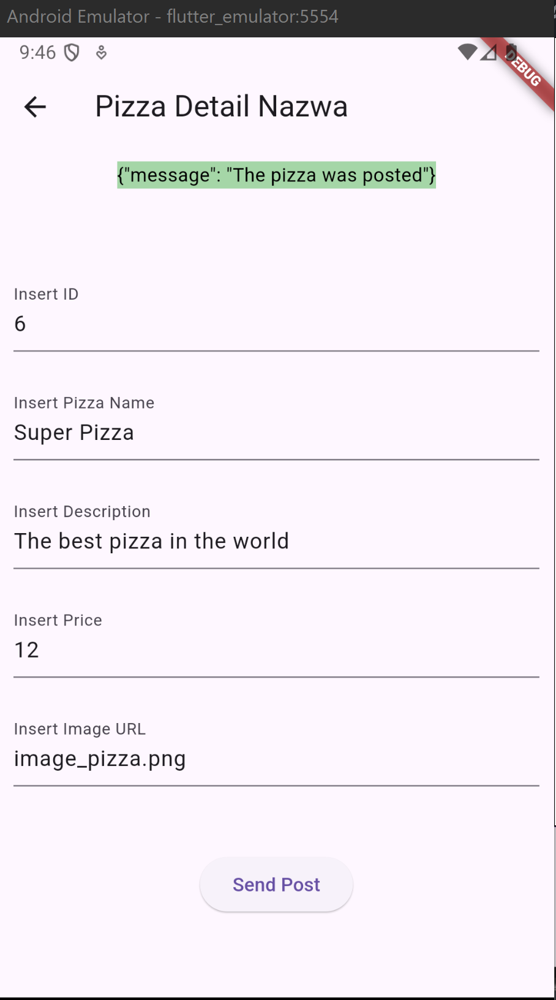
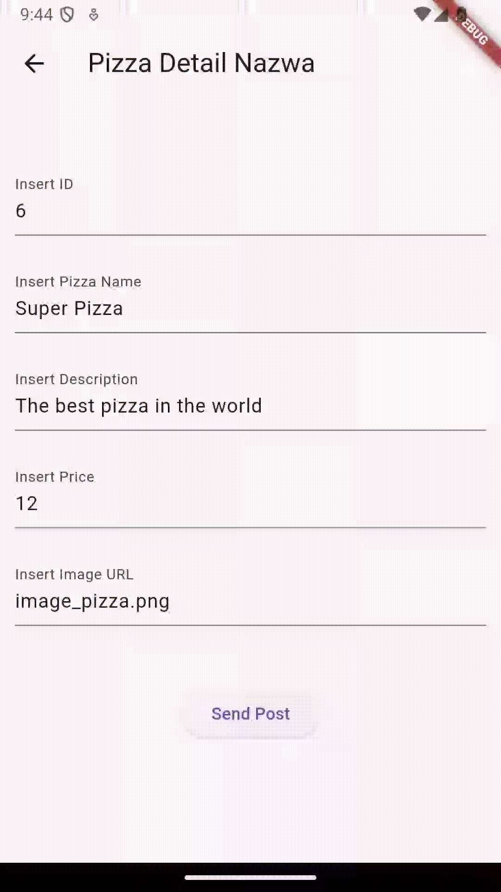
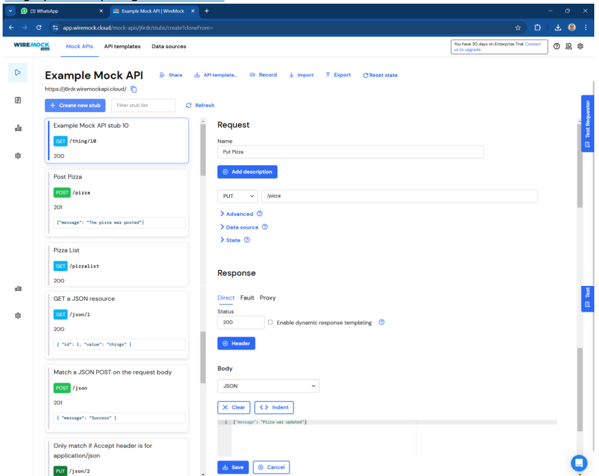
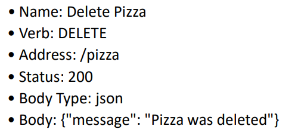

**Laporan Praktikum**
# **Pertemuan 14**
### **RESTFUL API**
------

### **Data Mahasiswa**

<table>
<tr>
    <th>Nama</th>
    <td>Nazwa Ayunda Mirrohillah</td>
  </tr>
  <tr>
    <th>NIM</th>
    <td>2241720013</td>
  </tr>
  <tr>
    <th>Kelas/Absn</th>
    <td>3C/20</td>
  </tr>
</table>

<br>

# Praktikum 1: Designing an HTTP client and getting data

Sebagian besar aplikasi seluler mengandalkan data yang berasal dari sumber eksternal.
Pikirkan aplikasi untuk membaca buku, menonton film, berbagi gambar dengan teman,
membaca berita, atau menulis email: semua aplikasi ini menggunakan data yang diambil dari
sumber eksternal. Ketika sebuah aplikasi menggunakan data eksternal, biasanya, ada layanan
backend yang menyediakan data tersebut untuk aplikasi: layanan web atau API web. Yang
terjadi adalah aplikasi Anda (frontend atau klien) terhubung ke layanan web melalui HTTP dan
meminta sejumlah data. Layanan backend kemudian merespons dengan mengirimkan data ke
aplikasi, biasanya dalam format JSON atau XML.
Untuk praktikum kali ini, kita akan membuat aplikasi yang membaca dan menulis data dari
layanan web. Karena membuat API web berada di luar cakupan buku ini, kita akan
menggunakan layanan yang tersedia, yang disebut Wire Mock Cloud, yang akan
mensimulasikan perilaku layanan web yang sebenarnya, tetapi akan sangat mudah disiapkan
dan digunakan.

### Langkah 1: Mendaftarlah ke layanan Lab Mock di https://app.wiremock.cloud/. Bisa anda gunakan akun google untuk mendaftar. Jika berhasil bendaftar dan login, akan muncul seperti gambar berikut.


**Jawab :**


### Langkah 2: Di halaman dahsboard, klik menu Stubs, kemudian klik entri pertama yaitu “GET a JSON resource”. Anda akan melihat layar yang mirip dengan berikut.


**Jawab :**


### Langkah 3: . Klik “Create new stub”. Di kolom sebelah kanan, lengkapi data berikut. Namanya adalah“Pizza List”, kemudian pilih GET dan isi dengan “/pizzalist”. Kemudian, pada bagian Response, untuk status 200, kemudian pada Body pilih JSON sebagai formatnya dan isi konten JSON dari https://bit.ly/pizzalist. Perhatikan gambar berikut.


**Jawab :**


### Langkah 4: Tekan tombol SAVE di bagian bawah halaman untuk menyimpan Mock ini. Jika berhasil tersimpan, maka Mock API sudah siap digunakan.


### Langkah 5: Tambah method `getColors()` Buatlah project flutter baru dengan nama pizza_api_nama_anda, tambahkan depedensi “http” melalui terminal.

``` dart
flutter pub add http
```


### Langkah 6: DI folder “lib” project anda, tambahkan file dengan nama “httphelper.dart”.


### Langkah 7: . Isi httphelper.dart dengan kode berikut. Ubah “02z2g.mocklab.io” dengan URL Mock API anda.

```dart
import 'dart:convert';
import 'dart:io';

import 'package:pizza_api_nazwa/models/pizza.dart';
import 'package:http/http.dart' as http;

class HttpHelper {
  final String authority = 'gw1gr.wiremockapi.cloud'; // Hanya nama domain
  final String path = 'pizzalist'; // Path API

  Future<List<Pizza>> getPizzaList() async {
    final Uri url = Uri.https(authority, path); // URL yang benar
    final http.Response response = await http.get(url);

    if (response.statusCode == HttpStatus.ok) {
      final jsonResponse = json.decode(response.body);
      List<Pizza> pizzas =
          (jsonResponse as List).map<Pizza>((json) => Pizza.fromJson(json)).toList();
      return pizzas;
    } else {
      return [];
    }
  }
}
```

### Langkah 8: Di file “main.dart”, di class _ MyHomePageState, tambahkan metode bernama “callPizzas”. Metode ini mengembalikan sebuah Future dari daftar objek Pizza dengan memanggil metode getPizzaList dari kelas HttpHelper, dengan kode sebagai berikut:

``` dart
 Future<List<Pizza>> callPizzas() async {
    HttpHelper httpHelper = HttpHelper();
    List<Pizza> pizzas = await httpHelper.getPizzaList();
    return pizzas;
  }

```

### Langkah 9: Pada metode build di class _MyHomePageState, di dalam body Scaffold, tambahkan FutureBuilder yang membuat ListView dari widget ListTile yang berisi objek Pizza:

``` dart
 import 'package:flutter/material.dart';
import 'package:pizza_api_nazwa/httphelper.dart';
import 'package:pizza_api_nazwa/models/pizza.dart';
// import 'package:pizza_api_nazwa/pizza_detail.dart';

void main() => runApp(const MyApp());

class MyApp extends StatelessWidget {
  const MyApp({Key? key}) : super(key: key);

  @override
  Widget build(BuildContext context) {
    return MaterialApp(
      title: 'Flutter JSON Demo - Nazwa Ayunda M',
      theme: ThemeData(
        primarySwatch: Colors.deepPurple,
      ),
      home: const MyHomePage(title: 'Flutter JSON Demo - Nazwa Ayunda M'),
    );
  }
}

class MyHomePage extends StatefulWidget {
  const MyHomePage({super.key, required this.title});

  
  final String title;

  @override
  State<MyHomePage> createState() => _MyHomePageState();
}

class _MyHomePageState extends State<MyHomePage> {
  int _counter = 0;

  void _incrementCounter() {
    setState(() {
  
      _counter++;
    });
  }

  @override
  Widget build(BuildContext context) {

    return Scaffold(
      appBar: AppBar(
      
        backgroundColor: Theme.of(context).colorScheme.inversePrimary,
        
        title: Text(widget.title),
      ),
      body: FutureBuilder(
          future: callPizzas(),
          builder: (BuildContext context, AsyncSnapshot<List<Pizza>> snapshot) {
            if (snapshot.hasError) {
              return const Text('Something went wrong');
            }
            if (!snapshot.hasData) {
              return const Center(child: CircularProgressIndicator());
            }
            return ListView.builder(
              itemCount: (snapshot.data == null) ? 0 : snapshot.data!.length,
              itemBuilder: (BuildContext context, int index) {
                return ListTile(
                  title: Text(snapshot.data![index].pizzaName),
                  subtitle: Text(snapshot.data![index].description + ' - €' + snapshot.data![index].price.toString()),
                );
              },
            );
          },
      ) // This trailing comma makes auto-formatting nicer for build methods.
    );
  }

  Future<List<Pizza>> callPizzas() async {
    HttpHelper httpHelper = HttpHelper();
    List<Pizza> pizzas = await httpHelper.getPizzaList();
    return pizzas;
  }
}
```

### Langkah 10:Jalankan aplikasi. Anda akan melihat layar yang mirip dengan berikut ini:


# Praktikum 2: POST-ing data

Dalam praktikum ini, Anda akan mempelajari cara melakukan tindakan POST pada layanan
web. Hal ini berguna ketika Anda menyambungkan ke layanan web yang tidak hanya
menyediakan data, tetapi juga memungkinkan Anda untuk mengubah informasi yang
tersimpan di sisi server. Biasanya, Anda harus menyediakan beberapa bentuk autentikasi ke
layanan, tetapi untuk praktikum ini, karena kita menggunakan layanan Mock API, hal ini tidak
diperlukan.


### Langkah 1: Masuk ke layanan Lab Mock di https://app.wiremock.cloud/ dan klik bagian Stubs, kemudian, buatlah stub baru.


### Langkah 2: Lengkapi isian seperti gambar berikut:



**Jawab :**


### Langkah 3: Simpan.




### Langkah 4: Di proyek Flutter, di file httpHelper.dart, di kelas HttpHelper, buat metode baru bernama postPizza, lengkapi kode sebagai berikut.

```dart
Future<String> postPizza(Pizza pizza) async {
    const String path = '/pizza';
    String body = json.encode(pizza.toJson());
    Uri url = Uri.https(authority, path);
    http.Response response = await http.post(url, body: body);
    return response.body;
  }
```

### Langkah 5:  Di dalam proyek, buat sebuah file baru bernama pizza_detail.dart.



### Langkah 6: Di bagian atas file baru, tambahkan impor yang diperlukan.

```dart
import 'package:flutter/material.dart';
import 'package:pizza_api_nazwa/httphelper.dart';
import 'package:pizza_api_nazwa/models/pizza.dart';
```

### Langkah 7: Buat StatefulWidget bernama PizzaDetailScreen.

```dart
class PizzaDetailScreen extends StatefulWidget {
  const PizzaDetailScreen({Key? key}) : super(key: key);

  @override
  _PizzaDetailScreenState createState() => _PizzaDetailScreenState();
}

class _PizzaDetailScreenState extends State<PizzaDetailScreen> {
  

  @override
  Widget build(BuildContext context) {
    return Placeholder();
  }
}
```

### Langkah 8: Di bagian atas kelas _PizzaDetailScreenState, tambahkan lima widget TextEditingController. Widget ini akan berisi data untuk objek Pizza yang akan diposting nanti. Juga, tambahkan sebuah String yang akan berisi hasil dari permintaan POST.

```dart
 final TextEditingController _txtId = TextEditingController();
  final TextEditingController _txtName = TextEditingController();
  final TextEditingController _txtDescription = TextEditingController();
  final TextEditingController _txtPrice = TextEditingController();
  final TextEditingController _txtImageUrl = TextEditingController();

  String operationResult = '';
```

### Langkah 9: Override metode dispose() untuk membuang controllers

```dart
 @override
  void dispose() {
    _txtId.dispose();
    _txtName.dispose();
    _txtDescription.dispose();
    _txtPrice.dispose();
    _txtImageUrl.dispose();
    super.dispose();
  }
```

### Langkah 10: Dalam metode build() pada kelas, kita return sebuah Scaffold, yang AppBar-nya berisi Teks yang menyatakan “Detail Pizza” dan Body-nya berisi Padding dan SingleChildScrollView yang berisi Column.

```dart
return Scaffold(
      appBar: AppBar(
        title: const Text('Pizza Detail Nazwa'),
      ),
      body: Padding(
        padding: const EdgeInsets.all(12.0),
        child: SingleChildScrollView(
          child: Column(
            children: []),
        )));
```


### Langkah 11: Untuk properti anak dari Column, tambahkan beberapa Text yang akan berisi hasil posting, lima TextFields, masing-masing terikat pada TextEditingController, dan sebuah ElevatedButton untuk menyelesaikan aksi POST (metode postPizza akan dibuat berikutnya). Juga, tambahkan SizedBox untuk memberi jarak pada widget di layar.

```dart
Text(operationResult, style: TextStyle(backgroundColor: Colors.green[200], color: Colors.black),),
              const SizedBox(height: 24),
              _textField('Insert ID', _txtId),
              _textField('Insert Pizza Name', _txtName),
              _textField('Insert Description', _txtDescription),
              _textField('Insert Price', _txtPrice),
              _textField('Insert Image URL', _txtImageUrl),
              const SizedBox(height: 24),
              ElevatedButton(
                  onPressed: () {
                    postPizza();
                  },
                  child: const Text('Send Post')
              )
```

### Langkah 12: Di bagian bawah kelas _PizzaDetailState, tambahkan metode postPizza

``` dart
 Future postPizza() async {
    HttpHelper helper = HttpHelper();
    Pizza pizza = Pizza(
      id: int.parse(_txtId.text),
      pizzaName: _txtName.text,
      description: _txtDescription.text,
      price: double.parse(_txtPrice.text),
      imageUrl: _txtImageUrl.text,
    );
    String result = await helper.postPizza(pizza);
    setState(() {
      operationResult = result;
    });
  }
```

### Langkah 13: Di file main.dart, impor file pizza_detail.dart.

``` dart
import 'package:pizza_api_nazwa/pizza_detail.dart';
```

### Langkah 14: Di perancah metode build() dari kelas _MyHomePageState, tambahkan FloatingActionButton yang akan menavigasi ke rute PizzaDetail.

``` dart
floatingActionButton: FloatingActionButton(
        child: const Icon(Icons.add),
        onPressed: () {
          Navigator.push(
            context,
            MaterialPageRoute(builder: (context) => PizzaDetailScreen()),
          );
        },
      ),
    );
```

### Langkah 15: Jalankan aplikasi. Pada layar utama, tekan FloatingActionButton untuk menavigasi ke rute PizzaDetail




### Langkah 16: Tambahkan detail pizza di kolom teks dan tekan tombol Kirim Postingan. Anda akan melihat hasil yang berhasil, seperti yang ditunjukkan pada gambar berikut.



**Jawab :**




# Praktikum 3: PUT-ting data

### Langkah 1: Masuk ke layanan Lab Mock di https://app.wiremock.cloud/ dan klik bagian Stubs, kemudian, buatlah stub baru.

### Langkah 2: Lengkapi isian seperti gambar berikut:



### Langkah 3: Simpan


### Langkah 4: Di proyek Flutter, tambahkan metode putPizza ke kelas HttpHelper di file http_helper.dart

``` dart

``` 

### Langkah 5: Di kelas PizzaDetailScreen di file pizza_detail.dart, tambahkan dua properti, Pizza dan boolean, dan di konstruktor, atur dua properti tersebut

``` dart

``` 

### Langkah 6: Di kelas PizzaDetailScreenState, override metode initState. Bila properti isNew dari kelas PizzaDetail tidak baru, properti ini akan menetapkan konten TextFields dengan nilai objek Pizza yang dilewatkan

``` dart

``` 

### Langkah 7: Edit metode savePizza sehingga memanggil metode helper.postPizza ketika properti isNew bernilai benar, dan helper.putPizza ketika bernilai salah

``` dart

``` 

### Langkah 8: Di file main.dart, di metode build _MyHomePageState, tambahkan properti onTap ke ListTile sehingga saat pengguna mengetuknya, aplikasi akan mengubah rute dan menampilkan layar PizzaDetail, dengan menampilkan data pizza yang ada saat ini dan menjadikan false untuk parameter isNew

``` dart

``` 

### Langkah 9: Di floatingActionButton, passing data Pizza baru dan menjadikan true untuk parameterisNew ke rute PizzaDetail

``` dart

``` 

### Langkah 10: Jalankan aplikasi. Pada layar utama, ketuk Pizza mana pun untuk menavigasi ke rute PizzaDetail

### Langkah 11: Edit detail pizza di kolom teks dan tekan tombol Simpan. Anda akan melihat pesan yang menunjukkan bahwa detail pizza telah diperbarui


# Praktikum 4: DELETE-ing data

### Langkah 1: Masuk ke layanan Wiremock di https://app.wiremock.cloud dan klik pada bagian Stubs


### Langkah 2: Lengkapi isian, dengan data berikut:



### Langkah 3: Save the new stub


### Langkah 4: Di proyek Flutter, tambahkan metode deletePizza ke kelas HttpHelper di file http_helper.dart

```dart

```

### Langkah 5: Pada file main.dart, di metode build kelas _MyHomePageState, refaktor itemBuilder dari ListView.builder agar ListTile terdapat dalam widget Dismissible, seperti berikut

```dart

```

### Langkah 6: Jalankan aplikasi. Saat Anda menggeser elemen apa pun dari daftar pizza, ListTile akan menghilang
