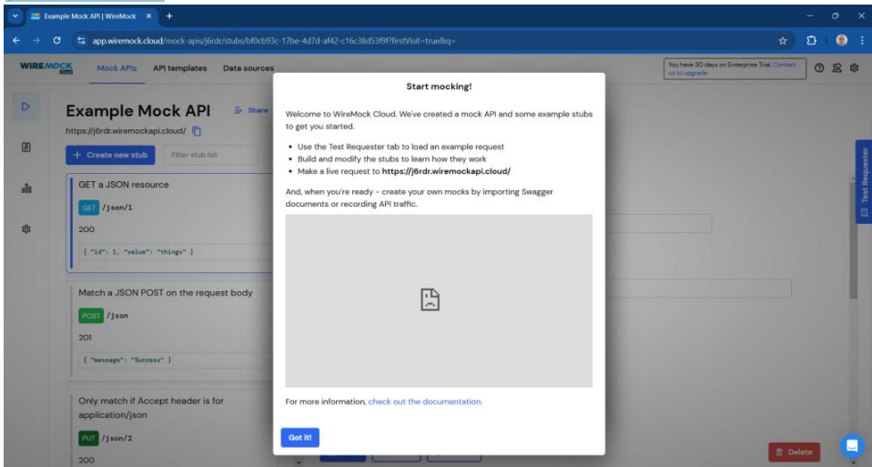
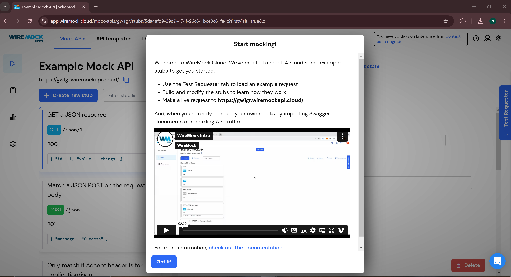
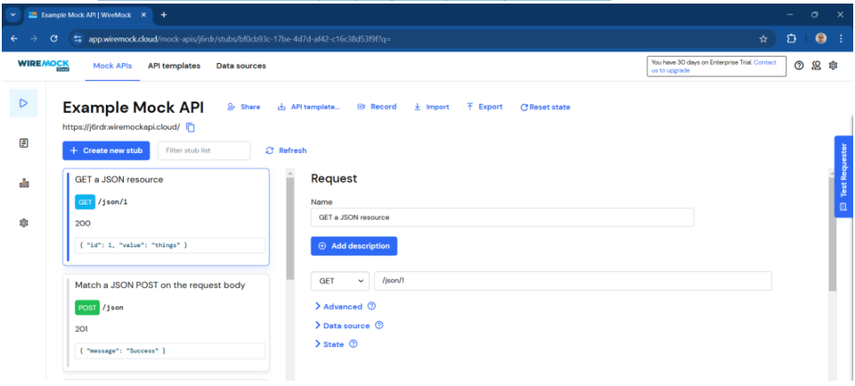
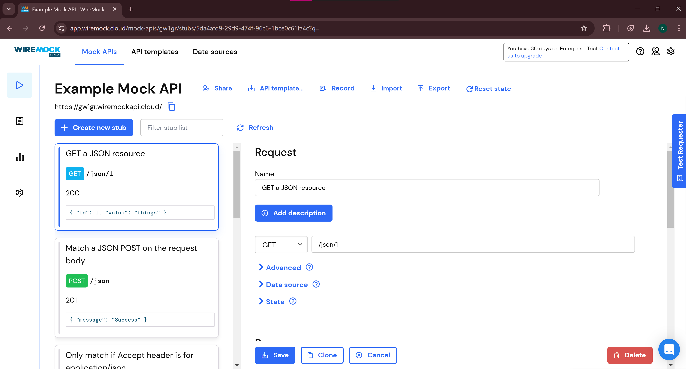
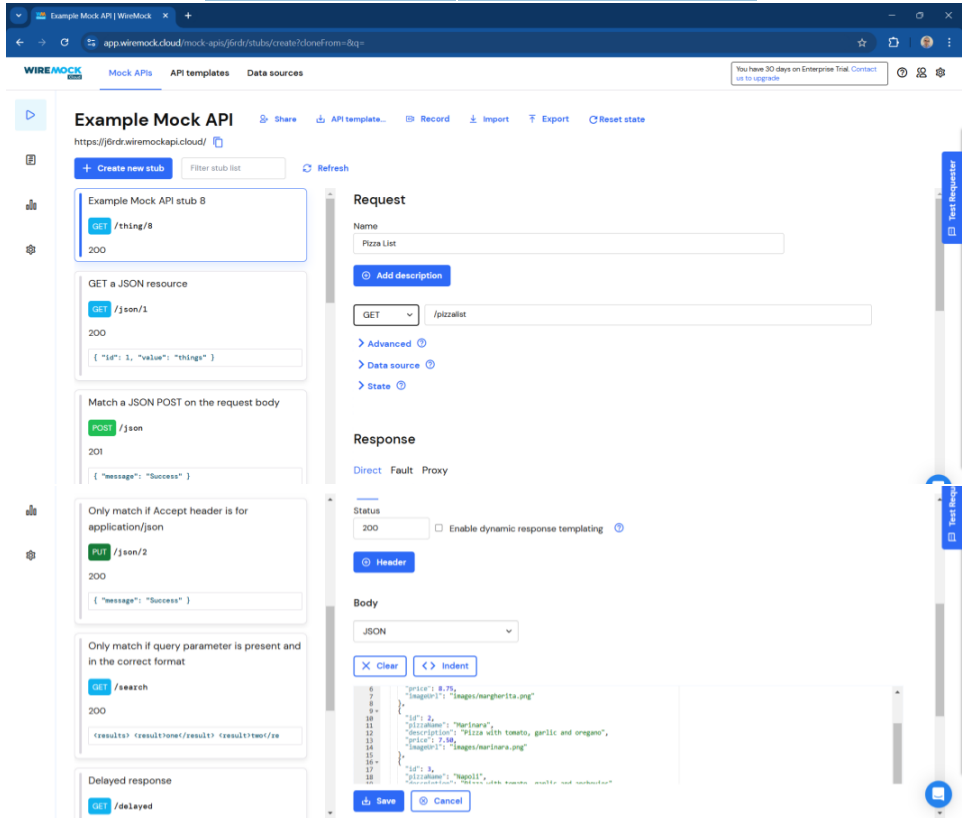
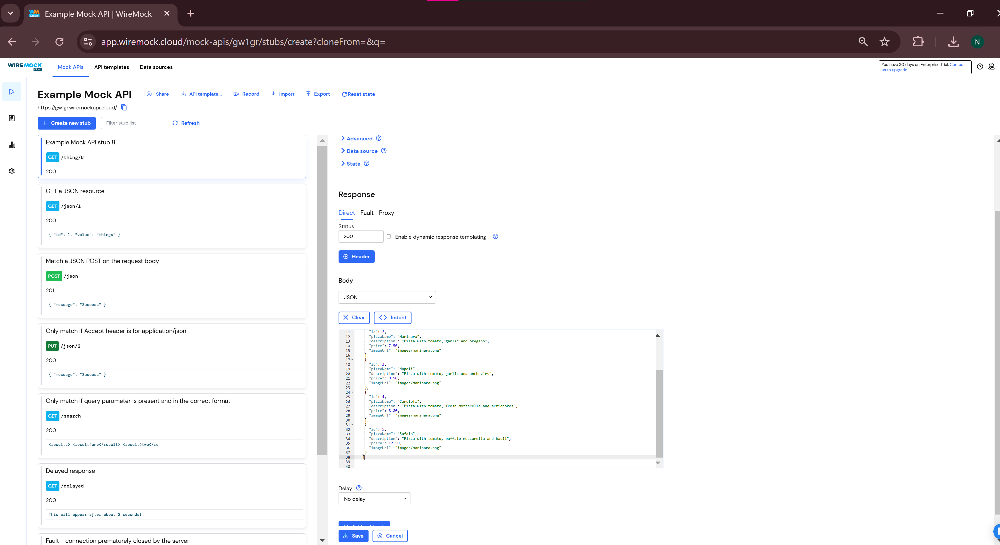
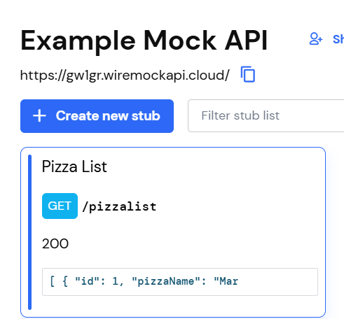
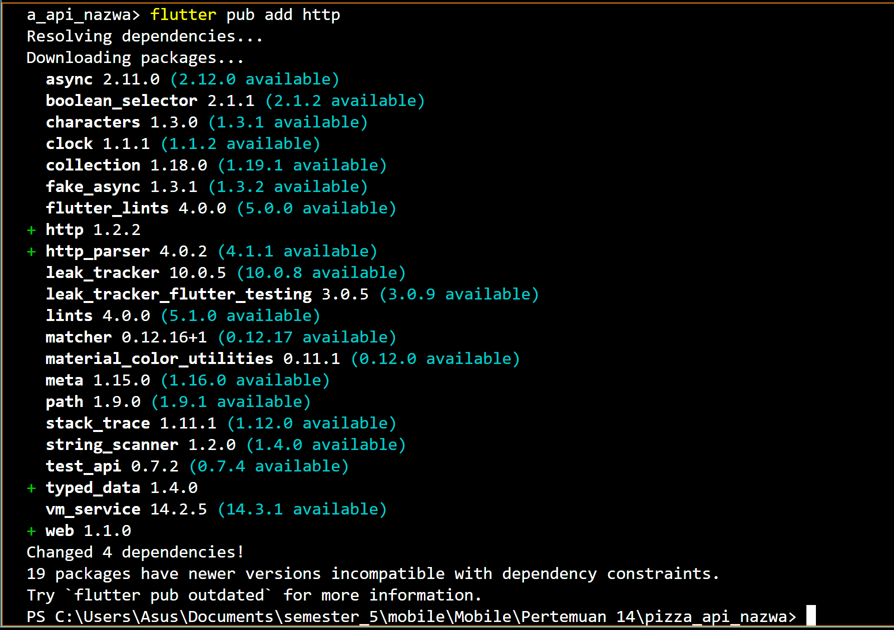
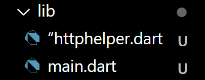
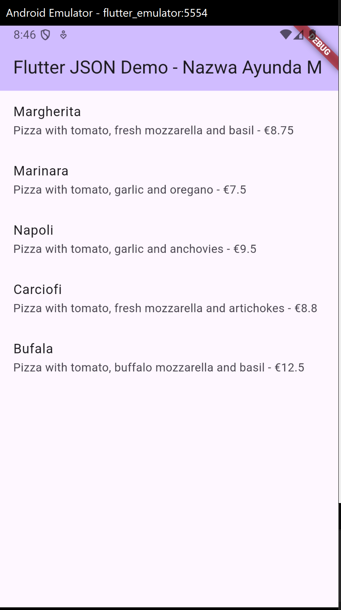

**Laporan Praktikum**
# **Pertemuan 13**
### **RESTFUL API**
------

### **Data Mahasiswa**

<table>
<tr>
    <th>Nama</th>
    <td>Nazwa Ayunda Mirrohillah</td>
  </tr>
  <tr>
    <th>NIM</th>
    <td>2241720013</td>
  </tr>
  <tr>
    <th>Kelas/Absn</th>
    <td>3C/20</td>
  </tr>
</table>

<br>

# Praktikum 1: Designing an HTTP client and getting data

Sebagian besar aplikasi seluler mengandalkan data yang berasal dari sumber eksternal.
Pikirkan aplikasi untuk membaca buku, menonton film, berbagi gambar dengan teman,
membaca berita, atau menulis email: semua aplikasi ini menggunakan data yang diambil dari
sumber eksternal. Ketika sebuah aplikasi menggunakan data eksternal, biasanya, ada layanan
backend yang menyediakan data tersebut untuk aplikasi: layanan web atau API web. Yang
terjadi adalah aplikasi Anda (frontend atau klien) terhubung ke layanan web melalui HTTP dan
meminta sejumlah data. Layanan backend kemudian merespons dengan mengirimkan data ke
aplikasi, biasanya dalam format JSON atau XML.
Untuk praktikum kali ini, kita akan membuat aplikasi yang membaca dan menulis data dari
layanan web. Karena membuat API web berada di luar cakupan buku ini, kita akan
menggunakan layanan yang tersedia, yang disebut Wire Mock Cloud, yang akan
mensimulasikan perilaku layanan web yang sebenarnya, tetapi akan sangat mudah disiapkan
dan digunakan.

### Langkah 1: Mendaftarlah ke layanan Lab Mock di https://app.wiremock.cloud/. Bisa anda gunakan akun google untuk mendaftar. Jika berhasil bendaftar dan login, akan muncul seperti gambar berikut.



**Jawab :**


### Langkah 2: Di halaman dahsboard, klik menu Stubs, kemudian klik entri pertama yaitu “GET a JSON resource”. Anda akan melihat layar yang mirip dengan berikut.



**Jawab :**



### Langkah 3: . Klik “Create new stub”. Di kolom sebelah kanan, lengkapi data berikut. Namanya adalah“Pizza List”, kemudian pilih GET dan isi dengan “/pizzalist”. Kemudian, pada bagian Response, untuk status 200, kemudian pada Body pilih JSON sebagai formatnya dan isi konten JSON dari https://bit.ly/pizzalist. Perhatikan gambar berikut.



**Jawab :**


### Langkah 4: Tekan tombol SAVE di bagian bawah halaman untuk menyimpan Mock ini. Jika berhasil tersimpan, maka Mock API sudah siap digunakan.




### Langkah 5: Tambah method `getColors()` Buatlah project flutter baru dengan nama pizza_api_nama_anda, tambahkan depedensi “http” melalui terminal.

``` dart
flutter pub add http
```


### Langkah 6: DI folder “lib” project anda, tambahkan file dengan nama “httphelper.dart”.



### Langkah 7: . Isi httphelper.dart dengan kode berikut. Ubah “02z2g.mocklab.io” dengan URL Mock API anda.

```dart
import 'dart:convert';
import 'dart:io';

import 'package:pizza_api_nazwa/models/pizza.dart';
import 'package:http/http.dart' as http;

class HttpHelper {
  final String authority = 'gw1gr.wiremockapi.cloud'; // Hanya nama domain
  final String path = 'pizzalist'; // Path API

  Future<List<Pizza>> getPizzaList() async {
    final Uri url = Uri.https(authority, path); // URL yang benar
    final http.Response response = await http.get(url);

    if (response.statusCode == HttpStatus.ok) {
      final jsonResponse = json.decode(response.body);
      List<Pizza> pizzas =
          (jsonResponse as List).map<Pizza>((json) => Pizza.fromJson(json)).toList();
      return pizzas;
    } else {
      return [];
    }
  }
}
```

### Langkah 8: Di file “main.dart”, di class _ MyHomePageState, tambahkan metode bernama “callPizzas”. Metode ini mengembalikan sebuah Future dari daftar objek Pizza dengan memanggil metode getPizzaList dari kelas HttpHelper, dengan kode sebagai berikut:

``` dart
 Future<List<Pizza>> callPizzas() async {
    HttpHelper httpHelper = HttpHelper();
    List<Pizza> pizzas = await httpHelper.getPizzaList();
    return pizzas;
  }

```

### Langkah 9: Pada metode build di class _MyHomePageState, di dalam body Scaffold, tambahkan FutureBuilder yang membuat ListView dari widget ListTile yang berisi objek Pizza:

``` dart
 import 'package:flutter/material.dart';
import 'package:pizza_api_nazwa/httphelper.dart';
import 'package:pizza_api_nazwa/models/pizza.dart';
// import 'package:pizza_api_nazwa/pizza_detail.dart';

void main() => runApp(const MyApp());

class MyApp extends StatelessWidget {
  const MyApp({Key? key}) : super(key: key);

  @override
  Widget build(BuildContext context) {
    return MaterialApp(
      title: 'Flutter JSON Demo - Nazwa Ayunda M',
      theme: ThemeData(
        primarySwatch: Colors.deepPurple,
      ),
      home: const MyHomePage(title: 'Flutter JSON Demo - Nazwa Ayunda M'),
    );
  }
}

class MyHomePage extends StatefulWidget {
  const MyHomePage({super.key, required this.title});

  
  final String title;

  @override
  State<MyHomePage> createState() => _MyHomePageState();
}

class _MyHomePageState extends State<MyHomePage> {
  int _counter = 0;

  void _incrementCounter() {
    setState(() {
  
      _counter++;
    });
  }

  @override
  Widget build(BuildContext context) {

    return Scaffold(
      appBar: AppBar(
      
        backgroundColor: Theme.of(context).colorScheme.inversePrimary,
        
        title: Text(widget.title),
      ),
      body: FutureBuilder(
          future: callPizzas(),
          builder: (BuildContext context, AsyncSnapshot<List<Pizza>> snapshot) {
            if (snapshot.hasError) {
              return const Text('Something went wrong');
            }
            if (!snapshot.hasData) {
              return const Center(child: CircularProgressIndicator());
            }
            return ListView.builder(
              itemCount: (snapshot.data == null) ? 0 : snapshot.data!.length,
              itemBuilder: (BuildContext context, int index) {
                return ListTile(
                  title: Text(snapshot.data![index].pizzaName),
                  subtitle: Text(snapshot.data![index].description + ' - €' + snapshot.data![index].price.toString()),
                );
              },
            );
          },
      ) // This trailing comma makes auto-formatting nicer for build methods.
    );
  }

  Future<List<Pizza>> callPizzas() async {
    HttpHelper httpHelper = HttpHelper();
    List<Pizza> pizzas = await httpHelper.getPizzaList();
    return pizzas;
  }
}
```

### Langkah 10:Jalankan aplikasi. Anda akan melihat layar yang mirip dengan berikut ini:

``` dart

```
