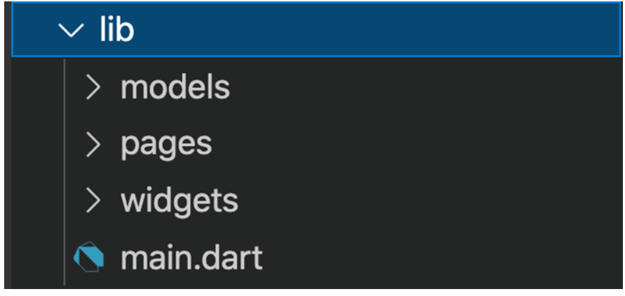
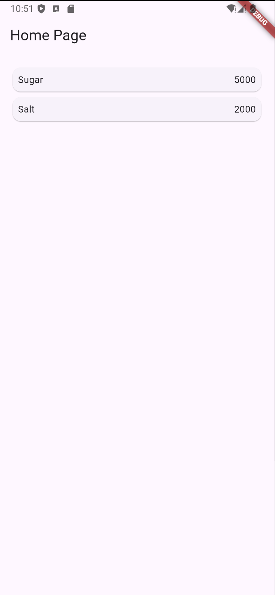
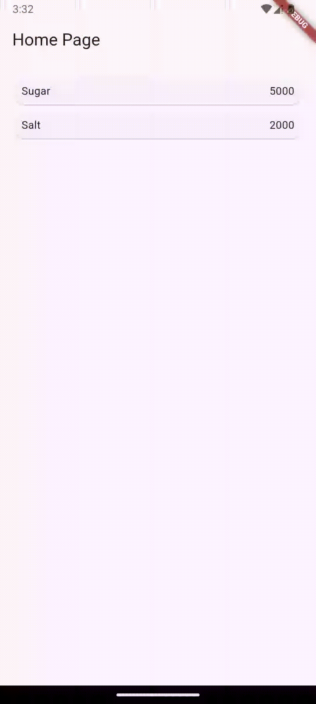

# Laporan Praktikum Mobile JS 6 (Prak 5 & Tugas)
<table>
<tr>
    <th>Nama</th>
    <td>Nazwa Ayunda Mirrohillah</td>
  </tr>
  <tr>
    <th>NIM</th>
    <td>2241720013</td>
  </tr>
  <tr>
    <th>Kelas/Absn</th>
    <td>3C/20</td>
  </tr>
</table>

# Praktikum 5: Membangun Navigasi di Flutter
## Langkah 1: Siapkan project baru
Sebelum melanjutkan praktikum, buatlah sebuah project baru Flutter dengan nama belanja dan susunan folder seperti pada gambar berikut. Penyusunan ini dimaksudkan untuk mengorganisasi kode dan widget yang lebih mudah.

 

## Langkah 2: Mendefinisikan Route
Buatlah dua buah file dart dengan nama home_page.dart dan item_page.dart pada folder pages. Untuk masing-masing file, deklarasikan class HomePage pada file home_page.dart dan ItemPage pada item_page.dart. Turunkan class dari StatelessWidget. Gambaran potongan kode dapat anda lihat sebagai berikut.

- Buat dua file di folder pages:
> home_page.dart:
```dart
import 'package:flutter/material.dart';
import 'package:belanja/models/item.dart';

class HomePage extends StatelessWidget {
  @override
  Widget build(BuildContext context) {
    //TODO: implement build
    throw UnimplementedError();
  }
}
```
> item_page.dart:
```dart
import 'package:flutter/material.dart';

class ItemPage extends StatelessWidget {
  const ItemPage({super.key});

  @override
  Widget build(BuildContext context) {
    //TODO: implement build
    throw UnimplementedError();
  }
}
```

## Langkah 3: Lengkapi Kode di main.dart
Setelah kedua halaman telah dibuat dan didefinisikan, bukalah file main.dart. Pada langkah ini anda akan mendefinisikan Route untuk kedua halaman tersebut. Definisi penamaan route harus bersifat unique. Halaman HomePage didefinisikan sebagai /. Dan halaman ItemPage didefinisikan sebagai /item. Untuk mendefinisikan halaman awal, anda dapat menggunakan named argument initialRoute. Gambaran tahapan ini, dapat anda lihat pada potongan kode berikut.
- Pada file main.dart, tambahkan kode berikut untuk mendefinisikan route:
```dart
import 'package:flutter/material.dart';
import 'package:belanja/pages/home_page.dart';
import 'package:belanja/pages/item_page.dart';

void main() {
  runApp(MaterialApp(
    initialRoute: '/',
    routes: {
      '/': (context) => HomePage(),
      '/item': (context) => const ItemPage(),
    },
  ));
}
```
## Langkah 4: Membuat data model
Sebelum melakukan perpindahan halaman dari HomePage ke ItemPage, dibutuhkan proses pemodelan data. Pada desain mockup, dibutuhkan dua informasi yaitu nama dan harga. Untuk menangani hal ini, buatlah sebuah file dengan nama item.dart dan letakkan pada folder models. Pada file ini didefinisikan pemodelan data yang dibutuhkan. Ilustrasi kode yang dibutuhkan, dapat anda lihat pada potongan kode berikut.
- Buat file item.dart di folder models untuk mendefinisikan model data Item:
```dart
class Item {
  String name;
  int price;

  Item({required this.name, required this.price});
}
```

## Langkah 5: Lengkapi kode di class HomePage
Pada halaman HomePage terdapat ListView widget. Sumber data ListView diambil dari model List dari object Item. Gambaran kode yang dibutuhkan untuk melakukan definisi model dapat anda lihat sebagai berikut.
- Di home_page.dart, tambahkan daftar item yang akan ditampilkan dalam ListView:
```dart
class HomePage extends StatelessWidget {
  final List<Item> items = [
    Item(name: 'Sugar', price: 5000),
    Item(name: 'Salt', price: 2000),
  ];

```

## Langkah 6: Membuat ListView dan itemBuilder
Untuk menampilkan ListView pada praktikum ini digunakan itemBuilder. Data diambil dari definisi model yang telah dibuat sebelumnya. Untuk menunjukkan batas data satu dan berikutnya digunakan widget Card. Kode yang telah umum pada bagian ini tidak ditampilkan. Gambaran kode yang dibutuhkan dapat anda lihat sebagai berikut.
- Melanjutkan langkah lima (tetap di home_page.dart)
```dart
@override
  Widget build(BuildContext context) {
    return Scaffold(
      appBar: AppBar(
        title: const Text('Home Page'),
      ),
      body: Container(
        margin: const EdgeInsets.all(8),
        child: ListView.builder(
          padding: const EdgeInsets.all(8),
          itemCount: items.length,
          itemBuilder: (context, index) {
            final item = items[index];
            return Card(
              child: Container(
                margin: const EdgeInsets.all(8),
                child: Row(
                  children: [
                    Expanded(child: Text(item.name)),
                    Expanded(
                      child: Text(
                        item.price.toString(),
                        textAlign: TextAlign.end,
                      ),
                    ),
                  ],
                ),
              ),
            );
          },
        ),
      ),
    );
  }
}
```
## Hasil
Jalankan aplikasi pada emulator atau pada device anda.
 

## Langkah 7: Menambahkan aksi pada ListView
Item pada ListView saat ini ketika ditekan masih belum memberikan aksi tertentu. Untuk menambahkan aksi pada ListView dapat digunakan widget InkWell atau GestureDetector. Perbedaan utamanya InkWell merupakan material widget yang memberikan efek ketika ditekan. Sedangkan GestureDetector bersifat umum dan bisa juga digunakan untuk gesture lain selain sentuhan. Pada praktikum ini akan digunakan widget InkWell.

Untuk menambahkan sentuhan, letakkan cursor pada widget pembuka Card. Kemudian gunakan shortcut quick fix dari VSCode (Ctrl + . pada Windows atau Cmd + . pada MacOS). Sorot menu wrap with widget... Ubah nilai widget menjadi InkWell serta tambahkan named argument onTap yang berisi fungsi untuk berpindah ke halaman ItemPage. Ilustrasi potongan kode dapat anda lihat pada potongan berikut.
> home_page.dart
```dart
import 'package:flutter/material.dart';
import 'package:belanja/models/item.dart';
import 'package:belanja/pages/item_page.dart';

class HomePage extends StatelessWidget {
  final List<Item> items = [
    Item(name: 'Sugar', price: 5000),
    Item(name: 'Salt', price: 2000),
  ];

  @override
  Widget build(BuildContext context) {
    return Scaffold(
      appBar: AppBar(
        title: const Text('Home Page'),
      ),
      body: Container(
        margin: const EdgeInsets.all(8),
        child: ListView.builder(
          padding: const EdgeInsets.all(8),
          itemCount: items.length,
          itemBuilder: (context, index) {
            final item = items[index];
            return InkWell(
              onTap: () {
                Navigator.push(
                  context,
                  MaterialPageRoute(
                    builder: (context) => ItemPage(item: item), // Kirim item yang dipilih ke ItemPage
                  ),
                );
              },
              child: Card(
                child: Container(
                  margin: const EdgeInsets.all(8),
                  child: Row(
                    children: [
                      Expanded(child: Text(item.name)),
                      Expanded(
                        child: Text(
                          item.price.toString(),
                          textAlign: TextAlign.end,
                        ),
                      ),
                    ],
                  ),
                ),
              ),
            );
          },
        ),
      ),
    );
  }
}
```

> item_page.dart
```dart 
import 'package:flutter/material.dart';
import 'package:belanja/models/item.dart';

class ItemPage extends StatelessWidget {
  final Item item; // Menerima data item

  const ItemPage({super.key, required this.item});

  @override
  Widget build(BuildContext context) {
    return Scaffold(
      appBar: AppBar(
        title: Text(item.name), // Menampilkan nama item di AppBar
      ),
      body: Center(
        child: Card(
          margin: const EdgeInsets.all(16.0),
          elevation: 5, // Memberikan efek bayangan pada card
          shape: RoundedRectangleBorder(
            borderRadius: BorderRadius.circular(15),
          ),
          child: Padding(
            padding: const EdgeInsets.all(20.0),
            child: Column(
              mainAxisSize: MainAxisSize.min, // Agar ukuran kolom menyesuaikan konten
              crossAxisAlignment: CrossAxisAlignment.center, // Posisikan di tengah
              children: [
                Text(
                  item.name,
                  style: const TextStyle(
                    fontSize: 28,
                    fontWeight: FontWeight.bold,
                    color: Colors.blue,
                  ),
                  textAlign: TextAlign.center, // Teks di tengah
                ),
                const SizedBox(height: 16), // Jarak antar elemen
                Text(
                  'Price: \$${item.price}',
                  style: const TextStyle(
                    fontSize: 24,
                    color: Colors.grey,
                  ),
                  textAlign: TextAlign.center,
                ),
                const SizedBox(height: 20),
                ElevatedButton(
                  onPressed: () {
                    Navigator.pop(context); // Kembali ke halaman sebelumnya
                  },
                  child: const Text('Back'),
                  style: ElevatedButton.styleFrom(
                    padding: const EdgeInsets.symmetric(horizontal: 24, vertical: 12),
                    textStyle: const TextStyle(fontSize: 18),
                  ),
                ),
              ],
            ),
          ),
        ),
      ),
    );
  }
}
```

> main.dart
```dart
import 'package:flutter/material.dart';
import 'package:belanja/pages/home_page.dart';

void main() {
  runApp(MaterialApp(
    initialRoute: '/',
    routes: {
      '/': (context) => HomePage(),
    },
  ));
}
```

## Hasil
Jalankan aplikasi pada emulator atau pada device anda.
 </br>

# Tugas Praktikum 2

1. Untuk melakukan pengiriman data ke halaman berikutnya, cukup menambahkan informasi arguments pada penggunaan Navigator. Perbarui kode pada bagian Navigator menjadi seperti berikut.
```dart
Navigator.pushNamed(context, '/item', arguments: item);
```
2. Pembacaan nilai yang dikirimkan pada halaman sebelumnya dapat dilakukan menggunakan ModalRoute. Tambahkan kode berikut pada blok fungsi build dalam halaman ItemPage. Setelah nilai didapatkan, anda dapat menggunakannya seperti penggunaan variabel pada umumnya. (https://docs.flutter.dev/cookbook/navigation/navigate-with-arguments)
```dart
final itemArgs = ModalRoute.of(context)!.settings.arguments as Item;
```
3. Pada hasil akhir dari aplikasi belanja yang telah anda selesaikan, tambahkan atribut foto produk, stok, dan rating. Ubahlah tampilan menjadi GridView seperti di aplikasi marketplace pada umumnya.
4. Silakan implementasikan Hero widget pada aplikasi belanja Anda dengan mempelajari dari sumber ini: https://docs.flutter.dev/cookbook/navigation/hero-animations
5. Sesuaikan dan modifikasi tampilan sehingga menjadi aplikasi yang menarik. Selain itu, pecah widget menjadi kode yang lebih kecil. Tambahkan Nama dan NIM di footer aplikasi belanja Anda.
6. Selesaikan Praktikum 5: Navigasi dan Rute tersebut. Cobalah modifikasi menggunakan plugin go_router, lalu dokumentasikan dan push ke repository Anda berupa screenshot setiap hasil pekerjaan beserta penjelasannya di file README.md. Kumpulkan link commit repository GitHub Anda kepada dosen yang telah disepakati!

JAWAB :

> models/item.dart
```dart
class Item {
  String name;
  int price;
  String img;
  int stock;
  int rating;
  String author;
  int pages;
  String lang;

  Item({
    required this.name, 
    required this.price,
    required this.img,
    required this.stock,
    required this.rating,
    required this.author,
    required this.pages,
    required this.lang,
    });
}
```

> pages/home_page.dart
```dart
import 'package:flutter/material.dart';
import 'package:belanja/models/item.dart';

class HomePage extends StatelessWidget {
  final List<Item> items = [
    Item(
      name: 'As Long As The Lemon Trees Grow',
      price: 178000,
      img: 'assets/LemonTrees.jpg',
      stock: 20,
      rating: 5,
      author: 'Zoulfa Katouh',
      pages: 399,
      lang: 'English',
    ),
    Item(
      name: 'If You Could See The Sun',
      price: 165000,
      img: 'assets/SeeTheSun.jpg',
      stock: 10,
      rating: 3,
      author: 'Ann Liang',
      pages: 320,
      lang: 'English',
    ),
    Item(
      name: 'Keajaiban Toko Kelontong Namiya',
      price: 98000,
      img: 'assets/Namiya.jpg',
      stock: 10,
      rating: 5,
      author: 'Keigo Higashino',
      pages: 350,
      lang: 'Indonesia',
    ),
    Item(
      name: 'Laut Bercerita',
      price: 110000,
      img: 'assets/LautBercerita.jpg',
      stock: 3,
      rating: 5,
      author: 'Leila S. Chudori',
      pages: 410,
      lang: 'Indonesia',
    ),
    Item(
      name: 'Gadis Kretek',
      price: 110000,
      img: 'assets/GadisKretek.jpg',
      stock: 12,
      rating: 5,
      author: 'Ratih Kumala',
      pages: 343,
      lang: 'Indonesia',
    ),
  ];

  HomePage({super.key});

  @override
  Widget build(BuildContext context) {
    // Mendapatkan ukuran layar
    var screenWidth = MediaQuery.of(context).size.width;

    // Tentukan jumlah kolom berdasarkan lebar layar
    int crossAxisCount = screenWidth > 600 ? 3 : 2;

    return Scaffold(
      appBar: AppBar(
        title: const Text('Books Shelf Shopping'),
        backgroundColor: Colors.blue.shade900,
      ),
      bottomNavigationBar: BottomAppBar(
        color: Colors.blue.shade900,
        height: 45,
        child: const Row(
          children: [
            Padding(padding: EdgeInsets.all(8.0)),
            Text(
            'Nazwa Ayunda M                                   (2141720013)',
              style: TextStyle(
                fontWeight: FontWeight.w500,
                color: Colors.white,
              ),
              textAlign: TextAlign.left,
            ),
          ],
        ),
      ),
      body: Container(
        margin: const EdgeInsets.all(8),
        child: GridView.builder(
          gridDelegate: SliverGridDelegateWithFixedCrossAxisCount(
            crossAxisCount: crossAxisCount, // Jumlah kolom disesuaikan
            crossAxisSpacing: 16.0, // Tambahkan jarak antara kolom
            mainAxisSpacing: 16.0,  // Tambahkan jarak antara baris
            childAspectRatio: 0.65,  // Mengatur proporsi tampilan item
          ),
          itemCount: items.length,
          itemBuilder: (context, index) {
            final item = items[index];
            return InkWell(
              onTap: () {
                Navigator.pushNamed(context, '/item', arguments: item);
              },
              child: Card(
                elevation: 4,
                shape: RoundedRectangleBorder(
                  borderRadius: BorderRadius.circular(16),
                ),
                child: Container(
                  padding: const EdgeInsets.all(12),
                  decoration: BoxDecoration(
                    borderRadius: BorderRadius.circular(16),
                    color: Colors.white,
                    boxShadow: [
                      BoxShadow(
                        color: Colors.grey.withOpacity(0.2),
                        spreadRadius: 1,
                        blurRadius: 8,
                        offset: const Offset(0, 4),
                      ),
                    ],
                  ),
                  child: Column(
                    crossAxisAlignment: CrossAxisAlignment.start,
                    children: [
                      Expanded(
                        child: Center(
                          child: Hero(
                            tag: item.img.toString(),
                            child: ClipRRect(
                              borderRadius: BorderRadius.circular(8),
                              child: Image.asset(
                                item.img.toString(),
                                fit: BoxFit.cover,
                              ),
                            ),
                          ),
                        ),
                      ),
                      const SizedBox(height: 8),
                      Text(
                        item.name,
                        style: const TextStyle(
                          fontWeight: FontWeight.bold,
                          fontSize: 16,
                        ),
                        textAlign: TextAlign.center,
                      ),
                      const SizedBox(height: 4),
                      Text(
                        'by ${item.author}',
                        style: TextStyle(
                          fontSize: 12,
                          color: Colors.grey.shade600,
                        ),
                      ),
                      const SizedBox(height: 8),
                      Row(
                        mainAxisAlignment: MainAxisAlignment.spaceBetween,
                        children: [
                          Text(
                            'Rp${item.price.toString()},00',
                            style: const TextStyle(
                              fontSize: 14,
                              fontWeight: FontWeight.bold,
                              color: Colors.blueAccent,
                            ),
                          ),
                          Text(
                            'Stock: ${item.stock.toString()}',
                            style: const TextStyle(
                              fontSize: 12,
                              color: Colors.redAccent,
                            ),
                          ),
                        ],
                      ),
                      const SizedBox(height: 8),
                      Row(
                        children: List.generate(5, (i) {
                          return Icon(
                            Icons.star,
                            size: 16,
                            color: i < item.rating ? Colors.yellow : Colors.grey.shade300,
                          );
                        }),
                      ),
                    ],
                  ),
                ),
              ),
            );
          },
        ),
      ),
    );
  }
}
```

> pages/item_page.dart
```dart
import 'package:flutter/material.dart';
import 'package:belanja/models/item.dart';

class ItemPage extends StatelessWidget {
  const ItemPage({super.key});

  @override
  Widget build(BuildContext context) {
    final Item item = ModalRoute.of(context)!.settings.arguments as Item;

    return Scaffold(
      appBar: AppBar(
        title: Text(item.name),
        backgroundColor: Colors.blue.shade900,
      ),
      body: GestureDetector(
        onTap: () {
          Navigator.pop(context);
        },
        child: SingleChildScrollView(
          // Tambahkan SingleChildScrollView agar bisa di scroll
          child: Card(
            child: Column(
              children: [
                Container(
                  margin: const EdgeInsets.all(8.0),
                  child: Row(
                    crossAxisAlignment: CrossAxisAlignment.start,
                    children: [
                      SizedBox(
                        width: 200,
                        child: Column(
                          children: [
                            Align(
                              alignment: Alignment.centerLeft,
                              child: Hero(
                                tag: item.img.toString(),
                                child: Image.asset(
                                  item.img.toString(),
                                  width: 200,
                                  height: 300,
                                ),
                              ),
                            ),
                          ],
                        ),
                      ),
                      Flexible(
                        child: Container(
                          padding: const EdgeInsets.only(left: 30),
                          child: Column(
                            crossAxisAlignment: CrossAxisAlignment.start,
                            children: [
                              Text(
                                item.name,
                                style: TextStyle(
                                  fontWeight: FontWeight.bold,
                                  fontSize: 15,
                                  color: Colors.blue.shade900,
                                ),
                                textAlign: TextAlign.left,
                              ),
                              const SizedBox(height: 30),
                              Text(item.author),
                              const SizedBox(height: 5),
                              Text(item.lang),
                              const SizedBox(height: 5),
                              Text('${item.pages} pages'),
                              const SizedBox(height: 30),
                              Row(
                                children: [
                                  const Text('Stok : '),
                                  Text(item.stock.toString()),
                                ],
                              ),
                              const SizedBox(height: 5),
                              Row(
                                children: [
                                  for (int i = 0; i < 5; i++)
                                    (i < item.rating)
                                        ? const Icon(
                                            Icons.star,
                                            size: 15,
                                            color: Colors.amber,
                                          )
                                        : const Icon(
                                            Icons.star,
                                            size: 15,
                                            color: Colors.black,
                                          ),
                                  const Padding(padding: EdgeInsets.all(3.0)),
                                  Text(item.rating.toString()),
                                ],
                              ),
                              const SizedBox(height: 10),
                              ElevatedButton(
                                onPressed: () {
                                  Navigator.pop(context);
                                },
                                style: ElevatedButton.styleFrom(
                                  backgroundColor:
                                      Colors.blue.shade900, // Warna tombol
                                ),
                                child: Text(
                                  'Purchase for Rp${item.price}',
                                  style: const TextStyle(
                                    color: Colors
                                        .white, // Warna teks menjadi putih
                                  ),
                                ),
                              ),
                            ],
                          ),
                        ),
                      ),
                    ],
                  ),
                ),
              ],
            ),
          ),
        ),
      ),
    );
  }
}
```

> main.dart
```dart
import 'package:flutter/material.dart';
import 'package:belanja/pages/home_page.dart';
import 'package:belanja/pages/item_page.dart';

void main() {
  //runApp(const MyApp());
  runApp(MaterialApp(
    initialRoute: '/',
    routes: {
      '/': (context) => HomePage(),
      '/item': (context) => const ItemPage(),
    },
  ));
}

class MyApp extends StatelessWidget {
  const MyApp({super.key});

  // This widget is the root of your application.
  @override
  Widget build(BuildContext context) {
    return MaterialApp(
      title: 'Flutter Demo',
      theme: ThemeData(
        colorScheme: ColorScheme.fromSeed(seedColor: Colors.deepPurple),
        useMaterial3: true,
      ),
      home: const MyHomePage(title: 'Flutter Demo Home Page'),
    );
  }
}

class MyHomePage extends StatefulWidget {
  const MyHomePage({super.key, required this.title});

  // This widget is the home page of your application. It is stateful, meaning
  // that it has a State object (defined below) that contains fields that affect
  // how it looks.

  // This class is the configuration for the state. It holds the values (in this
  // case the title) provided by the parent (in this case the App widget) and
  // used by the build method of the State. Fields in a Widget subclass are
  // always marked "final".

  final String title;

  @override
  State<MyHomePage> createState() => _MyHomePageState();
}

class _MyHomePageState extends State<MyHomePage> {
  int _counter = 0;

  void _incrementCounter() {
    setState(() {
      // This call to setState tells the Flutter framework that something has
      // changed in this State, which causes it to rerun the build method below
      // so that the display can reflect the updated values. If we changed
      // _counter without calling setState(), then the build method would not be
      // called again, and so nothing would appear to happen.
      _counter++;
    });
  }

  @override
  Widget build(BuildContext context) {
    // This method is rerun every time setState is called, for instance as done
    // by the _incrementCounter method above.
    //
    // The Flutter framework has been optimized to make rerunning build methods
    // fast, so that you can just rebuild anything that needs updating rather
    // than having to individually change instances of widgets.
    return Scaffold(
      appBar: AppBar(
        // TRY THIS: Try changing the color here to a specific color (to
        // Colors.amber, perhaps?) and trigger a hot reload to see the AppBar
        // change color while the other colors stay the same.
        backgroundColor: Theme.of(context).colorScheme.inversePrimary,
        // Here we take the value from the MyHomePage object that was created by
        // the App.build method, and use it to set our appbar title.
        title: Text(widget.title),
      ),
      body: Center(
        // Center is a layout widget. It takes a single child and positions it
        // in the middle of the parent.
        child: Column(
          // Column is also a layout widget. It takes a list of children and
          // arranges them vertically. By default, it sizes itself to fit its
          // children horizontally, and tries to be as tall as its parent.
          //
          // Column has various properties to control how it sizes itself and
          // how it positions its children. Here we use mainAxisAlignment to
          // center the children vertically; the main axis here is the vertical
          // axis because Columns are vertical (the cross axis would be
          // horizontal).
          //
          // TRY THIS: Invoke "debug painting" (choose the "Toggle Debug Paint"
          // action in the IDE, or press "p" in the console), to see the
          // wireframe for each widget.
          mainAxisAlignment: MainAxisAlignment.center,
          children: <Widget>[
            const Text(
              'You have pushed the button this many times:',
            ),
            Text(
              '$_counter',
              style: Theme.of(context).textTheme.headlineMedium,
            ),
          ],
        ),
      ),
      floatingActionButton: FloatingActionButton(
        onPressed: _incrementCounter,
        tooltip: 'Increment',
        child: const Icon(Icons.add),
      ), // This trailing comma makes auto-formatting nicer for build methods.
    );
  }
}
```

- HASIL TUGAS
 </br>
