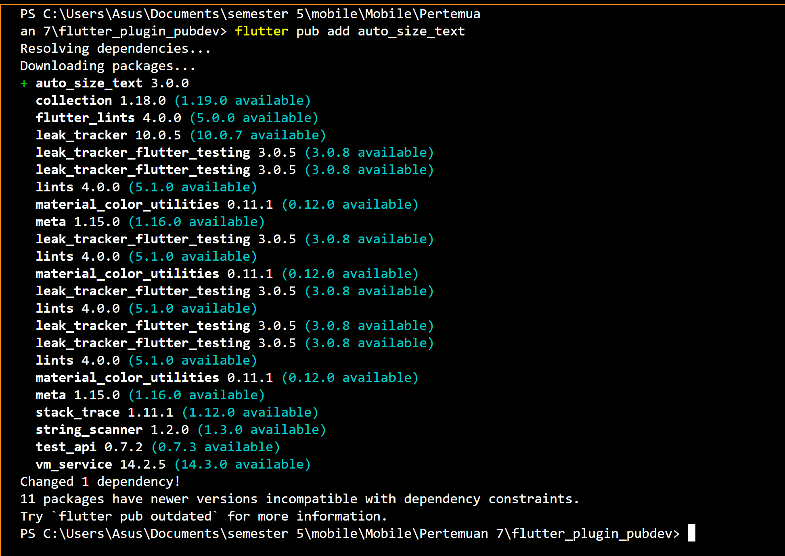
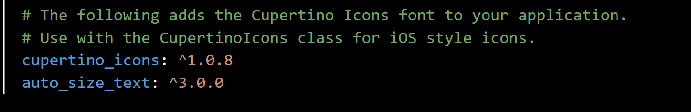
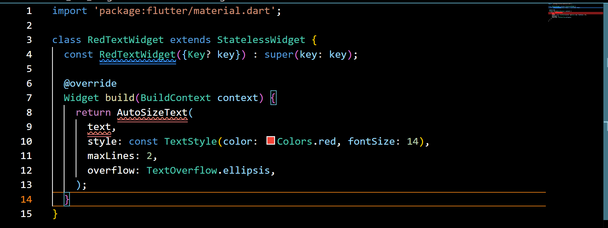
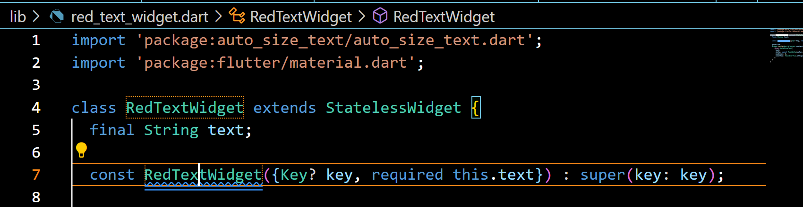
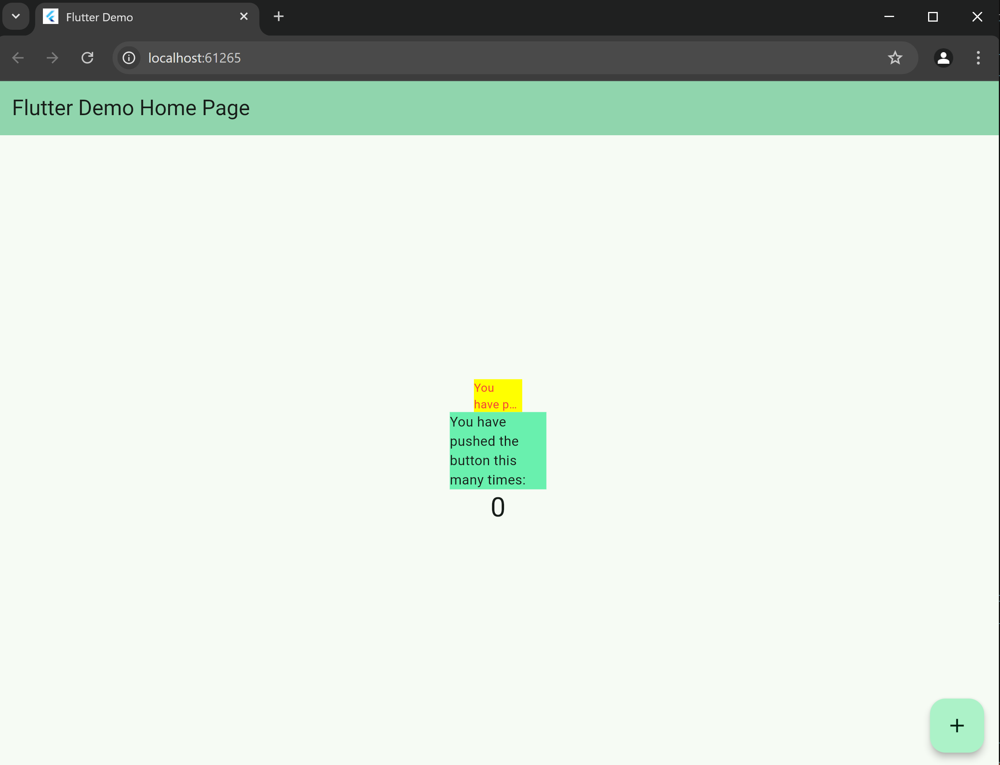
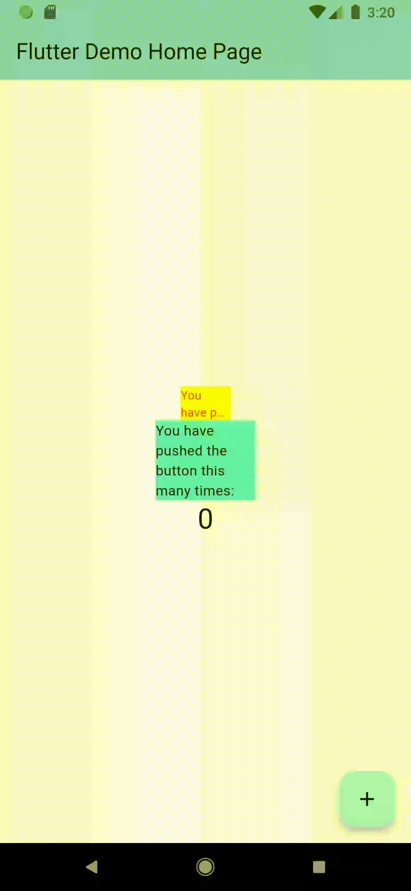
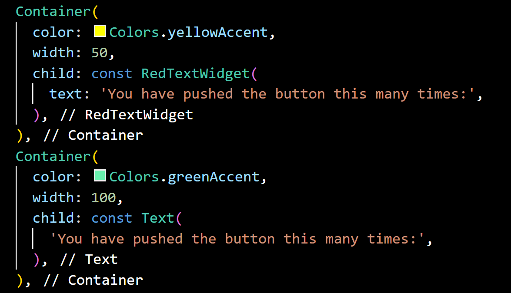

# Laporan Praktikum Mobile JS 7 Manajemen Plugin
<table>
<tr>
    <th>Nama</th>
    <td>Nazwa Ayunda Mirrohillah</td>
  </tr>
  <tr>
    <th>NIM</th>
    <td>2241720013</td>
  </tr>
  <tr>
    <th>Kelas/Absn</th>
    <td>3C/20</td>
  </tr>
</table>

## Praktikum Menerapkan Plugin di Project Flutter

Selesaikan langkah-langkah praktikum berikut ini menggunakan editor Visual Studio Code (VS Code) atau Android Studio atau code editor lain kesukaan Anda.

### **Langkah 1: Buat Project Baru**

Buatlah sebuah project flutter baru dengan nama **flutter_plugin_pubdev**. Lalu jadikan repository di GitHub Anda dengan nama **flutter_plugin_pubdev**.

### **Langkah 2: Menambahkan Plugin**
Tambahkan plugin auto_size_text menggunakan perintah berikut di terminal

```dart
flutter pub add auto_size_text
```



Jika berhasil, maka akan tampil nama plugin beserta versinya di file pubspec.yaml pada bagian dependencies.

**Succes Added**



### **Langkah 3: Buat file red_text_widget.dart**

Buat file baru bernama `red_text_widget.dart` di dalam folder lib lalu isi kode seperti berikut.

```dart
import 'package:flutter/material.dart';

class RedTextWidget extends StatelessWidget {
  const RedTextWidget({Key? key}) : super(key: key);

  @override
  Widget build(BuildContext context) {
    return Container();
  }
}
```

## **Langkah 4: Tambah Widget AutoSizeText**

Masih di file `red_text_widget.dart`, untuk menggunakan plugin `auto_size_text`, ubahlah kode `return Container()` menjadi seperti berikut.

```dart
return AutoSizeText(
      text,
      style: const TextStyle(color: Colors.red, fontSize: 14),
      maxLines: 2,
      overflow: TextOverflow.ellipsis,
);
```



Setelah Anda menambahkan kode di atas, Anda akan mendapatkan info error. Mengapa demikian? Jelaskan dalam laporan praktikum Anda!

**Answer**

The method 'AutoSizeText' isn't defined for the type 'RedTextWidget'.
Try correcting the name to the name of an existing method, or defining a method named 'AutoSizeText'.dartundefined_method

**Description**

Kode diatas eror karena pada file tersebut belum ditambahkan parameter text dalam konstruktor RedTextWidget, yang mana pada widget 'AutoSizeText' tidak mendefinisikan 'text' sebelum digunakan.


## **Langkah 5: Buat Variabel text dan parameter di constructor**

Tambahkan variabel `text` dan parameter di constructor seperti berikut.

```dart
class RedTextWidget extends StatelessWidget {
  final String text;

  const RedTextWidget({Key? key, required this.text}) : super(key: key);
```



## **Langkah 6: Tambahkan widget di main.dart**

Buka file `main.dart` lalu tambahkan di dalam `children:` pada `class _MyHomePageState`

```dart
Container(
   color: Colors.yellowAccent,
   width: 50,
   child: const RedTextWidget(
             text: 'You have pushed the button this many times:',
          ),
),
Container(
    color: Colors.greenAccent,
    width: 100,
    child: const Text(
           'You have pushed the button this many times:',
          ),
),
```

**Kode Lengkap**
```dart
import 'package:flutter/material.dart';
import 'package:flutter_plugin_pubdev/red_text_widget.dart';

void main() {
  runApp(const MyApp());
}

class MyApp extends StatelessWidget {
  const MyApp({super.key});

  // This widget is the root of your application.
  @override
  Widget build(BuildContext context) {
    return MaterialApp(
      title: 'Flutter Demo',
      debugShowCheckedModeBanner: false,
      theme: ThemeData(
        colorScheme: ColorScheme.fromSeed(seedColor: Colors.greenAccent),
        useMaterial3: true,
      ),
      home: const MyHomePage(title: 'Flutter Demo Home Page'),
    );
  }
}

class MyHomePage extends StatefulWidget {
  const MyHomePage({super.key, required this.title});

  final String title;

  @override
  State<MyHomePage> createState() => _MyHomePageState();
}

class _MyHomePageState extends State<MyHomePage> {
  int _counter = 0;

  void _incrementCounter() {
    setState(() {
      _counter++;
    });
  }

  @override
  Widget build(BuildContext context) {
    return Scaffold(
      appBar: AppBar(
        backgroundColor: Theme.of(context).colorScheme.inversePrimary,
        title: Text(widget.title),
      ),
      body: Center(
        child: Column(
          mainAxisAlignment: MainAxisAlignment.center,
          children: <Widget>[
            Container(
              color: Colors.yellowAccent,
              width: 50,
              child: const RedTextWidget(
                text: 'You have pushed the button this many times:',
              ),
            ),
            Container(
              color: Colors.greenAccent,
              width: 100,
              child: const Text(
                'You have pushed the button this many times:',
              ),
            ),
            Text(
              '$_counter',
              style: Theme.of(context).textTheme.headlineMedium,
            ),
          ],
        ),
      ),
      floatingActionButton: FloatingActionButton(
        onPressed: _incrementCounter,
        tooltip: 'Increment',
        child: const Icon(Icons.add),
      ), // This trailing comma makes auto-formatting nicer for build methods.
    );
  }
}
```


**Run** aplikasi tersebut dengan tekan **F5**, maka hasilnya akan seperti berikut.


**Output Chrome**



**Output Android**




## **Tugas Praktikum**

### 1. Selesaikan Praktikum tersebut, lalu dokumentasikan dan push ke repository Anda berupa screenshot hasil pekerjaan beserta penjelasannya di file README.md!

### 2. Jelaskan maksud dari langkah 2 pada praktikum tersebut!

**Answer**

Langkah 2 pada praktikum tersebut menambahkan plugin `auto_size_text` pada `pubspec.yaml`

Dengan melakukan 'flutter pub add auto_size_text' pada terminal dapat menambahkan plugin pada proyek yang dapat berfungsi untuk membuat teks dalam flutter dan dengan otomatis dapat melakukan penyesuaian ukurannya dengan ruang yang ada.Dengan plugin "auto_size_text" juga memberi kemungkinan teks melakukan penyesuaian terhadap ukuran termasuk lebar tinggi dan ukuran font pada widget, sehingga membuat teks tetap terbaca bahkan saat widget berubah ukuran.

### 3. Jelaskan maksud dari langkah 5 pada praktikum tersebut!

**Answer**

Langkah 5 pada praktikum tersebut menambahkan variable text pada class `RedTextWidget`

Dengan ditambahkannya variabel text dan parameter pada constructor, 'final String text' memiliki fungsi sebagai penampung teks yang kelak akan ditampilkan oleh widget. Dengan variabel 'final' membuat nilai yang ditetapkan pada constructor tidak dapat dirubah lagi. Sedangkan pada 'const RedTextWidget({Key? key, required this.text}) : super(key: key);' akan menerima nilai pada parameter 'text' yang telah di set 'required' sehinngga membuat nilai bersifat wajib untuk diinputkan.

**Description**
- final String text; adalah deklarasi variabel text yang bertipe String dan diberi kata kunci final. Ini berarti variabel text akan bersifat tidak dapat diubah setelah nilainya ditetapkan. Variabel ini digunakan untuk menerima teks yang akan ditampilkan oleh widget.
- ({Key? key, required this.text}) adalah parameter konstruktor yang digunakan untuk menginisialisasi objek dari kelas RedTextWidget. Parameter key bertipe Key? dan bersifat opsional karena diawali dengan kurung kurawal {}. Ini adalah cara yang umum digunakan untuk menerima parameter opsional yang akan digunakan untuk mengidentifikasi widget secara unik.
- Parameter required this.text adalah parameter yang wajib (required) dan digunakan untuk menginisialisasi variabel text yang dideklarasikan sebelumnya.

### 4. Pada langkah 6 terdapat dua widget yang ditambahkan, jelaskan fungsi dan perbedaannya!



**Answer**

Pada langkah 6 terdapat dua widget yang ditambahkan yaitu `AutoSizeText` dan `Text`

Kedua `widget` ini digunakan untuk menampilkan teks pada widget

Perbedaannya terletak pada warna, lebar (width), dan isi (child) dari Container. 
Container pertama menggunakan widget custom dengan lebar 50 dan text style telah di atur dalam widget RedTextWidget sehingga menghasilkan warna text merah dan background kuning lalu maksimal baris dibuat 2 baris saja dan sisa text/overflownya menggunkana elipsis

Container kedua menggunakna lebar 100 namun warna text menggunakan widget Text bawaan dari flutter dimana maksimal baris tidak di identifikasi sehingga tinggi kontainer akan menyesuaikan teks namun lebarnya akan tetap 100 piksel.

### 5. Jelaskan maksud dari tiap parameter yang ada di dalam plugin auto_size_text berdasarkan tautan pada dokumentasi!

**Answer**

| Parameter         | Description                                          |
| ----------------- | ---------------------------------------------------- |
| Key               | Digunakan untuk mengidentifikasi widget dalam widget tree Flutter. |
| textKey           | Key yang dapat digunakan untuk mengidentifikasi teks. |
| style             | Menentukan gaya teks, termasuk properti seperti ukuran font, warna, dan lainnya. |
| minFontSize       | Menentukan ukuran font minimum yang akan digunakan saat melakukan penyesuaian otomatis ukuran teks. |
| maxFontSize       | Menentukan ukuran font maksimum yang akan digunakan saat melakukan penyesuaian otomatis ukuran teks. |
| stepGranularity   | Digunakan saat menyesuaikan ukuran teks. |
| presetFontSizes   | Digunakan dalam penyesuaian ukuran teks. |
| group             | Digunakan untuk mengelompokkan beberapa widget AutoSizeText bersama untuk menyesuaikan ukuran teks mereka bersamaan. |
| textAlign         | Menentukan perataan teks, seperti 'kiri', 'tengah', 'kanan', dan sebagainya. |
| textDirection     | Menentukan arah teks, seperti 'kiri ke kanan' atau 'kanan ke kiri'. |
| locale            | Menentukan bahasa atau lokasi untuk penulisan teks. |
| softWrap          | Menentukan apakah teks akan dilipat secara otomatis ke baris berikutnya jika tidak cukup ruang. |
| wrapWords         | Menentukan perilaku teks saat tidak cukup ruang, misalnya 'ellipsis' akan menampilkan titik-titik jika teks terpotong. |
| overflow           | Menentukan perilaku teks saat tidak cukup ruang, misalnya 'ellipsis' akan menampilkan titik-titik jika teks terpotong |
| overflowReplacement | Widget alternatif yang akan ditampilkan sebagai pengganti teks yang terpotong. |
| textScaleFactor   | Faktor skala yang digunakan untuk memperbesar atau mengecilkan teks. |
| maxLines          | Jumlah maksimum baris teks yang akan ditampilkan. |
| semanticLabel     | Digunakan untuk aksesibilitas atau pembaca layar. |
