**Laporan Praktikum**

# **Pertemuan 13 - Persistensi Data**
------

### **Data Mahasiswa**

<table>
<tr>
    <th>Nama</th>
    <td>Nazwa Ayunda Mirohillah</td>
</tr>
<tr>
    <th>NIM</th>
    <td>2241720013</td>
</tr>
<tr>
    <th>Kelas/Absen</th>
    <td>3C/20</td>
</tr>
</table>

<br>

# **Praktikum 1: Converting Dart models into JSON**

#### 1. Di editor favorit Anda, buat proyek Flutter baru dan beri nama store_data


#### 2.  Pada file ``main.dart``, hapus kode yang ada dan tambahkan kode awal untuk aplikasi dengan kode berikut:
```dart
import 'package:flutter/material.dart';

void main() {
  runApp(const MyApp());
}

class MyApp extends StatelessWidget {
  const MyApp({super.key});

  // This widget is the root of your application.
  @override
  Widget build(BuildContext context) {
    return MaterialApp(
      title: 'Flutter JSON Demo - Nazwa Ayunda M',
      theme: ThemeData(
        primarySwatch: Colors.blue,
      ),
      home: const MyHomePage(),
    );
  }
}

class MyHomePage extends StatefulWidget {
  const MyHomePage({super.key});

  @override
  State<MyHomePage> createState() => _MyHomePageState();
}

class _MyHomePageState extends State<MyHomePage> {
  @override
  Widget build(BuildContext context) {
    return Scaffold(
      appBar: AppBar(title: const Text('JSON - Nazwa Ayunda M')),
      body: Container(),
    );
  }
}
```

#### 3. Tambahkan folder baru ke root proyek Anda dengan nama assets.
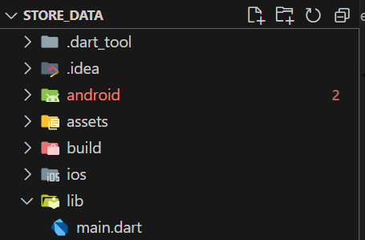

#### 4. Di dalam folder aset, buat file baru bernama pizzalist.json dan salin konten yang tersedia di tautan https://gist.github.com/simoales/a33c1c2abe78b48a75ccfd5fa0de0620. File ini berisi daftar objekJSON.
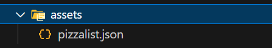

#### 5. Di file pubspec.yaml, tambahkan referensi ke folder aset baru, seperti yang ditunjukkan di sini:
```dart
# To add assets to your application, add an assets section, like this:
    assets:
      - assets/
```

#### 6. Pada kelas _MyHomePageState, di main.dart, tambahkan sebuah variabel state bernama pizzaString:
```dart
class _MyHomePageState extends State<MyHomePage> {
  String pizzaString = '';

  @override
  Widget build(BuildContext context) {
    return Scaffold(
      appBar: AppBar(title: const Text('JSON - Nazwa Ayunda M')),
      body: Container(),
    );
  }
```

#### 7. Untuk membaca isi file pizzalist.json, di bagian bawah kelas _MyHomePageState di main.dart, tambahkan metode asinkron baru yang disebut readJsonFile, yang akan mengatur nilai pizzaString, seperti yang ditunjukkan di sini:
```dart
  Future readJsonFile() async {
    String myString = await DefaultAssetBundle.of(context)
    .loadString('assets/pizzalist.json');
    setState(() {
      pizzaString = myString;
    });
  }
```

#### 8. Pada kelas _MyHomePageState, timpa metode initState dan, di dalamnya, panggil metode readJsonFile:
```dart
class _MyHomePageState extends State<MyHomePage> {
  String pizzaString = '';

  @override
  void initState() {
    super.initState();
    readJsonFile();
  }
```

#### 9. Sekarang, kita ingin menampilkan JSON yang diambil di properti dalam Scaffold. Untuk melakukannya, tambahkan widget Teks sebagai child dari Container kita:
```
  Widget build(BuildContext context) {
    return Scaffold(
      appBar: AppBar(
        title: const Text('JSON - Nazwa Ayunda M'),
        backgroundColor: Colors.blue,
      ),
      body: Text(pizzaString),
    );
  }
```

#### 10. Mari kita jalankan aplikasinya. Jika semuanya berjalan seperti yang diharapkan, Anda akan melihat konten file JSON di layar
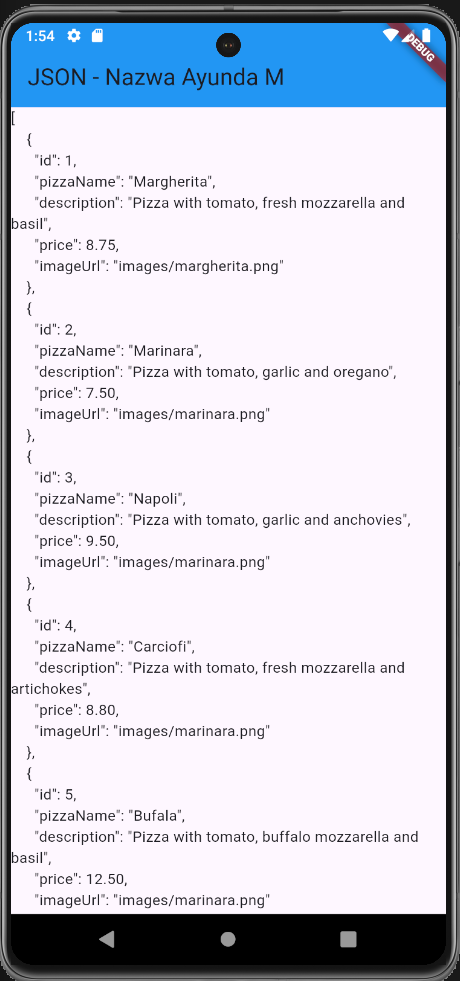

#### 11.  Kita ingin mengubah String ini menjadi sebuah List of Objects. Kita akan mulai dengan membuat kelas baru. Dalam folder lib aplikasi kita, buat file baru bernama pizza.dart.
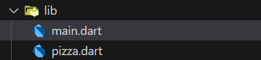

#### 12. Di dalam file tersebut, tentukan properti kelas Pizza:
```dart
class Pizza {
  final int id;
  final String pizzaName;
  final String description;
  final double price;
  final String imageUrl;
}
```

#### 13. Di dalam kelas Pizza, tentukan konstruktor bernama fromJson, yang akan mengambil sebuah Map sebagai parameter dan mengubah Map menjadi sebuah instance dari Pizza:
```dart
class Pizza {
  final int id;
  final String pizzaName;
  final String description;
  final double price;
  final String imageUrl;

  Pizza.fromJson(Map<String, dynamic> json) :
  id = json['id'],
  pizzaName = json['pizzaName'],
  description = json['description'],
  price = json['price'],
  imageUrl = json['imageUrl'];
}
```

#### 14. Refaktor metode readJsonFile() pada kelas ``_MyHomePageState``. Langkah pertama adalah mengubah String menjadi Map dengan memanggil metode jsonDecode. Pada method readJsonFile,tambahkan kode yang di cetak tebal berikut ini:
```dart
  Future<List<Pizza>> readJsonFile() async {
    String myString = await DefaultAssetBundle.of(context)
    .loadString('assets/pizzalist.json');
    List pizzaMapList = jsonDecode(myString);
```

#### 15. Pastikan editor Anda secara otomatis menambahkan pernyataan impor untuk pustaka "dart:convert" di bagian atas file main.dart; jika tidak, tambahkan saja secara manual. Tambahkan juga pernyataan impor untuk kelas pizza:
```dart
import 'dart:convert';
import './pizza.dart';
```

#### 16. Langkah terakhir adalah mengonversi string JSON kita menjadi List of native Dart objects. Kita dapat melakukan ini dengan mengulang pizzaMapList dan mengubahnya menjadi objek Pizza. Didalam metode readJsonFile, di bawah metode jsonDecode, tambahkan kode berikut:
```dart
    List<Pizza> myPizzas = [];
    for (var pizza in pizzaMapList) {
      Pizza myPizza = Pizza.fromJson(pizza);
      myPizzas.add(myPizza);
    }
```

#### 17. Hapus atau beri komentar pada metode setState yang mengatur String pizzaString dan kembalikan daftar objek Pizza sebagai gantinya:
```dart
return myPizzas;
```

#### 18. Ubah signature metode sehingga Anda dapat menampilkan nilai balik secara eksplisit:\
```dart
  Future<List<Pizza>> readJsonFile() async {
```

#### 19. Sekarang kita memiliki objek List of Pizza. Daripada hanya menampilkan sebuah Teks kepada pengguna, kita dapat menampilkan sebuah ListView yang berisi sekumpulan widget ListTile. Di bagian atas kelas _MyHomePageState buat ``List<Pizza>`` bernama myPizzas:
```dart
class _MyHomePageState extends State<MyHomePage> {
  String pizzaString = '';
  List<Pizza> myPizzas = []; 
```

#### 20. Dalam metode initState, pastikan Anda mengatur myPizzas dengan hasil panggilan ke readJsonFile:
```dart
  @override
  void initState() {
    super.initState();
    readJsonFile().then((value) {
      setState(() {
        myPizzas = value;
      });
    });
  }
```

#### 21. Tambahkan kode berikut ini di dalam Scaffold, di dalam metode build():
```dart
      body: ListView.builder(
        itemCount: myPizzas.length,
        itemBuilder: (context, index) {
          return ListTile(
            title: Text(myPizzas[index].pizzaName),
            subtitle: Text(myPizzas[index].description),
          );
        },
      ),
```

#### 22.  Jalankan aplikasi. Antarmuka pengguna sekarang seharusnya jauh lebih ramah dan terlihat seperti yang ditunjukkan pada
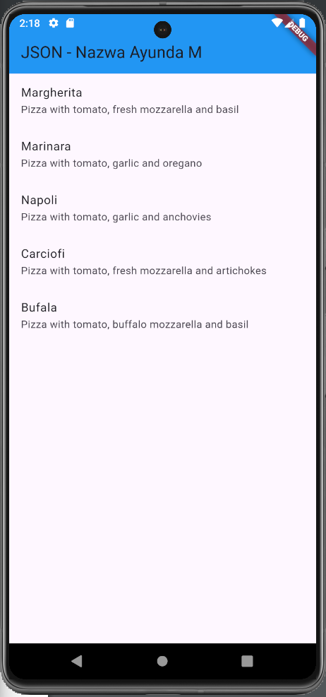

# **Praktikum 2: Reading the JSON file**

#### 1. Tambahkan metode baru ke kelas Pizza, di file pizza.dart, yang disebut toJson. Ini akan mengembalikan sebuah Map<String, dynamic> dari objek:
```dart
  Map<String, dynamic> toJson() {
    return {
    'id': id,
    'pizzaName': pizzaName,
    'description': description,
    'price': price,
    'imageUrl': imageUrl,
    };
  }
```

#### 2. Setelah Anda memiliki sebuah Map, Anda dapat menserialisasikannya kembali ke dalam string JSON. Tambahkan metode baru di di bagian bawah kelas _MyHomePageState, di dalam file main.dart, yang disebut convertToJSON:
```dart
  String convertToJSON(List<Pizza> pizzas) {
    return jsonEncode(pizzas.map((pizza) => jsonEncode(pizza)).toList());
  }
```

#### 3.  Metode ini mengubah objek List of Pizza kembali menjadi string Json dengan memanggil metode jsonEncode lagi di pustaka dart_convert.

#### 4. Terakhir, mari panggil metode tersebut dan cetak string JSON di Debug Console. Tambahkan kode berikut ke metode readJsonFile, tepat sebelum mengembalikan List myPizzas:
```dart
    debugPrint(convertToJSON(myPizzas));
    return myPizzas;
```

#### 5. Jalankan aplikasi. Anda akan melihat string JSON dicetak, seperti yang ditunjukkan pada gambar berikut:
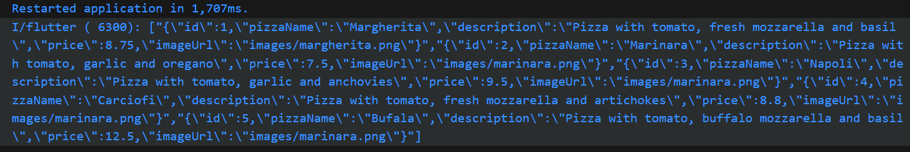

# **Praktikum 3: Saving data simply with SharedPreferences**

#### 1. Gunakan project pada pertemuan 11 bernama books. Pertama, tambahkan ketergantungan pada shared_preferences. Dari Terminal Anda, ketikkan perintah berikut
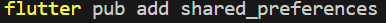\
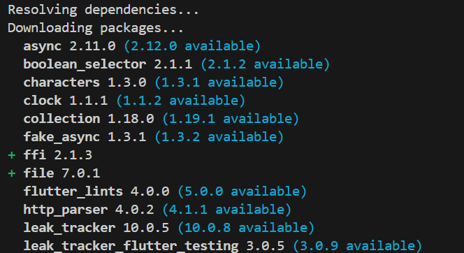

#### 2. Untuk memperbarui dependensi dalam proyek Anda, jalankan perintah flutter pub get dari jendela Terminal.
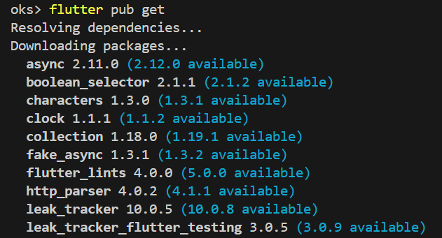

#### 3. Di bagian atas file main.dart, impor shared_preferences:
```dart
import 'package:shared_preferences/shared_preferences.dart';
```

#### 4. Di bagian atas kelas _MyHomePageState, buat variabel status integer baru bernama appCounter:
```dart
class _MyHomePageState extends State<MyHomePage> {
  int appCounter = 0;
```

#### 5. Dalam kelas _MyHomePageState, buat metode asinkron baru yang disebut ``readAndWritePreferences()``:
```dart
Future readAndWritePreference() async {}
````

#### 6.  Di dalam metode readAndWritePreference, buatlah sebuah instance dari SharedPreferences:
```dart
  Future readAndWritePreference() async {
    SharedPreferences prefs = await SharedPreferences.getInstance();
  }
```

#### 7. Setelah membuat instance preferensi, kita membuat kode yang mencoba baca nilai kunci appCounter. Jika nilainya nol, setel ke 0; lalu naikkan nilainya:
```dart
    appCounter = prefs.getInt('appCounter') ?? 0;
    appCounter++;
```

#### 8. Setelah itu, atur nilai kunci appCounter di preferensi ke nilai baru:
```dart
await prefs.setInt('appCounter', appCounter);
```

#### 9. Memperbarui nilai status appCounter:
```dart
    setState(() {
      appCounter = appCounter;
    });
```

#### 10. Pada metode initState di kelas _MyHomePageState, panggil metode readAndWritePreference() dengan kode yang dicetak tebal:
```dart
  @override
    void initState() {
    super.initState();
      readAndWritePreference();
  }
```

#### 11. Dalam metode build, tambahkan kode berikut ini di dalam widget Container:
```dart
  @override
  Widget build(BuildContext context) {
    return Scaffold(
      appBar: AppBar(
        title: const Text('Shared Preferences - Nazwa Ayunda M'),
        backgroundColor: Colors.orange,
      ),
      body: Container(
        child: Center(
          child: Column(
            mainAxisAlignment: MainAxisAlignment.spaceEvenly,
            children: [
              Text(
                'You have opened the app $appCounter times.'
              ),
              ElevatedButton(
                onPressed: () {},
                child: const Text('Reset Counter'),
              )
            ],
          ),
        )
      ),
    );
  }
```

#### 12. Jalankan aplikasi. Saat pertama kali membukanya, Anda akan melihat layar yang mirip dengan yang berikut ini:
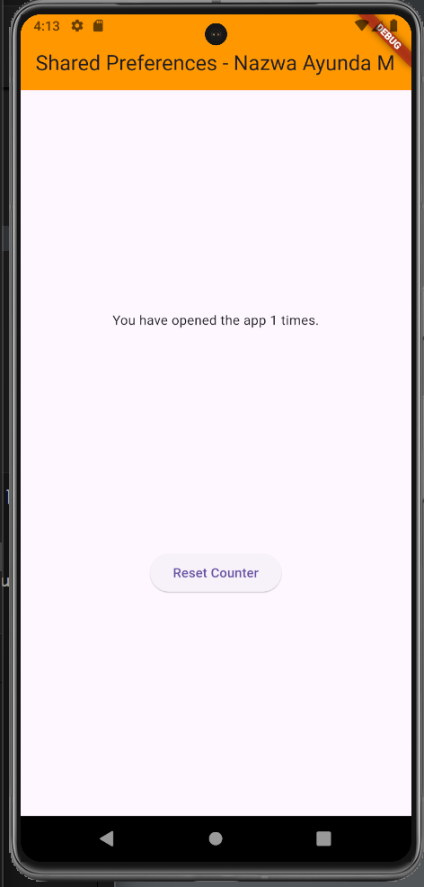

#### 13. Tambahkan metode baru ke kelas _MyHomePageState yang disebut deletePreference(), yang akan menghapus nilai yang disimpan:
```dart
  Future deletePreference() async {
    SharedPreferences prefs = await SharedPreferences.getInstance();
    await prefs.clear();
    setState(() {
      appCounter = 0;
    });
  }
```

#### 14. Dari properti onPressed dari widget ElevatedButton di metode build(), memanggil metode deletePreference(), dengan kode di cetak tebal:
```dart
              ElevatedButton(
                onPressed: () {
                  deletePreference();
                },
                child: const Text('Reset Counter'),
              )
```

#### 15. Jalankan aplikasi lagi. Sekarang, saat Anda menekan tombol Reset penghitung, nilai appCounter akan dihapus
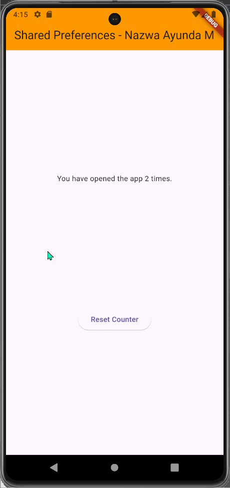

# **Praktikum 4: Accessing the filesystem, part 1:path_provider**
Buatlah project flutter baru dengan nama path_provider

#### 1.  menambahkan dependency yang relevan ke file pubspec.yaml. Tambahkan path_provider dengan mengetikkan perintah ini dari Terminal Anda:
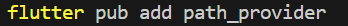\
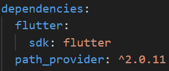

#### 2. Di bagian atas file main.dart, tambahkan impor path_provider:
```dart
import 'package:path_provider/path_provider.dart';
```

#### 3. Di bagian atas kelas _MyHomePageState, tambahkan variabel State yang akan kita gunakan untuk memperbarui antarmuka pengguna:
```dart
class _MyHomePageState extends State<MyHomePage> {
  String documentsPath = '';
  String tempPath = '';
}
```

#### 4. Masih dalam kelas _MyHomePageState, tambahkan metode untuk mengambil direktori temporary dan dokumen:
```dart
  Future getPaths() async {
    final docDir = await getApplicationDocumentsDirectory();
    final tempDir = await getTemporaryDirectory();
    setState(() {
      documentsPath = docDir.path;
      tempPath = tempDir.path;
    });
  }
```

#### 5. Pada metode initState dari kelas _MyHomePageState, panggil metode getPaths:
```dart
  @override
  void initState() {
    super.initState();
    getPaths();
  }
```

#### 6. Pada metode build _MyHomePageState, buat UI dengan dua widget Teks yang menunjukkan path yang diambil:
```dart
  Widget build(BuildContext context) {
    return Scaffold(
      appBar: AppBar(
        title: const Text('Path Provider - Nazwa Ayunda M'),
        backgroundColor: Colors.blue,
      ),
      body: Column(
        mainAxisAlignment: MainAxisAlignment.spaceEvenly,
        children: [
          Text('Doc path: $documentsPath'),
          Text('Temp path: $tempPath'),
        ],
      ),
    );
  }
```

#### 7. Jalankan aplikasi. Anda akan melihat layar yang terlihat seperti berikut ini:
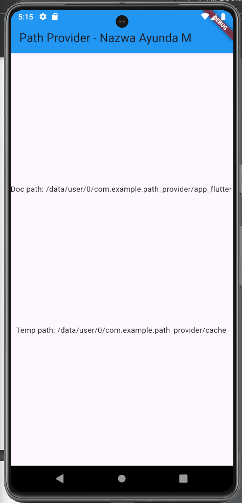

# **Praktikum 5: Accessing the filesystem, part 2: Working with directories**

#### 1. Di bagian atas berkas main.dart, impor pustaka dart:io:
```dart
import 'dart:io';
```
#### 2. Di bagian atas kelas _MyHomePageState, di file main.dart, buat dua variabel State baru untuk file dan isinya:
```dart
  late File myFile;
  String fileText = '';
```

#### 3. Masih dalam kelas MyHomePageState, buat metode baru bernama writeFile dan gunakan kelas File dari pustaka dart:io untuk membuat file baru:
```dart
  Future<bool> writeFile() async {
    try {
      await myFile.writeAsString('Margherita, Capricciosa, Napoli');
      return true;
    } catch (e) {
      return false;
    }
  }
```

#### 4. Dalam metode initState, setelah memanggil metode getPaths, dalam metode then, buat sebuah file dan panggil metode writeFile:
```dart
  void initState() {
    getPaths().then((_) {
      myFile = File('$documentsPath/pizzas.txt');
      writeFile();
    });
    super.initState();
  }
```

#### 5. Buat metode untuk membaca file:
```dart
  Future<bool> readFile() async {
    try {
      String fileContent = await myFile.readAsString();
      setState(() {
        fileText = fileContent;
      });
      return true;
    } catch (e) {
      return false;
    }
  }
```

#### 6. Dalam metode build, di widget Column, perbarui antarmuka pengguna dengan ElevatedButton. Ketika pengguna menekan tombol, tombol akan mencoba membaca konten file dan menampilkannya di layar, cek kode cetak tebal:
```dart
      body: Column(
        mainAxisAlignment: MainAxisAlignment.spaceEvenly,
        children: [
          Text('Doc path: ' + documentsPath),
          Text('Temp path: ' + tempPath),
          ElevatedButton(
            child: const Text('Read File'),
            onPressed: () => readFile(),
          ),
          Text(fileText),
        ],
      ),
```

#### 7. Jalankan aplikasi dan tekan tombol Baca File. Di bawah tombol tersebut, Anda akan melihat teks Margherita, Capricciosa, Napoli, seperti yang ditunjukkan pada tangkapan layar berikut:
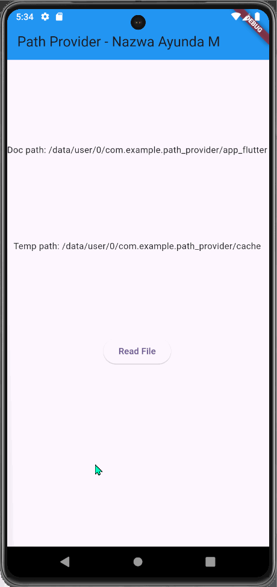

# **Praktikum 6: Using secure storage to store data**

#### 1. Tambahkan flutter_secure_storage ke proyek Anda, dengan mengetik:
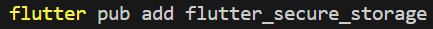

#### 2. Di file main.dart, salin kode berikut:
```dart
import 'package:flutter/material.dart';

void main() {
  runApp(const MyApp());
}

class MyApp extends StatelessWidget {
  const MyApp({super.key});

  @override
  Widget build(BuildContext context) {
    return MaterialApp(
      title: 'FlutterDemo',
      theme: ThemeData(
        primarySwatch: Colors.deepPurple,
      ),
      home: const MyHomePage(),
    );
  }
}

class MyHomePage extends StatefulWidget {
  const MyHomePage({super.key});

  @override
  State<MyHomePage> createState() => _MyHomePageState();
}

class _MyHomePageState extends State<MyHomePage> {
  final pwdController = TextEditingController();
  String myPass = '';

  @override
  void initState() {
    super.initState();
  }

  @override
  Widget build(BuildContext context) {
    return Scaffold(
      appBar: AppBar(
        title: const Text('Store Data - Nazwa Ayunda M'),
        backgroundColor: Colors.deepPurple,
      ),
      body: SingleChildScrollView(
        child: Padding(
          padding: const EdgeInsets.all(16.0),
          child: Column(
            children: [
              TextField(
                controller: pwdController,
              ),
              ElevatedButton(child: const Text('Save Value'), onPressed: () {}),
              ElevatedButton(child: const Text('Read Value'), onPressed: () {}),
              Text(myPass),
            ],
          ),
        ),
      ),
    );
  }
}
```

#### 3. Di bagian atas file main.dart, tambahkan impor yang diperlukan:
```dart
import 'package:flutter_secure_storage/flutter_secure_storage.dart';
```

#### 4. Di bagian atas kelas _myHomePageState, buat penyimpanan yang aman:
```dart
class _MyHomePageState extends State<MyHomePage> {
  final storage = const FlutterSecureStorage();
  final myKey = 'myPass';
}
```

#### 5. Di kelas _myHomePageState, tambahkan metode untuk menulis data ke penyimpanan aman:
```dart
  Future writeToSecureStorage() async {
    await storage.write(key: myKey, value: pwdController.text);
  }
```

#### 6. Pada metode build() dari kelas _myHomePageState, tambahkan kode yang akan menulis ke penyimpanan ketika pengguna menekan tombol Save Value, cek kode cetak tebal:
```dart
              ElevatedButton(
                child: const Text('Save Value'), 
                onPressed: () {
                  writeToSecureStorage();
              }),
```

#### 7. Di kelas _myHomePageState, tambahkan metode untuk membaca data dari penyimpanan aman:
```dart
  Future<String> readFromSecureStorage() async {
    String secret = await storage.read(key: myKey) ?? '';
    return secret;
  }
```

#### 8. Pada metode build() dari kelas _myHomePageState, tambahkan kode untuk membaca dari penyimpanan ketika pengguna menekan tombol Read Value dan memperbarui variabel myPass State:
```dart
              ElevatedButton(
                child: const Text('Read Value'), 
                onPressed: () {
                  readFromSecureStorage().then((value) {
                    setState(() {
                      myPass = value;
                    });
                  });
                },
```

#### 9. Jalankan aplikasi dan tulis beberapa teks pilihan Anda di bidang teks. Kemudian, tekan tombol Save Value. Setelah itu, tekan tombol Read Value. Anda akan melihat teks yang Anda ketik di kolom teks, seperti yang ditunjukkan pada tangkapan layar berikut:
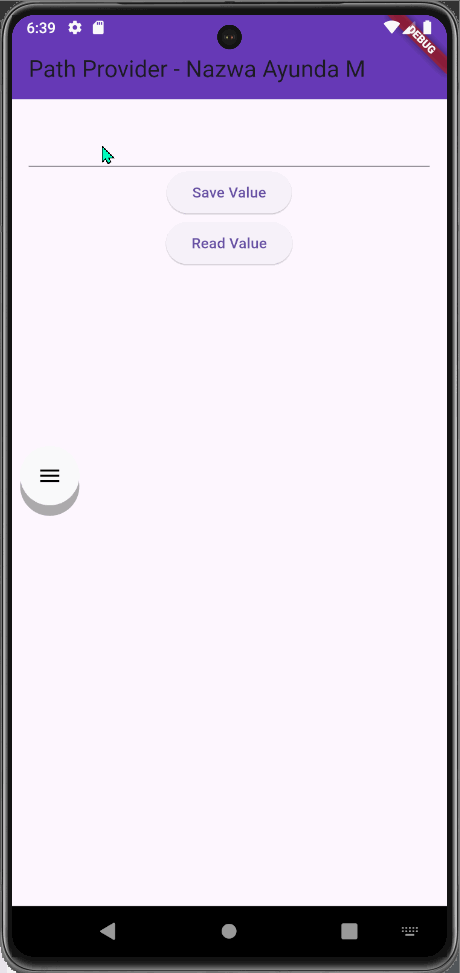