# Laporan Praktikum Mobile
<table>
<tr>
    <th>Nama</th>
    <td>Nazwa Ayunda Mirrohillah</td>
  </tr>
  <tr>
    <th>NIM</th>
    <td>2241720013</td>
  </tr>
  <tr>
    <th>Kelas/Absn</th>
    <td>3C/20</td>
  </tr>
</table>

# Praktikum 1: Menerapkan Control Flows ("if/else")
## Langkah 1
Ketik atau salin kode program berikut ke dalam fungsi main()..
```dart
String test = "test2";
if (test == "test1") {
   print("Test1");
} else If (test == "test2") {
   print("Test2");
} Else {
   print("Something else");
}
if (test == "test2") print("Test2 again");
```

## Langkah 2:
Silakan coba eksekusi (Run) kode pada langkah 1 tersebut. Apa yang terjadi Jelaskan!        
Jawab : 

Hasil Running:     

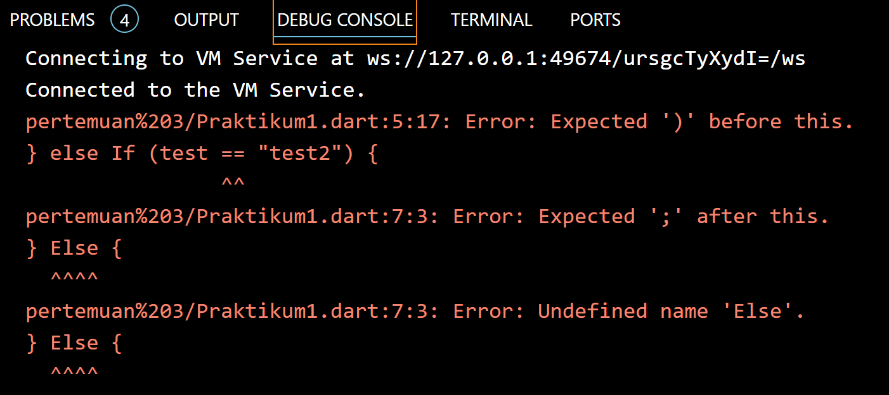  
Penjelasan :    

Hasilnya akan eror seperti gambar diatas karena terjadi beberapa kesalahan yaitu 
- Kesalahan: else If. 
(Huruf "I" di If besar, padahal seharusnya kecil. Jadi, cukup ubah jadi else if.)
- Kesalahan: Else. 
(Huruf "E" di Else besar, padahal harusnya kecil. Ubah jadi else.)

Kesimpulan : 
Dart adalah bahasa yang case-sensitive, jadi Else dan else dianggap berbeda. Compiler tidak mengenali Else karena seharusnya ditulis dengan huruf kecil sebagai else.

Perbaikan :
```dart
String test = "test2";
if (test == "test1") {
   print("Test1");
} else if (test == "test2") {
   print("Test2");
} else {
   print("Something else");
}
if (test == "test2") print("Test2 again");
```
Hasil Running: 

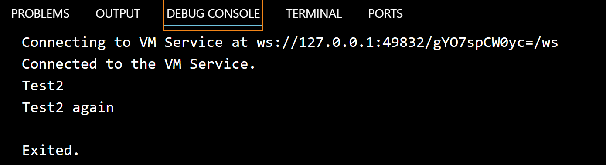 

Penjelasan :    

1. Pada baris pertama, mendeklarasi fungsi main(). Fungsi main() merupakan titik awal eksekusi program dalam bahasa pemrograman Dart.

2. Pada baris kedua, mendeklarasikan sebuah variabel bernama test dan menginisialisasinya dengan nilai string "test2".

3. Kemudian, terdapat struktur kontrol kondisional if-else. Ini digunakan untuk memeriksa nilai variabel test dan mencetak pesan berdasarkan kondisi berikut:
   - Jika test sama dengan "test1", maka program akan mencetak "Test1".
   - Jika test sama dengan "test2", maka program akan mencetak "Test2".
   - Jika test tidak sama dengan "test1" atau "test2" (kondisi default), maka program akan mencetak "Something else".
  
4. Di baris terakhir, terdapat pernyataan if terpisah yang memeriksa apakah test sama dengan "test2" lagi. Jika ya, maka program akan mencetak "Test2 again".

Hasil akhir dari program ini adalah dua keluaran yang tercetak ke konsol: "Test2" dan "Test2 again".

Secara keseluruhan, kode ini melakukan pemeriksaan kondisi pada variabel test dan mencetak pesan berdasarkan nilai variabel tersebut.

## Langkah 3:
Tambahkan kode program berikut, lalu coba eksekusi (Run) kode Anda.
```dart
String test = "true";
if (test) {
   print("Kebenaran");
}
```
Apa yang terjadi ? Jika terjadi error, silakan perbaiki namun tetap menggunakan if/else.    
Jawab : 

Hasil Running: 

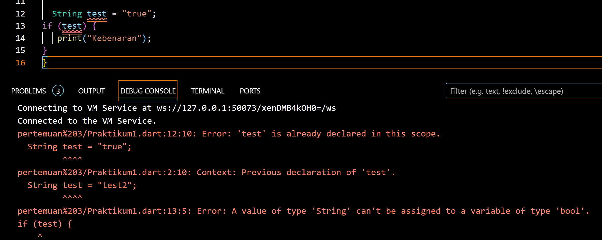

Penjelasan :

Kode tersebut akan error dikarenakan tipe data dari kode diatas masih menggunakan string, dan seharusnya menggunakan boolean. 

Perbaikan : 

```dart
 bool isTrue = true;
  if (isTrue) {
    print("Kebenaran");
  }
```
Hasil :     
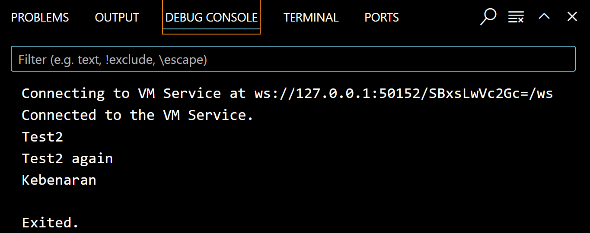

Penjelasan :

1. Nama variable diubah menjadi `test2` agar tidak terjadi error karena nama variable test sudah digunakan sebelumnya.
2. Pada pengecekan `if(test)` diubah menjadi `if(test2 == "true")` agar sesuai dengan nilai yang diinisialisasikan pada variable `test2`. Ini karena variable `test2` bertipe string, sehingga harus dibandingkan dengan string juga.
3. Pengecekan `if(test)` bisa juga diubah menjadi `if(test2)` dengan catatan variable `test2` bertipe data boolean.

# Praktikum 2: Menerapkan Perulangan "while" dan "do-while"

## Langkah 1:
Ketik atau salin kode program berikut ke dalam fungsi main().
```dart
while (counter < 33) {
  print(counter);
  counter++;
}
```     

## Langkah 2:
Silakan coba eksekusi (Run) kode pada langkah 1 tersebut. Apa yang terjadi? Jelaskan! Lalu perbaiki jika terjadi error.     
Jawab :    

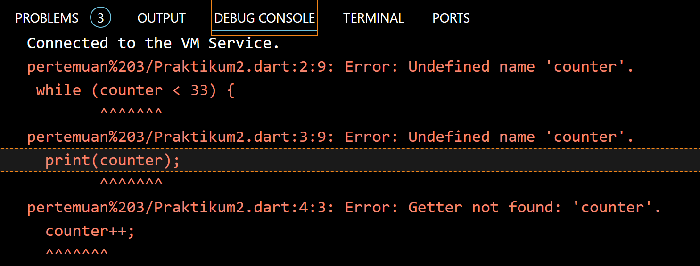   

Penjelasan :

Hasilnya akan eror seperti gambar diatas karena terjadi beberapa kesalahan  variabel counter tidak dideklarasikan atau diinisialisasi sebelum digunakan. Jadi perlu mendeklarasikan dan menginisialisasi variabel counter sebelum menggunakannya. 

Perbaikan : 

```dart
void main() {
  int counter = 0;
  while (counter < 33) {
    print(counter);
    counter++;
  }
}
```
Hasil Running : 

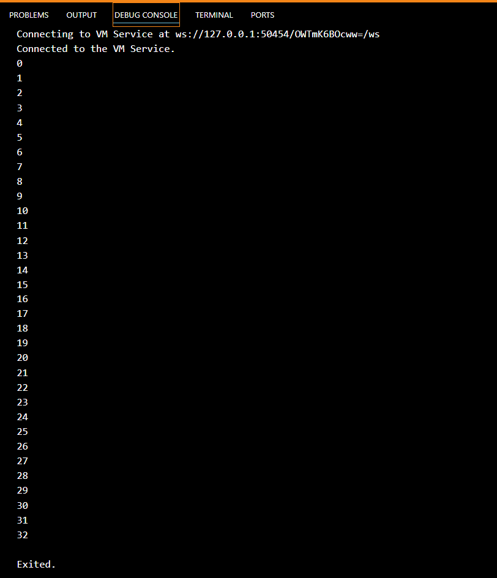

Penjelasan :

Kode diatas akan mencetak angka dari 0 hingga 32. Perulangan dimulai dari `counter = 0`. Pada iterasi pertama, angka 0 dicetak, lalu `counter` bertambah menjadi 1. Iterasi kedua mencetak angka 1, dan `counter` bertambah lagi. Proses ini terus berlanjut sampai angka 32 tercetak. Setelah `counter` mencapai 33, kondisi `while (counter < 33)` menjadi salah, sehingga perulangan berhenti.

## Langkah 3:
Tambahkan kode program berikut, lalu coba eksekusi (Run) kode Anda.
```dart
do {
  print(counter);
  counter++;
} while (counter < 77);
```
Apa yang terjadi ? Jika terjadi error, silakan perbaiki namun tetap menggunakan do-while.   
Jawab : 

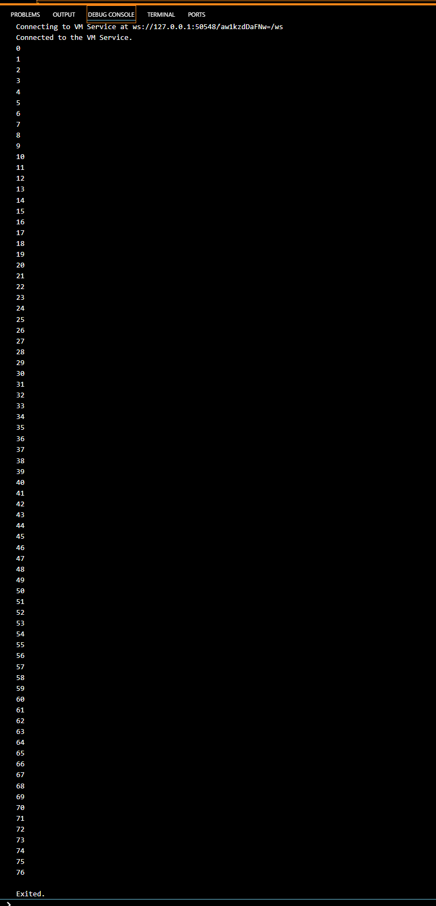  

Penjelasan :

Karena melanjutkan dari percobaan sebelumnya dan variabel sudah diinialisasikan program tidak mengalami kesalahan , hasilnya akan melanjutkan perhitungan dari kode sebelumnya, yang berakhir di angka 32, dan meneruskannya dari 33 hingga 76. Hal ini karena ada `counter++`, yang artinya nilai awal digunakan terlebih dahulu sebelum ditambah 1.

# Praktikum 3: Menerapkan Perulangan "for" dan "break-continue"
## Langkah 1:
Ketik atau salin kode program berikut ke dalam fungsi main().
```dart
for (Index = 10; index < 27; index) {
  print(Index);
}
```
## Langkah 2:
Silakan coba eksekusi (Run) kode pada langkah 1 tersebut. Apa yang terjadi? Jelaskan! Lalu perbaiki jika terjadi error.   

Jawab:    

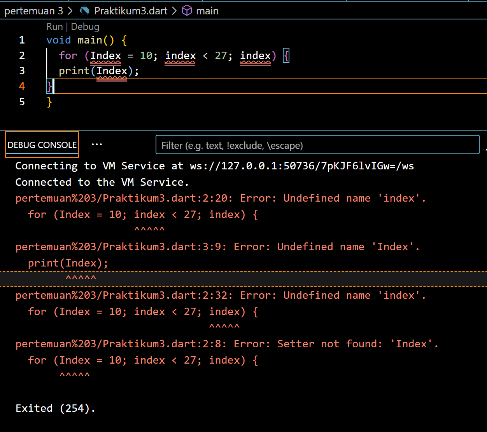  

Penjelasan :

Hasilnya akan eror seperti gambar diatas karena  variable index belum dideklarasikan sebelumnya dan operasi increment pada variable index tidak ada, dan Dalam loop for, tidak dapat melakukan peningkatan nilai variabel Index. Oleh karena itu, loop ini akan menjadi loop tak berujung, yang akan mengakibatkan program berhenti merespons atau hang.

Pembenaran : 

Solusinya adalah dengan mendeklarasikan variable index terlebih dahulu dengan cara menambahkan tipe data int sebelum nama variable. Kemudian, pada operasi increment, tambahkan index++ agar variable index dapat terus bertambah. Kode Program : 

```dart
void main() {
  for (int index = 10; index < 27; index++) {
    print(index);
  }
}
```
Hasilnya :      
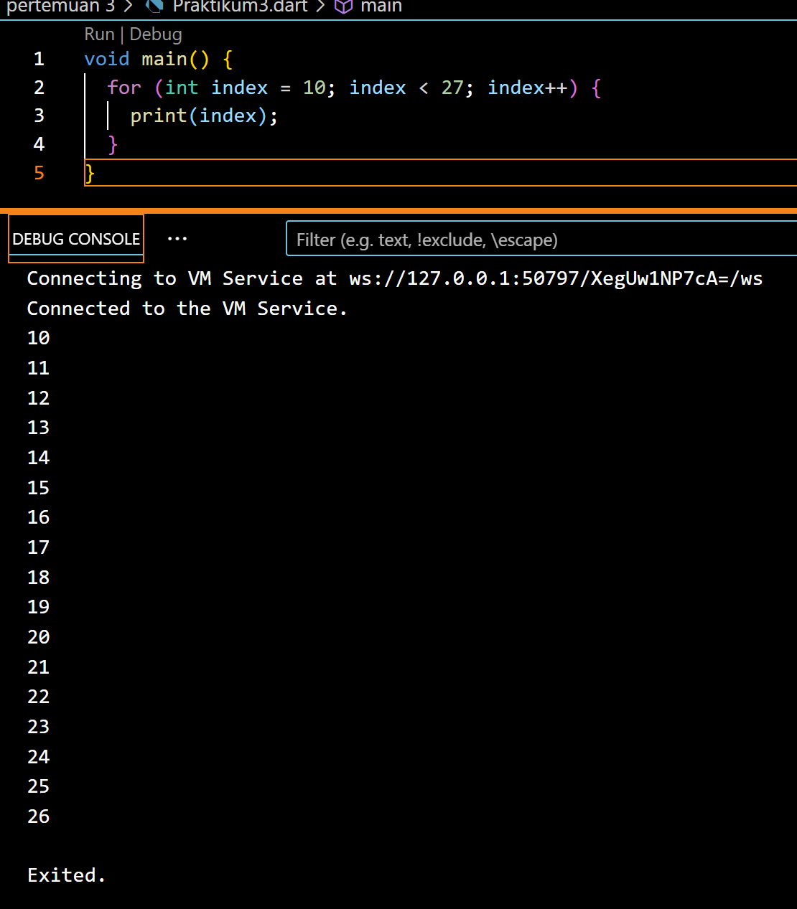

Penjelasan :

hasilnya, program mencetak angka dari 10 hingga 26 secara berurutan ke layar console, masing-masing pada baris yang terpisah

## Langkah 3:
Tambahkan kode program berikut di dalam for-loop, lalu coba eksekusi (Run) kode Anda.
```dart
If (Index == 21) break;
Else If (index > 1 || index < 7) continue;
print(index);
```
Apa yang terjadi ? Jika terjadi error, silakan perbaiki namun tetap menggunakan for dan break-continue.

Jawab:      

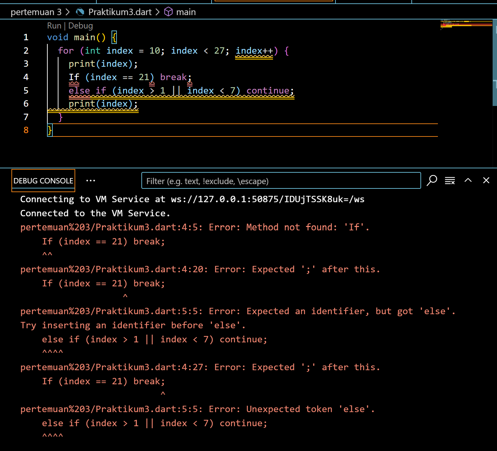

Penjelasan : 

Hasilmya eror sama seperti percobaan pertama tadi yaitu kesalahan dalam penulisan kata kunci "if" dan "else if" harus diawali dengan huruf kecil (if dan else if), bukan huruf besar.

diperbaiki menjadi :      

```dart
void main() {
  for (int index = 10; index < 27; index++) {
    print(index);
    if (index == 21) break;
    else if (index > 1 || index < 7) continue;
  }
}
```
Hasilnya :

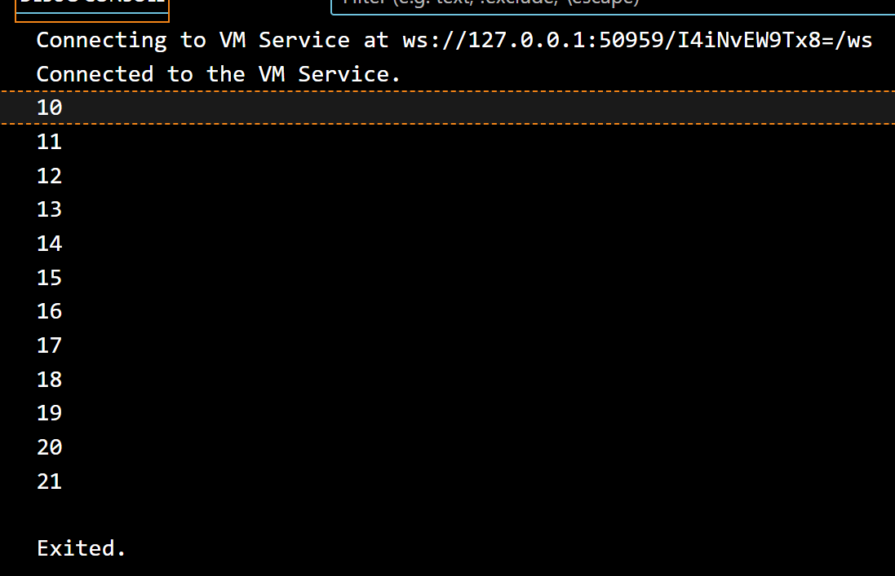

Penjelasan : 

Program diatas menggunakan perulangan `for` untuk mencetak angka dari 10 hingga 21. Di setiap iterasi, nilai indeks dicetak ke konsol. Saat indeks mencapai 21, perulangan berhenti dengan `break`. Namun, karena kondisi `index > 1 || index < 7` selalu terpenuhi setelah iterasi pertama, perintah `continue` mencegah angka 11 hingga 20 dicetak. Akibatnya, hanya angka 10 dan 21 yang tercetak.

# Tugas Praktikum   

## Soal 1
1. Silakan selesaikan Praktikum 1 sampai 3, lalu dokumentasikan berupa screenshot hasil pekerjaan beserta penjelasannya!<p>
**Jawab**<p>
- [Praktikum 1: Menerapkan Control Flows ("if/else")](#praktikum-1-menerapkan-control-flows-ifelse)
- [Praktikum 2: Menerapkan Perulangan "while" dan "do-while"](praktikum-2-menerapkan-perulangan-while-dan-do-while)
- [Praktikum 3: Menerapkan Perulangan "for" dan "break-continue"](praktikum-3-menerapkan-perulangan-for-dan-break-continue)

<p>
     
## Soal 2
Buatlah sebuah program yang dapat menampilkan bilangan prima dari angka 0 sampai 201 menggunakan Dart. Ketika bilangan prima ditemukan, maka tampilkan nama lengkap dan NIM Anda.            
Jawab:

Kode Program : 
```dart
void main() {
  int maxNumber = 201;
  List<int> PrimeNumbers = [];

  for (int i = 0; i < maxNumber; i++) {
    if (isPrime(i)) {
      PrimeNumbers.add(i);
    }
  }

  if (PrimeNumbers.isNotEmpty) {
    print(PrimeNumbers);
    print("Nama: Nazwa Ayunda Mirrohillah");
    print("NIM: 2241720013");
  }
}

// Fungsi menentukan apakah sebuah angka adalah bilangan prima
bool isPrime(int number) {
  if (number < 2) {
    return false;
  }

  for (int i = 2; i < number; i++) {
    if (number % i == 0) {
      return false;
    }
  }

  return true;
}
```

Hasilnya :

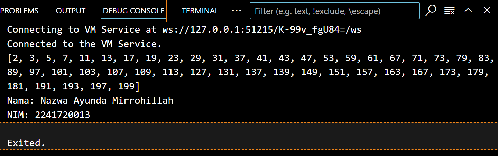   

Penjelasan : 

#### Fungsi main()
- `int maxNumber = 201` Menginisialisasi variabel maxNumber dengan nilai 201, yang akan digunakan sebagai batas atas dalam loop untuk mencari bilangan prima.
- `List<int> PrimeNumbers = [] Membuat list kosong bernama PrimeNumbers yang nantinya akan diisi dengan bilangan prima yang ditemukan.
- `for (int i = 0; i < maxNumber; i++) { ... } Perulangan ini dimulai dari 0 hingga kurang dari maxNumber (yaitu 200). Setiap angka i akan diperiksa apakah termasuk bilangan prima melalui fungsi isPrime(i).
- `if (isPrime(i)) { PrimeNumbers.add(i); }` Jika fungsi isPrime(i) mengembalikan nilai true, berarti angka i adalah bilangan prima dan akan dimasukkan ke dalam list PrimeNumbers.
- `if (PrimeNumbers.isNotEmpty) { ... }` Setelah perulangan selesai, program memeriksa apakah list PrimeNumbers berisi bilangan prima. Jika ya, maka list tersebut akan ditampilkan.
- `print(PrimeNumbers)` Menampilkan semua bilangan prima dari 0 hingga 200 yang telah dimasukkan ke dalam list PrimeNumbers.
- `print("Nama: Nazwa Ayunda Mirrohillah")` Mencetak nama dan `print("NIM: 2241720013")` Mencetak NIM.

#### Fungsi isPrime(int number)
- `bool isPrime(int number)` Ini adalah sebuah fungsi yang menerima sebuah bilangan bulat number sebagai input dan mengembalikan true jika number adalah bilangan prima, dan false jika tidak.
- `if (number < 2) { return false; }` Bilangan prima didefinisikan sebagai bilangan bulat positif yang lebih besar dari 1. Jika number kurang dari 2, maka number bukan bilangan prima, dan fungsi ini langsung mengembalikan false.
- `for (int i = 2; i < number; i++) { ... }` Loop ini dimulai dari i = 2 hingga i < number. Tujuan dari loop ini adalah untuk memeriksa apakah number dapat dibagi habis oleh bilangan lain selain 1 dan dirinya sendiri. Jika ada angka i di mana `number % i == 0`, maka number bukan bilangan prima, dan fungsi mengembalikan false.
- `return true;` Jika loop selesai tanpa menemukan pembagi i yang membuat `number % i == 0`, maka number adalah bilangan prima, dan fungsi ini mengembalikan true.
