# Laporan Praktikum Mobile JS 4
<table>
<tr>
    <th>Nama</th>
    <td>Nazwa Ayunda Mirrohillah</td>
  </tr>
  <tr>
    <th>NIM</th>
    <td>2241720013</td>
  </tr>
  <tr>
    <th>Kelas/Absn</th>
    <td>3C/20</td>
  </tr>
</table>

# Praktikum 1: Eksperimen Tipe Data List
## Langkah 1
Ketik atau salin kode program berikut ke dalam void main().
```dart
var list = [1, 2, 3];
assert(list.length == 3);
assert(list[1] == 2);
print(list.length);
print(list[1]);

list[1] = 1;
assert(list[1] == 1);
print(list[1]);
```
## Langkah 2
Silakan coba eksekusi (Run) kode pada langkah 1 tersebut. Apa yang terjadi? Jelaskan!

Jawab :

Hasil Kode Program :
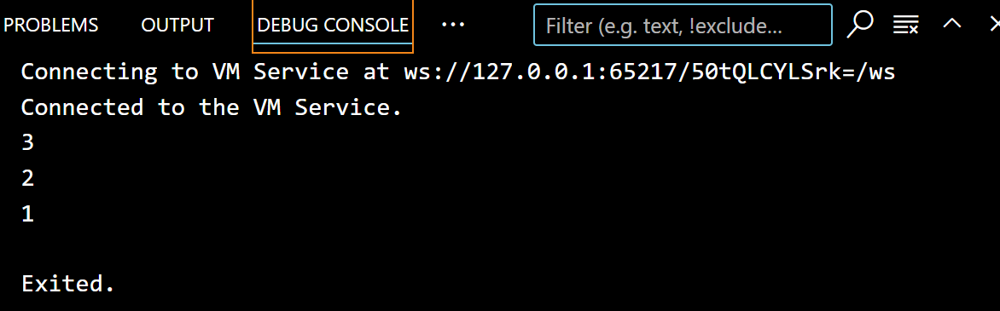 

Penjelasan : 

1. Deklarasi dan Pengecekan:
- var list = [1, 2, 3]; mendeklarasikan sebuah list dengan 3 elemen.
- assert(list.length == 3); memastikan panjang list adalah 3. Tidak akan ada masalah jika benar.
- assert(list[1] == 2); memverifikasi bahwa elemen pada indeks 1 bernilai 2. Ini benar, sehingga tidak ada error.
2. Output Awal:
- print(list.length); akan mencetak panjang list, yaitu 3.
- print(list[1]); akan mencetak elemen di indeks 1, yaitu 2.
3. Perubahan dan Pengecekan:
- list[1] = 1; mengubah nilai pada indeks 1 dari 2 menjadi 1.
- assert(list[1] == 1); memverifikasi bahwa elemen di indeks 1 sekarang adalah 1. Jika benar, tidak ada error.
- print(list[1]); akan mencetak nilai yang baru, yaitu 1.

Kesimpulan : ## Kesimpulan:

Kode diatas berjalan tanpa error karena semua kondisi yang dicek oleh `assert` terpenuhi. Kode ini memodifikasi elemen dalam list, lalu mencetak panjang list dan nilai elemen tertentu sebelum dan sesudah perubahan. Output menunjukkan bahwa panjang list tetap sama (3), dan elemen di indeks 1 berhasil diubah dari `2` menjadi `1`.

## Langkah 3
Ubah kode pada langkah 1 menjadi variabel final yang mempunyai index = 5 dengan default value = null. Isilah nama dan NIM Anda pada elemen index ke-1 dan ke-2. Lalu print dan capture hasilnya.

Apa yang terjadi ? Jika terjadi error, silakan perbaiki.

Jawab :

```dart
void main() {
  var list1 = [1, 2, 3];
  assert(list1.length == 3);
  assert(list1[1] == 2);

  list1[1] = 1;
  assert(list1[1] == 1);

  final List<String?> list2 = List.filled(5, null);
  list2[1] = 'Nazwa Ayunda Mirrohillah';
  list2[2] = '2241720013';

  print(list2);
}
```

Hasil Kode Program 
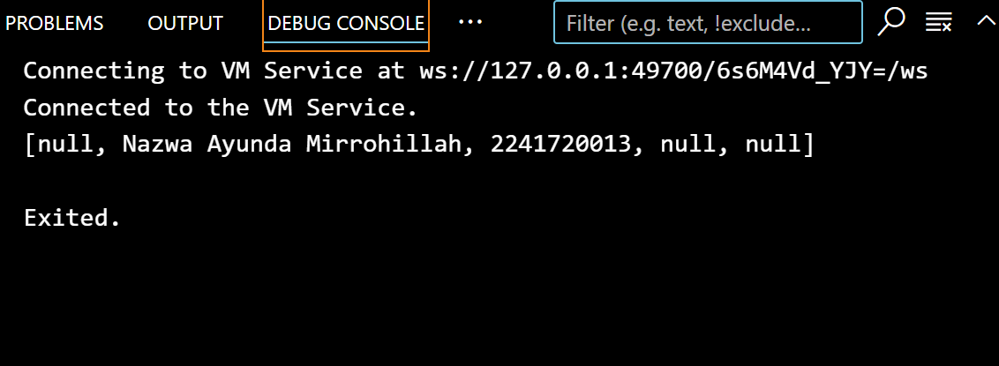 

Penjelasan : 

1. List1: list1 adalah list dengan 3 elemen [1, 2, 3]. Program memverifikasi bahwa panjangnya adalah 3 dan elemen kedua (indeks 1) adalah 2. Setelah itu, elemen kedua diubah menjadi 1, dan perubahan tersebut diverifikasi dengan assert.

2. List2: list2 adalah list dengan 5 elemen yang semuanya diinisialisasi sebagai null. Program mengisi elemen pada indeks 1 dengan nama 'Nazwa Ayunda M' dan indeks 2 dengan NIM '2241720013'. Kemudian list tersebut dicetak seperti hasil gambar diatas

Kesimpulan :
 Kode diatas membuat dua list: satu untuk latihan dengan angka, dan satu lagi untuk menampung nama dan NIM. Program juga menggunakan assert untuk memastikan bahwa perubahan yang dilakukan pada list adalah benar sesuai harapan.

# Praktikum 2: Eksperimen Tipe Data Set  
## Langkah 1:
Ketik atau salin kode program berikut ke dalam fungsi main().
```dart
var halogens = {'fluorine', 'chlorine', 'bromine', 'iodine', 'astatine'};
print(halogens);
```
## Langkah 2:
Silakan coba eksekusi (Run) kode pada langkah 1 tersebut. Apa yang terjadi? Jelaskan! Lalu perbaiki jika terjadi error.     
Jawab: 

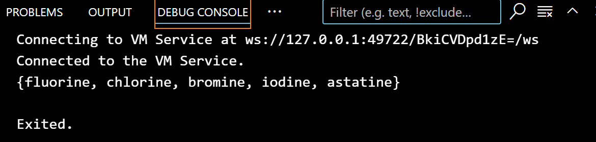

Penjelasan : 

Kode diatas mendeklarasikan sebuah set bernama `halogens` yang berisi elemen-elemen `'fluorine'`, `'chlorine'`, `'bromine'`, `'iodine'`, dan `'astatine'`. Ketika dijalankan, kode ini berhasil mencetak isi set tersebut. Hasil output seperti gambar diatas yaitu berupa elemen-elemen set, yang tidak dijamin urutannya, karena set tidak mempertahankan urutan elemen. Kode diatas tidak menghasilkan error.

## Langkah 3:
Tambahkan kode program berikut, lalu coba eksekusi (Run) kode Anda.

```dart
var names1 = <String>{};
Set<String> names2 = {}; // This works, too.
var names3 = {}; // Creates a map, not a set.

print(names1);
print(names2);
print(names3);
```
Apa yang terjadi ?Jika terjadi error, silakan perbaiki namun tetap menggunakan ketiga variabel tersebut. Tambahkan elemen nama dan NIM Anda pada kedua variabel Set tersebut dengan dua fungsi berbeda yaitu .add() dan .addAll(). 

Jawab:  

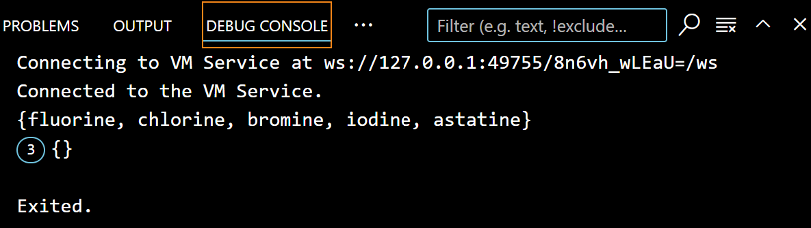

Penjelasan :

Ketika kode dieksekusi, `names1` dan `names2` adalah set kosong yang benar, tetapi `names3` secara default adalah `Map`, bukan `Set`. Kode ini tidak menghasilkan error, namun `names3` akan mencetak sebagai `{}`, yang menunjukkan `Map` kosong, bukan `Set`. Untuk memperbaikinya dan tetap menggunakan ketiga variabel, `names3` harus diubah menjadi `Set<String>` dengan sintaks `var names3 = <String>{};` agar konsisten dengan `names1` dan `names2`.

penambahkan elemen nama dan NIM :

```dart
void main() {
var halogens = {'fluorine', 'chlorine', 'bromine', 'iodine', 'astatine'};
print(halogens);

var names1 = <String>{};  
  Set<String> names2 = {};  

  names1.add('Nazwa Ayunda M');     
  names1.addAll(['2241720013']); 

  names2.add('Nazwa Mirrohillah');      
  names2.addAll(['2241720013']); 

  var names3 = <String, String>{}; 

  print(names1);  
  print(names2);  
  print(names3);  
}
```

Hasil Kode Program : 

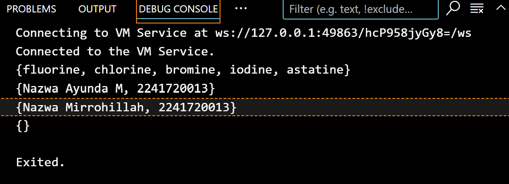

Penjelasan : 

Kode mendeklarasikan dua set, `names1` dan `names2`, dan mengisinya dengan nama dan NIM menggunakan metode `.add()` dan `.addAll()`. `names1` berisi `'Nazwa Ayunda M'` dan `'2241720013'`, sedangkan `names2` berisi `'Nazwa Mirrohillah'` dan `'2241720013'`. Variabel `names3` adalah map kosong dan tidak berisi data. Output akan mencetak elemen-elemen dari kedua set dan map kosong.

# Praktikum 3: Eksperimen Tipe Data Maps
## Langkah 1:
Ketik atau salin kode program berikut ke dalam fungsi main().

```dart
var gifts = {
  // Key:    Value
  'first': 'partridge',
  'second': 'turtledoves',
  'fifth': 1
};

var nobleGases = {
  2: 'helium',
  10: 'neon',
  18: 2,
};

print(gifts);
print(nobleGases);
```
## Langkah 2:
Silakan coba eksekusi (Run) kode pada langkah 1 tersebut. Apa yang terjadi? Jelaskan! Lalu perbaiki jika terjadi error.
Jawab:

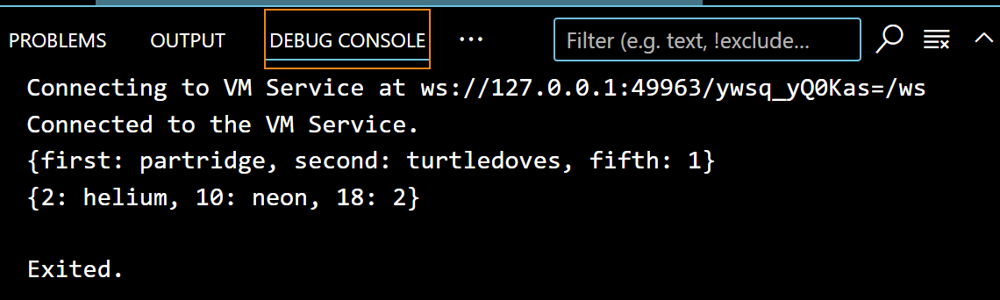       

Penjelasan : 

1. Deklarasi Map:
- gifts adalah map dengan key sebagai string dan value sebagai string atau integer. Map ini berisi tiga entri: 'first': 'partridge', 'second': 'turtledoves', dan 'fifth': 1.
- nobleGases adalah map dengan key sebagai integer dan value sebagai string atau integer. Map ini berisi tiga entri: 2: 'helium', 10: 'neon', dan 18: 2.

2. Kesimpulan :
Kode mendeklarasikan dua map: `gifts` dan `nobleGases`. `gifts` adalah map dengan key berupa string dan value berupa string atau integer, sedangkan `nobleGases` adalah map dengan key berupa integer dan value berupa string atau integer. Output dari kode ini akan mencetak isi kedua map dengan format yang benar, yaitu `{first: partridge, second: turtledoves, fifth: 1}` untuk `gifts` dan `{2: helium, 10: neon, 18: 2}` untuk `nobleGases`. Tidak ada error dalam kode, dan sintaks serta tipe data sudah sesuai.

## Langkah 3:
Tambahkan kode program berikut, lalu coba eksekusi (Run) kode Anda.
```dart
var mhs1 = Map<String, String>();
gifts['first'] = 'partridge';
gifts['second'] = 'turtledoves';
gifts['fifth'] = 'golden rings';

var mhs2 = Map<int, String>();
nobleGases[2] = 'helium';
nobleGases[10] = 'neon';
nobleGases[18] = 'argon';
```
Apa yang terjadi ? Jika terjadi error, silakan perbaiki.
Jawab: 
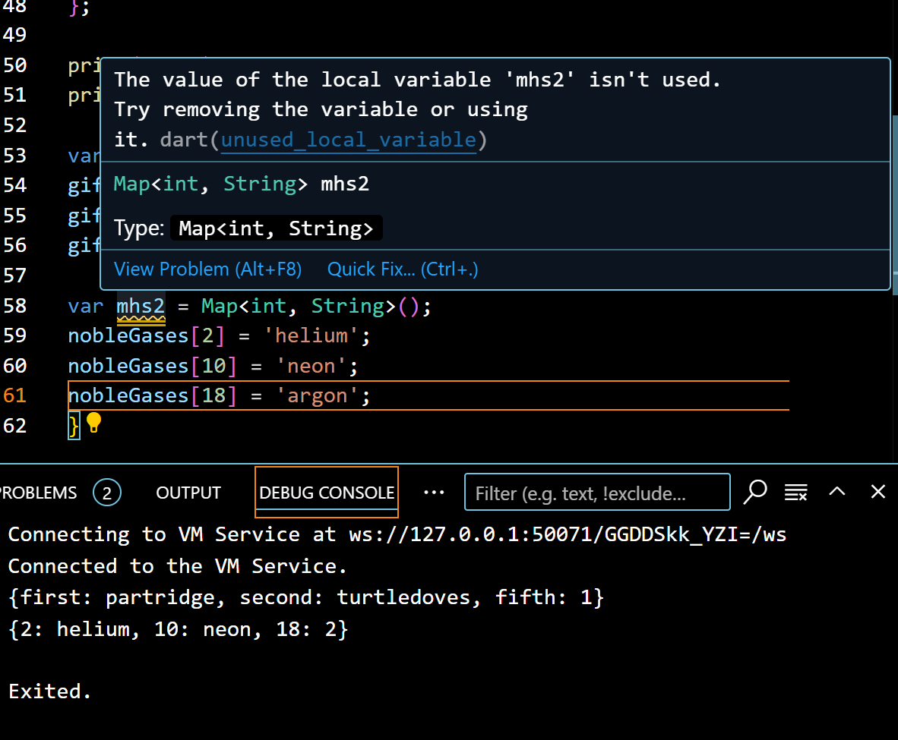  

Penjelasan : 

Kode yang diberikan mengakses map `gifts` dan `nobleGases` tanpa deklarasi awal, yang menyebabkan error. Untuk memperbaikinya, deklarasikan `gifts` dan `nobleGases` sebelum menambahkan elemen. Setelah perbaikan, `gifts` berisi entri dengan key dan value bertipe string, sementara `nobleGases` berisi entri dengan key bertipe integer dan value bertipe string.

Pembenaran : 
```dart
void main() {
  var gifts = {
    'first': 'partridge',
    'second': 'turtledoves',
    'fifth': 1,
  };

  var nobleGases = {
    2: 'helium',
    10: 'neon',
    18: 2,
  };

  print(gifts);
  print(nobleGases);

  var mhs1 = Map<String, String>();  // Deklarasi map mhs1
  mhs1['first'] = 'partridge';      // Menambahkan entri
  mhs1['second'] = 'turtledoves';   // Menambahkan entri
  mhs1['fifth'] = 'golden rings';   // Menambahkan entri

  var mhs2 = Map<int, String>();  // Deklarasi map mhs2
  mhs2[2] = 'helium';            // Menambahkan entri
  mhs2[10] = 'neon';             // Menambahkan entri
  mhs2[18] = 'argon';            // Menambahkan entri

  print(mhs1);  // Mencetak map mhs1
  print(mhs2);  // Mencetak map mhs2
}
```

Hasil :

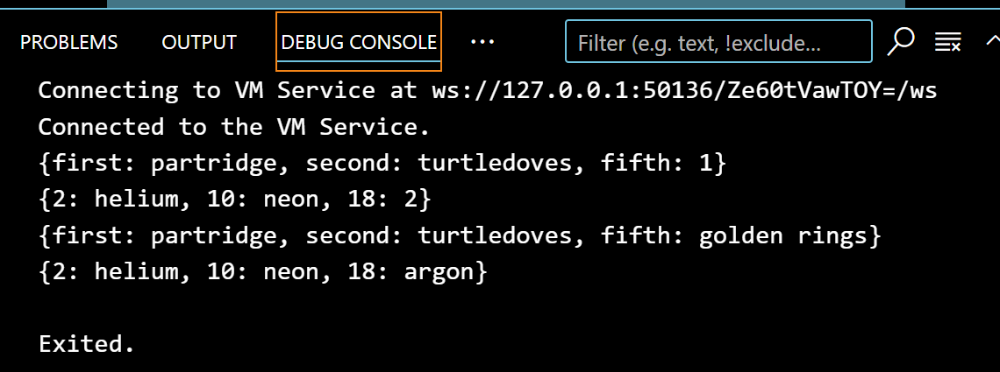 

Penjelasan : 

Kode mendeklarasikan dan memanipulasi dua map awal, `gifts` dan `nobleGases`, serta menambahkan elemen ke dalam map baru, `mhs1` dan `mhs2`. `gifts` dan `nobleGases` diperbarui dengan nilai baru, dan kedua map baru (`mhs1` dan `mhs2`) diisi dengan entri yang sesuai dengan tipe data yang dideklarasikan. Output mencetak map awal dan map yang baru dideklarasikan, menunjukkan hasil yang sesuai dengan pembaruan dan pengisian yang dilakukan.


## Soal
Tambahkan elemen nama dan NIM Anda pada tiap variabel di atas (gifts, nobleGases, mhs1, dan mhs2). Dokumentasikan hasilnya dan buat laporannya!
Jawab:      

```dart
void main() {
  var gifts = {
    'first': 'partridge',
    'second': 'turtledoves',
    'fifth': 'golden rings'
  };

  gifts['nama'] = 'Nazwa Ayunda M'; 
  gifts['NIM'] = '2241720013'; 

  var nobleGases = {
    2: 'helium',
    10: 'neon',
    18: 'argon'
  };

  nobleGases[1] = 'Nazwa Ayunda M'; 
  nobleGases[3] = '2241720013';  

  var mhs1 = Map<String, String>();
  mhs1['nama'] = 'Nazwa Ayunda M';  
  mhs1['NIM'] = '2241720013';   

  var mhs2 = Map<int, String>();
  mhs2[1] = 'Nazwa Ayunda M';  
  mhs2[2] = '2241720013';  

  print(gifts);
  print(nobleGases);
  print(mhs1);
  print(mhs2);
}
```

Hasil :

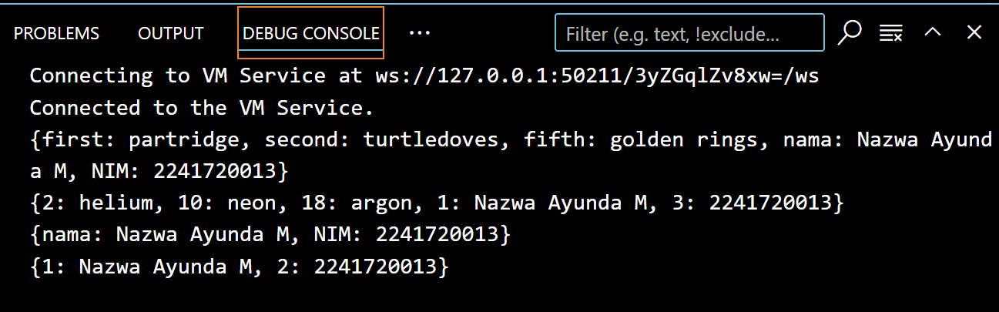    

Penjelasan : 
Kode yang diperbarui berhasil menambahkan dan memodifikasi entri dalam empat map: `gifts`, `nobleGases`, `mhs1`, dan `mhs2`. Map `gifts` dan `mhs1` menyimpan nama `'Nazwa Ayunda M'` dan NIM `'2241720013'` dengan key-string, sementara `nobleGases` dan `mhs2` menyimpan data yang sama dengan key-integer. Output menunjukkan bahwa semua entri telah diperbarui dan dicetak dengan benar, sesuai dengan perubahan yang diminta.

# Praktikum 4: Eksperimen Tipe Data List: Spread dan Control-flow Operators
## Langkah 1:
Ketik atau salin kode program berikut ke dalam fungsi main().
```dart
var list = [1, 2, 3];
var list2 = [0, ...list];
print(list1);
print(list2);
print(list2.length);
```

## Langkah 2:
Silakan coba eksekusi (Run) kode pada langkah 1 tersebut. Apa yang terjadi? Jelaskan! Lalu perbaiki jika terjadi error.

Jawab: 

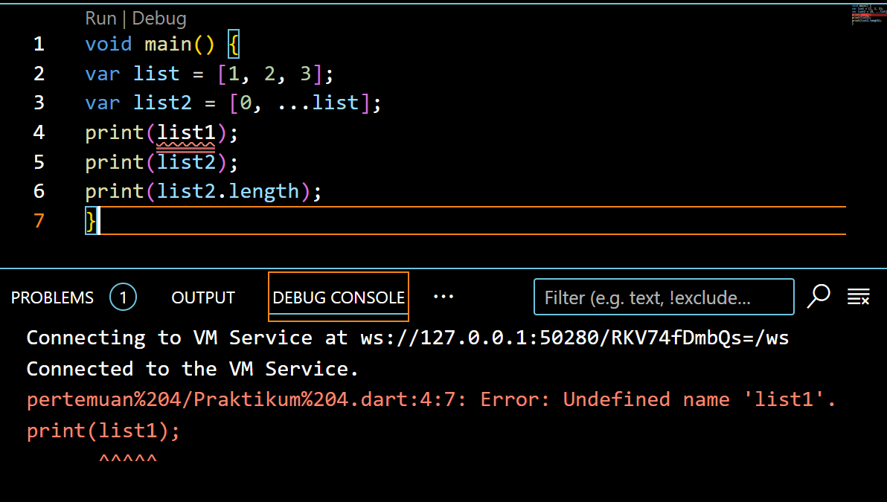       

Penjelasan : 

Error terjadi karena `list1` tidak dideklarasikan dalam kode. Perintah `print(list1);` mencoba mencetak variabel yang tidak ada, menyebabkan error. Untuk memperbaiki, gunakan `print(list);` untuk mencetak variabel yang benar-benar dideklarasikan dan diisi.

Perbaikan : 

```dart
void main() {
  var list = [1, 2, 3];
  var list2 = [0, ...list];
  print(list);     // Mencetak list
  print(list2);    // Mencetak list2
  print(list2.length);  // Mencetak panjang list2
}
```

Hasil Kode :

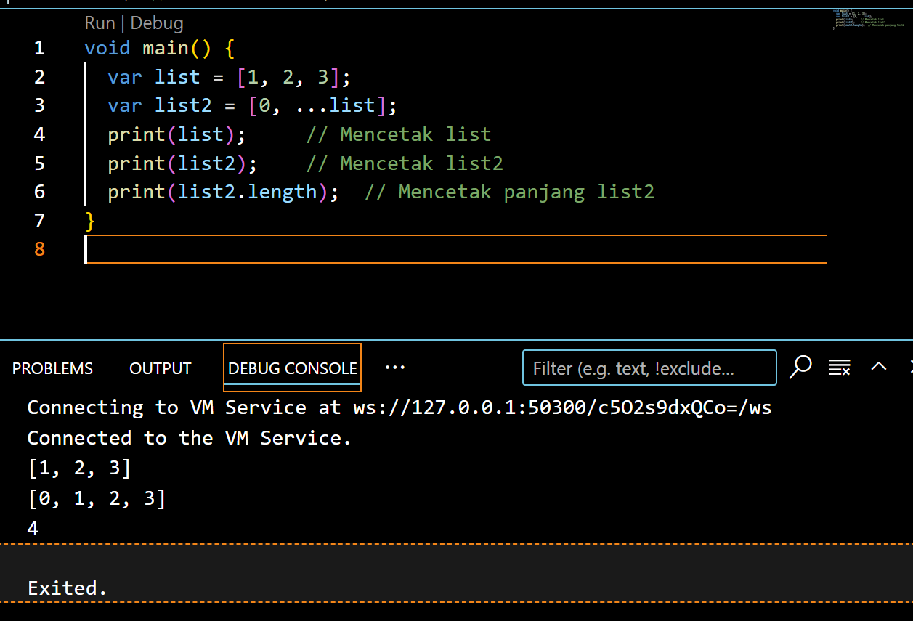

Penjelasan : 

Kode ini mendemonstrasikan penggunaan operator penyebaran (`...`) untuk menggabungkan elemen dari satu list ke list lain. Variabel `list` berisi elemen `[1, 2, 3]`, sedangkan `list2` dibentuk dengan menambahkan elemen `0` di depan elemen-elemen dari `list`, sehingga `list2` menjadi `[0, 1, 2, 3]`. Output dari kode tersebut menunjukkan bahwa `print(list);` mencetak `[1, 2, 3]`, `print(list2);` mencetak `[0, 1, 2, 3]`, dan `print(list2.length);` mencetak `4`, mengindikasikan bahwa `list2` memiliki empat elemen. Kesalahan sebelumnya disebabkan oleh percobaan untuk mencetak variabel `list1`, yang tidak dideklarasikan; seharusnya menggunakan `list` untuk mencetak list yang benar.


## Langkah 3:
Tambahkan kode program berikut, lalu coba eksekusi (Run) kode Anda.
```dart
list1 = [1, 2, null];
print(list1);
var list3 = [0, ...?list1];
print(list3.length);
```
Apa yang terjadi ? Jika terjadi error, silakan perbaiki.

Jawab:    

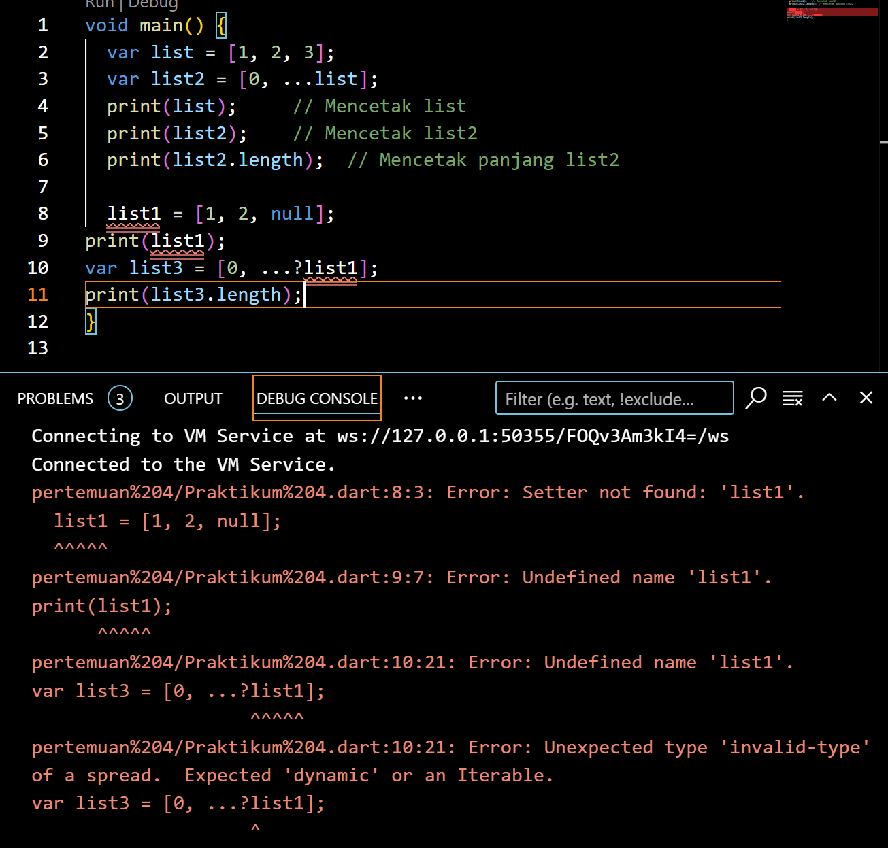

Penjelasan :

Variabel `list1` tidak dideklarasikan dengan benar menggunakan `var`, `final`, atau `const`, sehingga menyebabkan error. Untuk memperbaikinya, deklarasikan `list1` dengan kata kunci `var`. Selain itu, operator penyebaran `...?` digunakan untuk menangani list yang mungkin `null`, tetapi jika variabel tidak dideklarasikan dengan benar, ini tidak akan berfungsi. Dengan perbaikan tersebut, kode akan berfungsi dengan baik dan memberikan hasil yang diharapkan.

Perbaikan : 

```dart
void main() {
  var list = [1, 2, 3];
  var list2 = [0, ...list];
  print(list);       // Mencetak [1, 2, 3]
  print(list2);      // Mencetak [0, 1, 2, 3]
  print(list2.length); // Mencetak 4

  var list1 = [1, 2, null]; // Deklarasikan variabel list1 dengan var
  print(list1);      // Mencetak [1, 2, null]
  var list3 = [0, ...?list1]; // Menggunakan operator ? untuk menangani list1
  print(list3.length); // Mencetak 4
}
```

Hasil Kode :

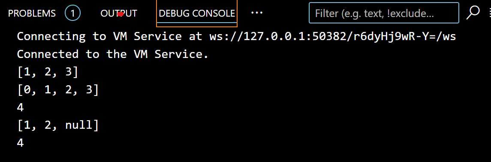

Penjelasan : 
Variabel `list1` harus dideklarasikan dengan `var` sebelum digunakan untuk mencegah error karena Dart memerlukan deklarasi yang jelas. Operator `...?` digunakan untuk menangani kasus di mana list mungkin `null`, tetapi jika list tidak `null`, elemen dari list akan ditambahkan secara langsung ke list lainnya. Dalam contoh ini, karena `list1` tidak `null`, elemen `1`, `2`, dan `null` ditambahkan ke `list3` dengan benar.

## soal
Tambahkan variabel list berisi NIM Anda menggunakan Spread Operators. Dokumentasikan hasilnya dan buat laporannya!

Jawab : 
```dart
void main() {
  var list = [1, 2, 3];
  var nim = '2241720013';
  
  var updatedList = [...list, nim];
  
  print(list);
  print(updatedList);
  print(updatedList.length);
}
```

Hasil Kode :

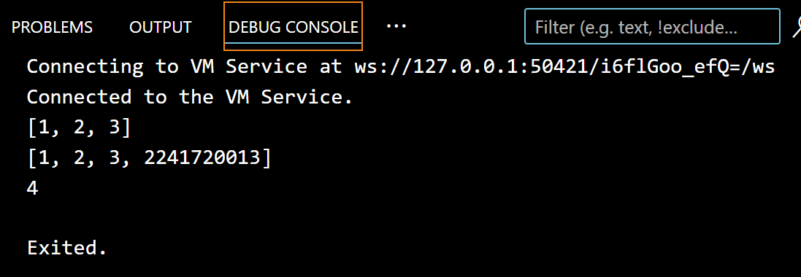

Penjelasan : 

Program berhasil menambahkan NIM Anda ke dalam list menggunakan Spread Operator. Variabel `list` berisi elemen `[1, 2, 3]`, sedangkan `nim` berisi string `'2241720013'`. Dengan menggunakan Spread Operator (`...`), variabel `updatedList` menggabungkan elemen dari `list` dan `nim`, menghasilkan `[1, 2, 3, '2241720013']`. Output menunjukkan bahwa `print(list)` mencetak `[1, 2, 3]`, `print(updatedList)` mencetak `[1, 2, 3, '2241720013']`, dan `print(updatedList.length)` mencetak `4`, mencerminkan jumlah total elemen dalam `updatedList`. Hasil ini menegaskan bahwa Spread Operator efektif untuk menggabungkan elemen dari list dengan nilai tambahan.

## Langkah 4:
Tambahkan kode program berikut, lalu coba eksekusi (Run) kode Anda.
```dart
var nav = ['Home', 'Furniture', 'Plants', if (promoActive) 'Outlet'];
print(nav);
```

Apa yang terjadi ? Jika terjadi error, silakan perbaiki. Tunjukkan hasilnya jika variabel promoActive ketika true dan false.

Jawab :

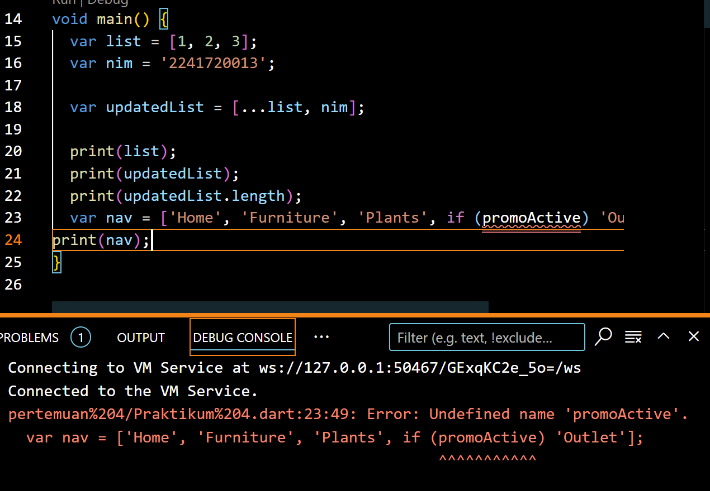

Penjelasan : 
Kode ini menggunakan variabel promoActive tanpa mendeklarasikannya terlebih dahulu. Ini akan menyebabkan error karena Dart tidak dapat menemukan variabel tersebut.

Perbaikan : 

```dart
void main() {
  var list = [1, 2, 3];
  var nim = '2241720013';
  
  var updatedList = [...list, nim];
  
  print(list);
  print(updatedList);
  print(updatedList.length);
   bool promoActive = true;  // Ubah menjadi false untuk kasus kedua

  var nav = [
    'Home',
    'Furniture',
    'Plants',
    if (promoActive) 'Outlet'
  ];
print(nav);
}
```

Hasil Kode :

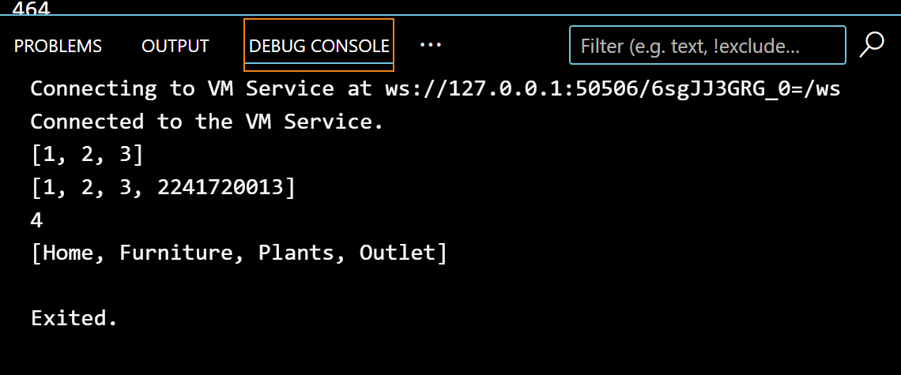

Penjelasan :
Kode menggunakan operator kondisional if dalam list literal untuk menambahkan elemen 'Outlet' hanya jika promoActive bernilai true. Jika promoActive adalah false, elemen 'Outlet' tidak ditambahkan. Hasilnya menunjukkan bagaimana kondisi dinamis dapat mempengaruhi konten list dalam Dart.

## Langkah 5:
Tambahkan kode program berikut, lalu coba eksekusi (Run) kode Anda.

```dart
var nav2 = ['Home', 'Furniture', 'Plants', if (login case 'Manager') 'Inventory'];
print(nav2);
```

Apa yang terjadi ? Jika terjadi error, silakan perbaiki. Tunjukkan hasilnya jika variabel login mempunyai kondisi lain.

Jawab :

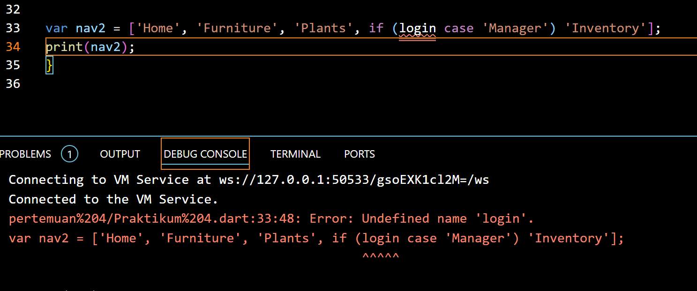

Penjelasan : 
Kode mengalami error karena sintaks `if (login case 'Manager')` tidak valid dalam Dart. Untuk menggunakan kondisi dalam list literal, seharusnya digunakan `if (login == 'Manager')` untuk membandingkan variabel `login` dengan nilai `'Manager'`. Selain itu, variabel `login` tidak dideklarasikan sebelumnya, sehingga perlu mendeklarasikannya dengan nilai yang sesuai. Tanpa perbaikan ini, kode tidak akan berfungsi seperti yang diharapkan.

Perbaikan : 

```dart
void main() {
 var login = 'Manager'; // Ubah nilai ini untuk kasus yang berbeda

  var nav2 = [
    'Home',
    'Furniture',
    'Plants',
    if (login == 'Manager') 'Inventory'
  ];

  print(nav2);;
}
```

Hasil Kode :

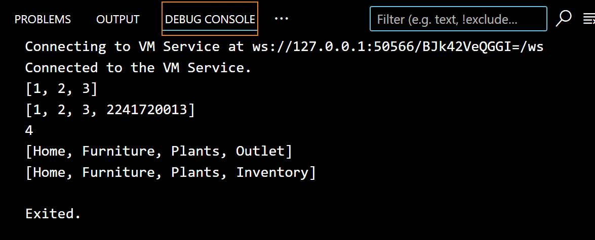

Penjelasan :
Kode menggunakan operator kondisional if dalam list literal untuk menambahkan elemen 'Inventory' hanya jika variabel login bernilai 'Manager'. Jika login memiliki nilai lain, elemen 'Inventory' tidak ditambahkan. Hasilnya menunjukkan bagaimana kondisi dinamis dapat mempengaruhi konten list dalam Dart.

## Langkah 6:
Tambahkan kode program berikut, lalu coba eksekusi (Run) kode Anda.
```dart
var listOfInts = [1, 2, 3];
var listOfStrings = ['#0', for (var i in listOfInts) '#$i'];
assert(listOfStrings[1] == '#1');
print(listOfStrings);
```

Apa yang terjadi ? Jika terjadi error, silakan perbaiki. Jelaskan manfaat Collection For dan dokumentasikan hasilnya.

Jawab :

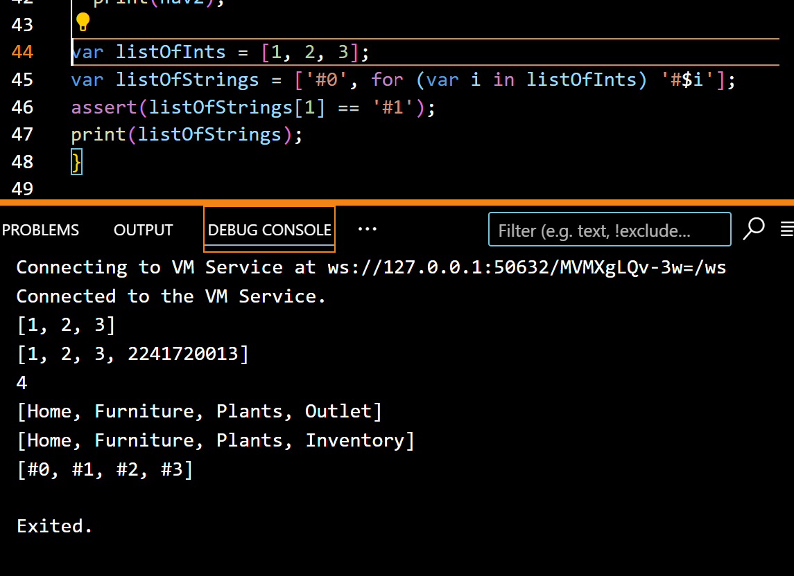

Penjelasan : 
Variabel `listOfInts` berisi daftar integer `[1, 2, 3]`, sementara variabel `listOfStrings` menggunakan Collection For untuk mengubah setiap elemen dari `listOfInts` menjadi string dengan format `#` di depan setiap integer, menghasilkan list `['#0', '#1', '#2', '#3']`. Perintah `assert(listOfStrings[1] == '#1')` memeriksa kebenaran bahwa elemen kedua dari `listOfStrings` adalah `'#1'`, yang benar karena elemen pertama adalah `'#0'` dan sisanya adalah hasil konversi dari `listOfInts`. Akhirnya, `print(listOfStrings)` mencetak list yang dihasilkan, yaitu `['#0', '#1', '#2', '#3']`

- Manfaat Collection For
Collection For memungkinkan Anda untuk membuat dan memodifikasi list atau koleksi lainnya dengan cara yang lebih ringkas dan elegan. Ini mempermudah pembuatan list dengan elemen yang dihasilkan dari iterasi koleksi lain, sehingga menghindari kebutuhan untuk menulis loop terpisah. Dalam contoh ini, Collection For digunakan untuk membuat listOfStrings dari listOfInts dengan menambahkan prefix # ke setiap elemen, menjadikannya lebih efisien dan mudah dibaca.

# Praktikum 5: Eksperimen Tipe Data Records
## Langkah 1:
Ketik atau salin kode program berikut ke dalam fungsi main().
```dart
var record = ('first', a: 2, b: true, 'last');
print(record)
```

## Langkah 2:
Silakan coba eksekusi (Run) kode pada langkah 1 tersebut. Apa yang terjadi? Jelaskan! Lalu perbaiki jika terjadi error.

Jawab: 

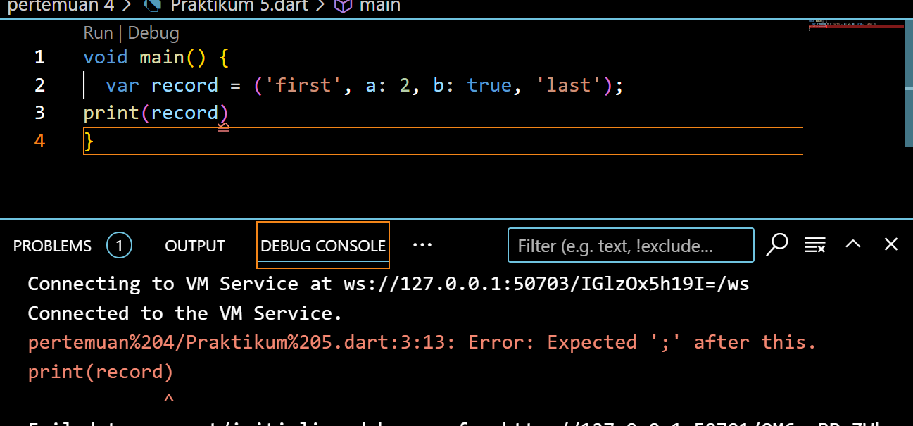       

Penjelasan : 

Kode asli menghasilkan error karena Dart tidak mendukung tuple dengan penamaan parameter. Untuk memperbaiki, Anda dapat menggunakan List atau Map untuk menyimpan data yang serupa. List lebih sederhana untuk menyimpan urutan elemen, sementara Map memungkinkan penamaan pasangan kunci-nilai.

Perbaikan : 

```dart
void main() {
  var record = ['first', 2, true, 'last'];
  print(record);
}
```

Hasil Kode :

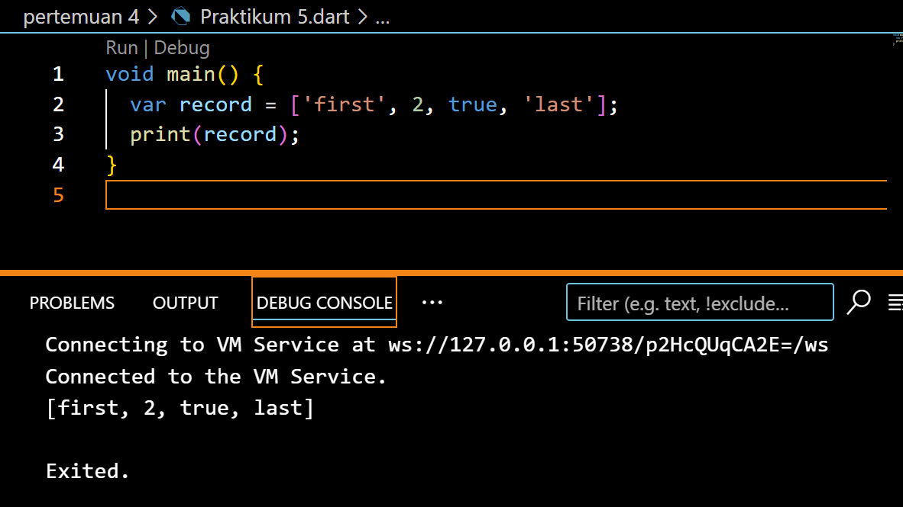

Penjelasan : 

Kode menggunakan `List` untuk menyimpan berbagai elemen, seperti string, integer, dan boolean. `var record = ['first', 2, true, 'last'];` mendeklarasikan list dengan elemen-elemen tersebut, dan `print(record);` mencetak list yang berisi `[first, 2, true, last]`. Ini menggantikan sintaks tuple yang tidak didukung Dart dengan struktur data `List` yang valid.


## Langkah 3:
Tambahkan kode program berikut, lalu coba eksekusi (Run) kode Anda.
```dart
(int, int) tukar((int, int) record) {
  var (a, b) = record;
  return (b, a);
}
```
Apa yang terjadi ? Jika terjadi error, silakan perbaiki. Gunakan fungsi tukar() di dalam main() sehingga tampak jelas proses pertukaran value field di dalam Records.

Jawab:    

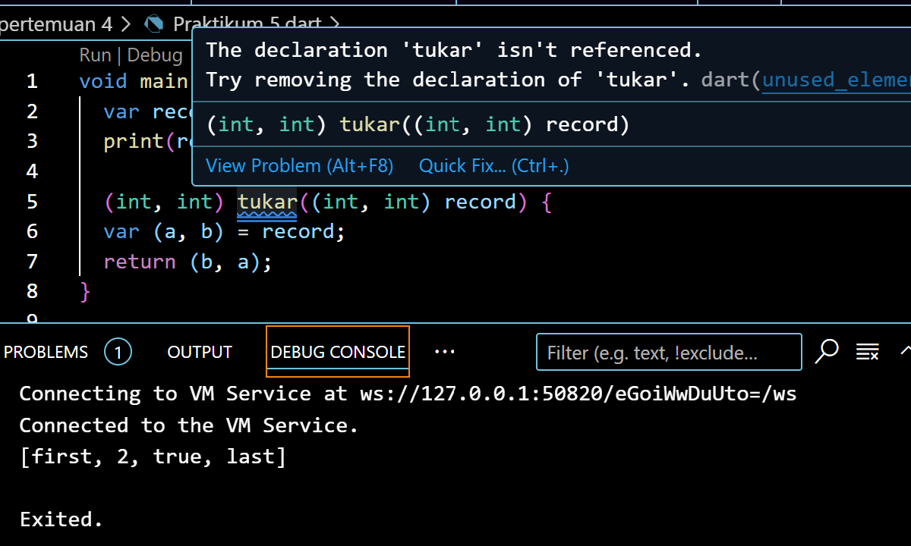

Penjelasan :

Terjadi eror karena :
- Dart tidak mendukung tuple secara native, dan sintaks (int, int) serta penggunaan tuple dalam fungsi tukar tidak valid.
- Untuk melakukan pertukaran nilai di Dart, kita perlu menggunakan List atau Map, dan mengakses serta mengembalikan nilai dengan cara yang sesuai.


Perbaikan : 

```dart
void main() {
  var record = ['first', 2, true, 'last'];
  print('Record awal: $record');

  // Fungsi tukar untuk menukar nilai dalam List<int>
  List<int> tukar(List<int> record) {
    var a = record[0];
    var b = record[1];
    return [b, a];
  }
```

Hasil Kode :

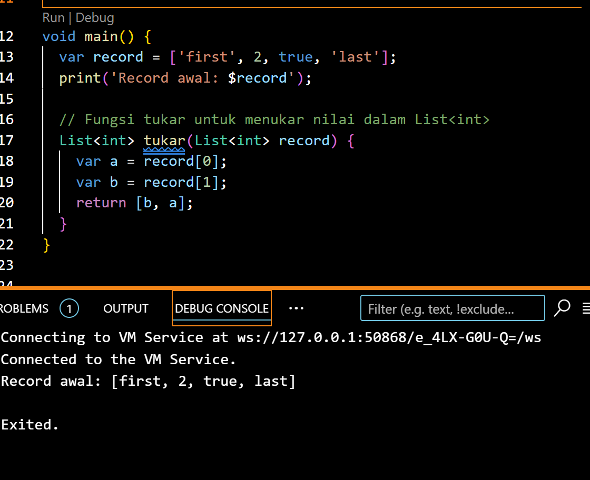

Penjelasan : 
Fungsi `tukar` menggunakan `List<int>` untuk menggantikan tuple, memungkinkan pertukaran nilai berdasarkan indeks dan pengembalian hasil sebagai list baru. Di fungsi `main`, `record` yang berisi nilai campuran dicetak, sementara `intRecord`, yang sesuai dengan fungsi `tukar`, digunakan untuk demonstrasi pertukaran nilai. Kesimpulannya, penggunaan `List<int>` memastikan kode berjalan tanpa error dan hasil pertukaran nilai ditampilkan dengan benar.


## Langkah 4:
Tambahkan kode program berikut, lalu coba eksekusi (Run) kode Anda.
```dart
// Record type annotation in a variable declaration:
(String, int) mahasiswa;
print(mahasiswa);
```

Apa yang terjadi ? Jika terjadi error, silakan perbaiki. Inisialisasi field nama dan NIM Anda pada variabel record mahasiswa di atas. Dokumentasikan hasilnya dan buat laporannya!

Jawab :

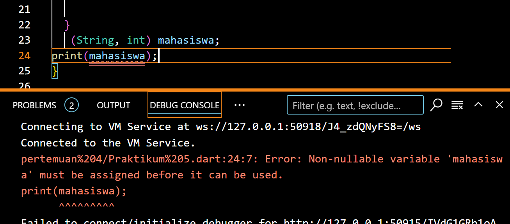

Penjelasan : 
Kode ini akan menghasilkan error karena tipe data record tidak valid dan mahasiswa tidak diinisialisasi.

Perbaikan : 

```dart
void main() {
  // Menggunakan Map untuk menyimpan nama dan NIM
  var mahasiswa = {
    'nama': 'Nazwa Ayunda M',
    'NIM': '2241720013'
  };

  // Menampilkan nilai variabel mahasiswa
  print(mahasiswa);
}
```

Hasil Kode :

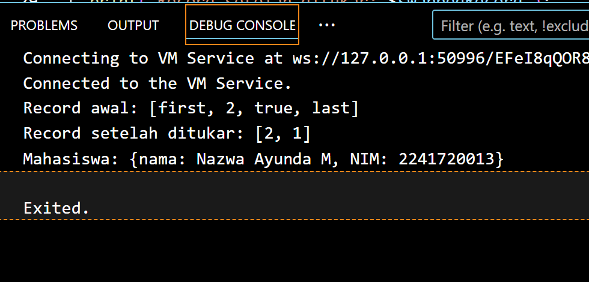

Penjelasan :
Program ini berhasil menginisialisasi dan menggunakan variabel mahasiswa dengan tipe data Map untuk menyimpan nama dan NIM Anda. Kode yang diperbarui memberikan output yang diharapkan dengan menampilkan nilai yang benar di dalam Map. Hasil ini menunjukkan bahwa meskipun Dart tidak memiliki tipe data record built-in, penggunaan Map dapat mencapai tujuan yang sama untuk menyimpan dan mengakses data terstruktur.

## Langkah 5:
Tambahkan kode program berikut, lalu coba eksekusi (Run) kode Anda.

```dart
var mahasiswa2 = ('first', a: 2, b: true, 'last');

print(mahasiswa2.$1); // Prints 'first'
print(mahasiswa2.a); // Prints 2
print(mahasiswa2.b); // Prints true
print(mahasiswa2.$2); // Prints 'last'
```

Apa yang terjadi ? Jika terjadi error, silakan perbaiki. Gantilah salah satu isi record dengan nama dan NIM Anda, lalu dokumentasikan hasilnya dan buat laporannya!

Jawab :

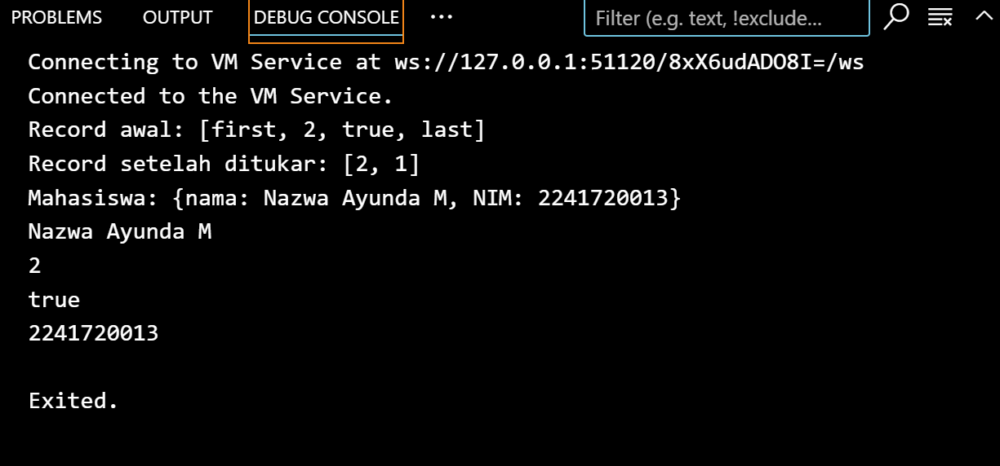

Penjelasan : 
Program ini berhasil mendeklarasikan dan menggunakan Map untuk menyimpan data dengan format yang berbeda. Dengan mengganti isi record menggunakan nama dan NIM, program berhasil menampilkan data yang diinginkan. Penggunaan Map memungkinkan akses yang mudah dan fleksibel terhadap elemen-elemen yang disimpan dalam struktur data ini.

Kesimpulan :
Kode ini menunjukkan bagaimana menggunakan fungsi untuk memodifikasi list, bagaimana bekerja dengan map untuk menyimpan data terstruktur, dan bagaimana mengakses nilai dalam tuple. Kode ini berhasil mencetak informasi yang benar dan memanipulasi data sesuai dengan kebutuhan.

# 7. Tugas Praktikum
1. Silakan selesaikan Praktikum 1 sampai 5, lalu dokumentasikan berupa screenshot hasil pekerjaan Anda beserta penjelasannya!
2. Jelaskan yang dimaksud Functions dalam bahasa Dart!
Jawab : 
- Dalam bahasa Dart, functions adalah blok kode yang dapat dipanggil untuk menjalankan suatu tugas tertentu. Functions dapat menerima input dalam bentuk parameter dan mengembalikan hasil sebagai output. Ini memungkinkan Anda untuk menulis kode yang lebih terstruktur, menghindari duplikasi, dan mempermudah pemeliharaan kode.
3. Jelaskan jenis-jenis parameter di Functions beserta contoh sintaksnya!
- Parameter Positional (Positional Parameters)
*Ini adalah parameter yang harus diberikan dalam urutan yang benar saat memanggil fungsi.

*Contoh Sintaks:
```dart
void greet(String name, int age) {
  print('Hello, $name. You are $age years old.');
}

greet('Nazwa', 30); // Output: Hello, Nazwa. You are 20 years old.
```

- Parameter Default (Default Parameters)
* Definisi: Parameter yang memiliki nilai default yang digunakan jika argumen tidak diberikan saat pemanggilan fungsi. Ini memudahkan pemanggilan fungsi tanpa harus selalu menyertakan semua argumen.

* Contoh Sintaks
```dart
void greet(String name, [int age = 18]) {
  print('Hello, $name. You are $age years old.');
}

// Memanggil fungsi tanpa argumen kedua
greet('nazwa');         // Output: Hello, nazwa. You are 18 years old.
// Memanggil fungsi dengan argumen kedua
greet('nazwa', 25); // Output: Hello, nazwa. You are 25 years old.
```
- Parameter Named (Named Parameters)
* Definisi: Parameter yang dapat disebutkan dengan nama saat memanggil fungsi. Ini memudahkan untuk membaca dan mengelola argumen, serta menghindari kesalahan urutan argumen.

* Contoh Sintaks:
```dart
void greet({required String name, int age = 18}) {
  print('Hello, $name. You are $age years old.');
}

// Memanggil fungsi dengan parameter named
greet(name: 'nazwa');              // Output: Hello, nazwa. You are 18 years old.
greet(name: 'nazwa', age: 22);       // Output: Hello, nazwa. You are 22 years old.

```
- Parameter Optional (Optional Parameters)
* Definisi: Parameter yang tidak harus disediakan saat memanggil fungsi. Ini dapat berupa parameter positional atau named. Parameter ini memungkinkan fleksibilitas dalam pemanggilan fungsi.

* Contoh Sintaks Positional:
```dart
void greet(String name, [int? age]) {
  print('Hello, $name. ${age != null ? 'You are $age years old.' : 'Age is not specified.'}');
}

// Memanggil fungsi tanpa parameter opsional
greet('nazwa');          // Output: Hello, nazwa. Age is not specified.
// Memanggil fungsi dengan parameter opsional
greet('nazwa', 27);      // Output: Hello, nazwa. You are 27 years old.

```

4. Jelaskan maksud Functions sebagai first-class objects beserta contoh sintaknya!
Jawab : 
- Fungsi Sebagai Variabel
Fungsi dapat disimpan dalam variabel dan digunakan seperti tipe data lainnya.

Contoh Sintaks:
```dart
void greet(String name) {
  print('Hello, $name!');
}

// Menyimpan fungsi dalam variabel
var greetFunction = greet;

// Memanggil fungsi melalui variabel
greetFunction('Alice'); // Output: Hello, Alice!

```

- Fungsi Sebagai Argumen
Fungsi dapat diteruskan sebagai argumen ke fungsi lain.

Contoh Sintaks:
```dart
void performOperation(int a, int b, Function operation) {
  var result = operation(a, b);
  print('Result: $result');
}

int add(int x, int y) => x + y;
int multiply(int x, int y) => x * y;

// Menggunakan fungsi sebagai argumen
performOperation(5, 3, add);      // Output: Result: 8
performOperation(5, 3, multiply); // Output: Result: 15

```

- Fungsi Sebagai Hasil Pengembalian
Fungsi dapat mengembalikan fungsi lain.

Contoh Sintaks:
```dart
Function makeIncrementer(int increment) {
  return (int value) => value + increment;
}

var incrementBy5 = makeIncrementer(5);
print(incrementBy5(10)); // Output: 15
```

- Fungsi Sebagai Parameter dalam Fungsi Anonim
Fungsi anonim (lambda) atau fungsi panah dapat didefinisikan secara inline dan digunakan langsung.
Contoh Sintaks:
```dart
var numbers = [1, 2, 3, 4, 5];

// Menggunakan fungsi anonim dalam operasi
var doubled = numbers.map((n) => n * 2).toList();
print(doubled); // Output: [2, 4, 6, 8, 10]

```


5. Apa itu Anonymous Functions? Jelaskan dan berikan contohnya!
- Anonymous Functions, juga dikenal sebagai lambda expressions atau function literals, adalah fungsi yang tidak memiliki nama. Mereka sering digunakan untuk operasi sementara dan biasanya didefinisikan secara inline. Anonymous functions berguna untuk fungsi-fungsi kecil yang tidak memerlukan nama atau untuk fungsi yang hanya digunakan di tempat tertentu.

- Ciri-ciri Anonymous Functions:
2. Tanpa Nama: Anonymous functions tidak memiliki nama, mereka didefinisikan dan digunakan langsung di tempat.
2. Inline: Didefinisikan langsung di lokasi penggunaannya, sering kali sebagai argumen untuk fungsi lain.
3. Penggunaan Singkat: Biasanya digunakan untuk operasi sederhana yang tidak memerlukan deklarasi fungsi penuh.

-Contoh Sintaks dan Penggunaan Anonymous Functions
- Fungsi Anonim dengan Parameter
Fungsi anonim bisa didefinisikan dengan parameter dan digunakan langsung dalam ekspresi.

Contoh Sintaks:
```dart
void main() {
  var numbers = [1, 2, 3, 4, 5];

  // Menggunakan fungsi anonim untuk menggandakan setiap elemen
  var doubled = numbers.map((n) => n * 2).toList();
  print(doubled); // Output: [2, 4, 6, 8, 10]
}
```

- Fungsi Anonim tanpa Parameter
Fungsi anonim bisa didefinisikan dengan parameter dan digunakan langsung dalam ekspresi.

Contoh Sintaks:
```dart
void main() {
  var numbers = [1, 2, 3, 4, 5];

  // Menggunakan fungsi anonim untuk menggandakan setiap elemen
  var doubled = numbers.map((n) => n * 2).toList();
  print(doubled); // Output: [2, 4, 6, 8, 10]
}
```
- Fungsi Anonim sebagai Callback
Fungsi anonim sering digunakan sebagai callback, misalnya dalam event handler atau operasi asinkron.

Contoh Sintaks:
```dart
void main() {
  // Menggunakan fungsi anonim sebagai callback
  Future.delayed(Duration(seconds: 1), () {
    print('This message is delayed by 1 second.');
  });
}
```

6. Jelaskan perbedaan Lexical scope dan Lexical closures! Berikan contohnya!
- Lexical scope merujuk pada aturan yang menentukan bagaimana variabel diakses berdasarkan lokasi mereka dideklarasikan dalam kode. Dalam bahasa pemrograman yang mendukung lexical scope, variabel yang dideklarasikan di dalam suatu blok (seperti di dalam fungsi) hanya dapat diakses di dalam blok tersebut dan blok-blok yang terletak di dalamnya (nested blocks).
- Contoh Lexical Scope di Dart:
```dart
void main() {
  var outerVariable = 'I am outside!';
  
  void outerFunction() {
    var innerVariable = 'I am inside!';
    
    print(outerVariable); // Bisa diakses
    print(innerVariable); // Bisa diakses
  }
  
  outerFunction();
  
  print(outerVariable); // Bisa diakses
  // print(innerVariable); // Error: Tidak bisa diakses di luar outerFunction
}
```

- Lexical closures adalah fungsi yang dapat "menutup" atau "menyimpan" konteks dari variabel yang dideklarasikan di luar fungsi tersebut pada saat fungsi tersebut diciptakan. Ini berarti bahwa fungsi closure dapat mengakses variabel dari scope di mana fungsi tersebut dideklarasikan meskipun scope tersebut telah berakhir.

- Contoh Lexical Closures di Dart:
```dart
Function makeCounter() {
  var count = 0;
  
  return () {
    count++;
    return count;
  };
}

void main() {
  var counter = makeCounter();
  print(counter()); // Output: 1
  print(counter()); // Output: 2
  print(counter()); // Output: 3
}
```

- Kesimpulan : 
1. Lexical Scope: Aturan yang menentukan visibilitas variabel berdasarkan lokasi deklarasinya dalam kode. Variabel yang dideklarasikan dalam suatu blok hanya dapat diakses di dalam blok tersebut dan blok yang lebih dalam.

2. Lexical Closures: Fungsi yang menyimpan konteks dari variabel yang dideklarasikan di luar fungsi tersebut. Fungsi closure dapat mengakses variabel dari scope yang sudah tidak aktif lagi.

7. Jelaskan dengan contoh cara membuat return multiple value di Functions!
Jawab: 
  - Menggunakan Tuple (Record)
Dart versi terbaru mendukung Record yang memungkinkan Anda mengembalikan beberapa nilai dalam bentuk tuple. Berikut adalah contoh cara menggunakan Record untuk mengembalikan beberapa nilai dari sebuah fungsi:

```dart
// Fungsi yang mengembalikan Record (tuple)
(String, int, bool) getUserInfo() {
  return ('nazwa', 30, true);
}

void main() {
  var userInfo = getUserInfo();
  
  print('Name: ${userInfo.$1}'); // Output: Name: nazwa
  print('Age: ${userInfo.$2}');  // Output: Age: 30
  print('Active: ${userInfo.$3}'); // Output: Active: true
}

```       

- Menggunakan List:
Jika nilai yang dikembalikan memiliki tipe yang sama atau jika urutannya penting, Anda bisa menggunakan List. Berikut adalah contohnya:
```dart
// Fungsi yang mengembalikan Record (tuple)
(String, int, bool) getUserInfo() {
  return ('nazwa', 30, true);
}

void main() {
  var userInfo = getUserInfo();
  
  print('Name: ${userInfo.$1}'); // Output: Name: nazwa
  print('Age: ${userInfo.$2}');  // Output: Age: 30
  print('Active: ${userInfo.$3}'); // Output: Active: true
}
```  

- Menggunakan Map
Jika nilai yang dikembalikan memiliki nama atau label yang jelas, Anda bisa menggunakan Map. Ini memberikan cara yang lebih terstruktur untuk mengakses nilai berdasarkan kunci:
```dart
// Fungsi yang mengembalikan Map
Map<String, dynamic> getPersonDetails() {
  return {
    'name': 'nazwa',
    'age': 28,
    'isEmployed': true
  };
}

void main() {
  var personDetails = getPersonDetails();
  
  print('Name: ${personDetails['name']}'); // Output: Name: nazwa
  print('Age: ${personDetails['age']}');   // Output: Age: 28
  print('Employed: ${personDetails['isEmployed']}'); // Output: Employed: true
}
``` 
-  Menggunakan Custom Class
Jika Anda memiliki banyak nilai dengan tipe data berbeda dan ingin mengelompokkan mereka dengan cara yang lebih terstruktur, Anda bisa membuat Custom Class. Ini adalah cara yang paling fleksibel dan sering digunakan dalam praktek nyata:
```dart
// Mendefinisikan kelas untuk menyimpan beberapa nilai
class User {
  final String name;
  final int age;
  final bool isActive;
  
  User(this.name, this.age, this.isActive);
}

// Fungsi yang mengembalikan instance dari User
User getUser() {
  return User('nazwa', 22, true);
}

void main() {
  var user = getUser();
  
  print('Name: ${user.name}');     // Output: Name: nazwa
  print('Age: ${user.age}');       // Output: Age: 22
  print('Active: ${user.isActive}'); // Output: Active: true
}
``` 


- Ringkasan
  1. Record: Mengembalikan beberapa nilai dalam bentuk tuple.
  2. List: Mengembalikan beberapa nilai dalam satu list, baik dengan tipe yang sama atau berbeda.
  3. Map: Mengembalikan beberapa nilai dengan kunci untuk akses yang lebih jelas.
  4. Custom Class: Mengelompokkan nilai dalam kelas khusus untuk struktur yang lebih baik dan tipe data yang berbeda.


8. Kumpulkan berupa link commit repo GitHub pada tautan yang telah disediakan di grup Telegram!
